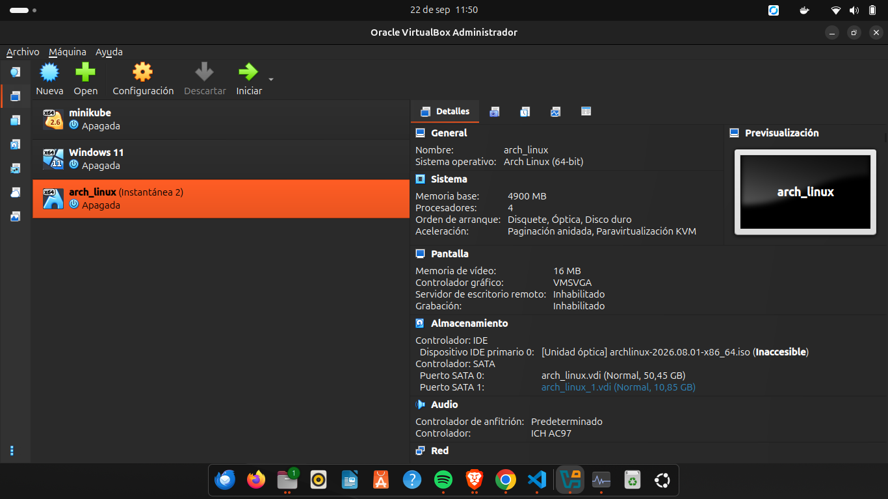
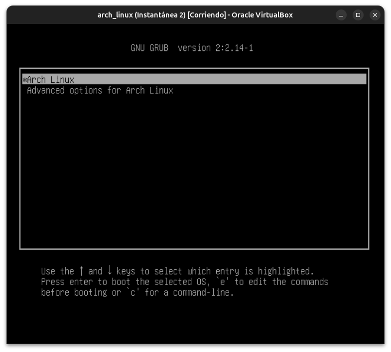
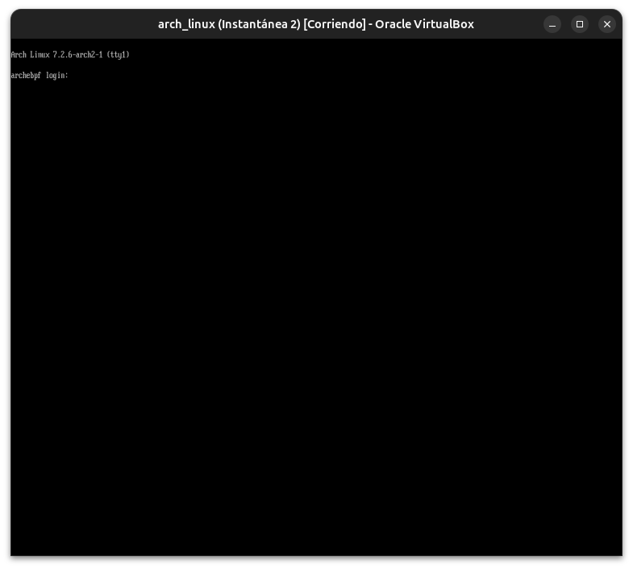
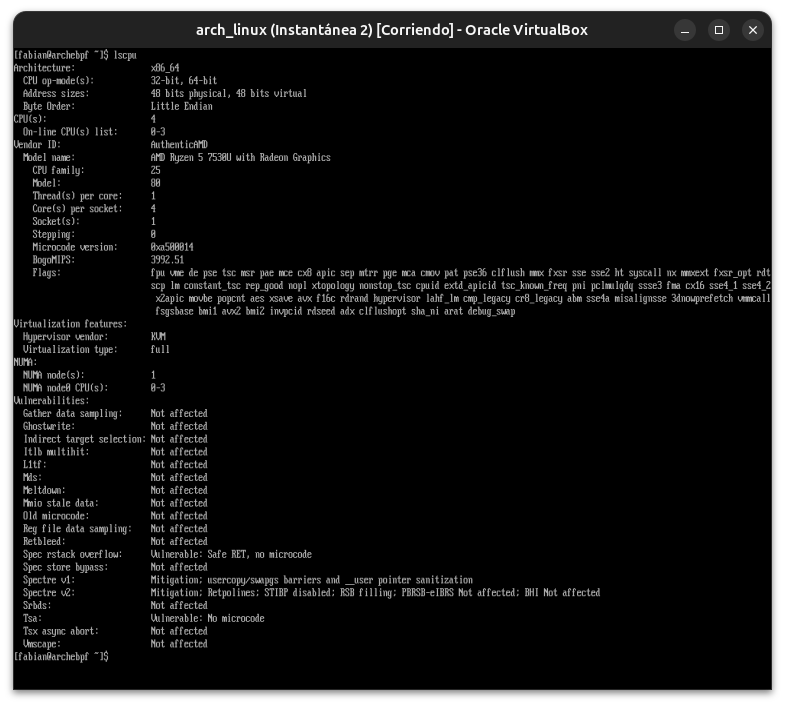
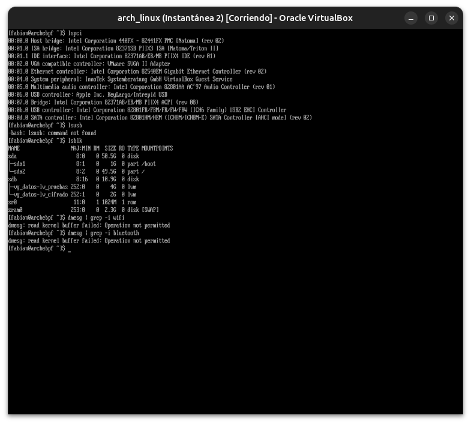
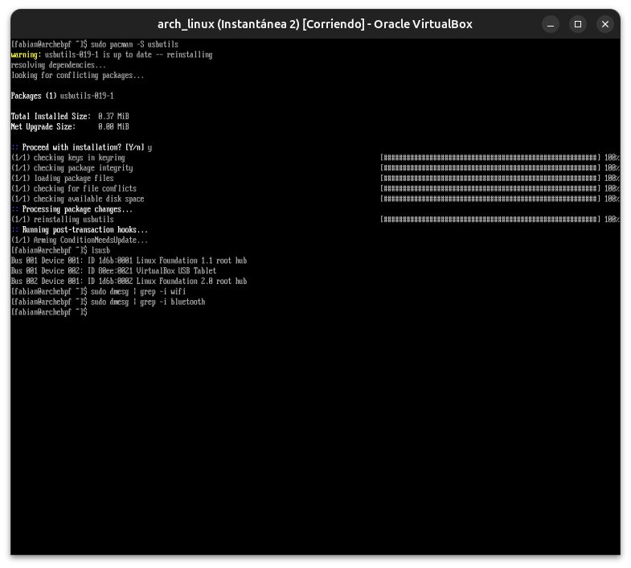

# Módulo 00 — Hardware Discovery & Preinstallation

**Fase 00 — Hardware Discovery**

---

## Objetivos del módulo

- Reutilizar la VM `arch_linux` del curso anterior como base de este curso de escritorio (en vez de crear una VM nueva desde cero).
- Revisar su configuración actual en VirtualBox y ajustarla para lo que este curso necesita (más video memory, aceleración 3D).
- Entender qué hardware es real y cuál es virtualizado, antes de avanzar a instalar el entorno gráfico.
- Dejar un inventario documentado que sirva de referencia para el resto del curso (sobre todo para los módulos de GPU, audio y networking, donde la diferencia VM/físico importa).

---

## 1. CONCEPTO: por qué reusar la VM en vez de crear una nueva

El plan original de este módulo era crear una VM nueva y separada para el curso de escritorio. En la práctica, la decisión correcta fue otra: la VM `arch_linux` ya existe, ya tiene Arch instalado y configurado desde el Módulo 06 del curso anterior, y crear una segunda VM solo para "empezar de cero" hubiera significado repetir instalación, particionado y configuración base sin aprender nada nuevo — puro costo de tiempo y disco.

Este curso arranca entonces **sobre la instalación existente**, tratando la Fase 01 (instalación) como una **auditoría y ajuste** de lo que ya está, no como una instalación desde una ISO en blanco.

```
┌─────────────────────────────────────────┐
│  Arch Linux (guest) — instalación        │  ← la misma desde el Módulo 06
│  existente del curso anterior             │     del curso anterior
├─────────────────────────────────────────┤
│  VirtualBox (hypervisor tipo 2)           │
│  traduce el "hardware virtual" a          │
│  llamadas reales al sistema anfitrión     │
├─────────────────────────────────────────┤
│  Ubuntu (host) sobre tu HP 255 G10        │  ← el hardware real vive acá
└─────────────────────────────────────────┘
```

---

## 2. POR QUÉ EXISTE: la restricción real detrás de esta decisión

La laptop (HP 255 G10) es tu herramienta de trabajo diaria con Ubuntu — no se puede reinstalar solo con Arch. Esa restricción ya estaba documentada en `docs/guia.md`. Lo que se ajusta acá es una capa más: tampoco tiene sentido duplicar la VM cuando la existente ya resuelve la base (Arch instalado, particionado, red funcionando). El curso se enfoca en lo que realmente es nuevo: el entorno gráfico completo y todo su ecosistema, no repetir una instalación ya dominada.

La consecuencia técnica sigue siendo la misma que ya estaba anotada: algunos módulos (GPU dedicada, Wi-Fi, Bluetooth, batería/ACPI) van a estar marcados como **adaptados** u **opcionales**, porque VirtualBox no expone ese hardware de forma real al guest, sea la VM nueva o reusada.

---

## 3. ARQUITECTURA: qué expone VirtualBox realmente

| Componente | ¿Qué ve el guest Arch? |
|---|---|
| CPU | Los mismos núcleos/instrucciones del host, pasados casi directo (VT-x/AMD-V) |
| RAM | Un bloque de memoria del tamaño que le asignes, gestionado por el host |
| GPU | Un dispositivo gráfico virtual de VirtualBox (VMSVGA), no tu GPU real |
| Disco | Un archivo `.vdi` en el host, que el guest ve como un disco SATA normal |
| Red | Un adaptador Ethernet virtual (NAT o Bridged), nunca Wi-Fi nativo |
| Audio | Un controlador de audio virtual, pero conectado de verdad al audio del host |
| USB | Nada, salvo que actives passthrough explícito de un dispositivo del host |

Esto no es una limitación oculta — es la razón exacta por la que la guía marca ciertos módulos como adaptados. Se comprueba en la práctica de este módulo, sobre la VM real que ya tenés.

---

## 4. HERRAMIENTA: revisar y ajustar la configuración de la VM existente

Con la VM `arch_linux` **apagada**, abrir `Configuración` en VirtualBox y revisar contra esta tabla:

| Opción | Valor confirmado en esta VM | Estado |
|---|---|---|
| RAM | 4900 MB | ✅ OK — suficiente para un entorno gráfico completo (Fase 03) |
| CPU | 4 núcleos | ✅ OK — de sobra para compilar paquetes AUR (Fase 08) |
| Video Memory | 256 MB (máximo permitido) | ✅ Ya estaba al máximo |
| Aceleración 3D | Tildado | ✅ Ya estaba activada |
| Controlador gráfico | VMSVGA | ✅ OK — es el recomendado por VirtualBox para guests Linux modernos |
| Firmware (EFI) | Checkbox "UEFI" **destildado** en `Sistema → Placa base` | **BIOS legacy confirmado**, no UEFI — el Módulo 03 (UEFI/bootloaders) se adapta para explicar GRUB en BIOS en vez de systemd-boot en UEFI |
| Audio | ICH AC97, controlador de anfitrión: Predeterminado | ✅ OK para empezar — se revisa a fondo en la Fase 05 (PipeWire) |
| Disco | `arch_linux.vdi` (50,45 GB) + `arch_linux_1.vdi` (10,85 GB) | ✅ OK — espacio de sobra para los snapshots de Btrfs (Fase 07) |

---

## 5. EJEMPLO: arrancando la VM existente e investigando su hardware

Encendé la VM. Va a bootear por GRUB directo a la instalación existente (no hay ISO live que montar, ya está instalado):

```
GNU GRUB version 2:2.14-1
*Arch Linux
 Advanced options for Arch Linux
```

Después del login (`archebpf login:`), con la sesión ya iniciada, corré el mismo inventario que se haría antes de instalar, pero ahora sobre el sistema real ya en marcha:

```bash
lscpu
lspci
lsusb
lsblk
dmesg | grep -i wifi
dmesg | grep -i bluetooth
```

`lspci` va a mostrar el mismo tipo de dispositivos virtuales que en cualquier VM de VirtualBox (`VMware SVGA II Adapter` o similar para la GPU) — la prueba de que, aunque la instalación ya exista, el hardware debajo sigue siendo virtual. Las líneas de `dmesg` sobre Wi-Fi/Bluetooth casi seguro no van a devolver nada, por la misma razón.

---

## 6. PRÁCTICA

1. Ajustar la configuración de la VM según la tabla de la sección 4 (video memory, aceleración 3D, confirmar EFI).
2. Arrancar la VM y correr el inventario de la sección 5.
3. Completar esta tabla con lo que realmente encontraste:

| Componente | Comando usado | Resultado observado | ¿Real o virtual? |
|---|---|---|---|
| CPU | `lscpu` | AMD Ryzen 5 7530U with Radeon Graphics, 4 CPUs, hypervisor KVM (virtualization: full) | **Real** — el modelo exacto de la HP 255 G10, pasado casi directo al guest |
| GPU | `lspci` | `VGA compatible controller: VMware SVGA II Adapter` | **Virtual** |
| Red | `lspci` | `Ethernet controller: Intel Corporation 82540EM Gigabit Ethernet Controller` | **Virtual** (emulada) |
| Disco | `lsblk` | `sda` 50.56G (`sda1`→`/boot`, `sda2`→`/`) + `sdb` 10.96G con LVM (`vg_datos-lv_pruebas`, `vg_datos-lv_cifrado`) + `zram0` 2.36G SWAP | **Virtual** como dispositivo, con LVM/LUKS real armado en el Módulo 11 del curso anterior |
| Audio | `lspci` | `Multimedia audio controller: Intel Corporation 82801AA AC'97 Audio Controller` | **Virtual**, pero conectado al audio real del host |
| USB | `lsusb` (tras `sudo pacman -S usbutils`) | Solo `Linux Foundation root hub` (x2) y `VirtualBox USB Tablet` | **Virtual** — sin dispositivos USB reales pasados por passthrough |
| Wi-Fi | `sudo dmesg \| grep -i wifi` | Sin resultados | **No existe** en esta VM |
| Bluetooth | `sudo dmesg \| grep -i bluetooth` | Sin resultados | **No existe** en esta VM |

4. Tabla completada y guardada como evidencia inicial del curso — referencia directa para los módulos de GPU (06), Wi-Fi (18) y Bluetooth (19) más adelante.

**Nota de diagnóstico:** la primera corrida de `dmesg` (sin `sudo`) falló con `read kernel buffer failed: Operation not permitted` — eso es un error de permisos, no evidencia de ausencia de hardware. Hubo que repetir con `sudo dmesg` para tener una lectura válida (vacía, confirmando la ausencia real de Wi-Fi/Bluetooth).

---

## 7. ERROR INTENCIONAL / DIAGNÓSTICO

Con la VM apagada, desmontá o desconectá temporalmente el disco `arch_linux.vdi` principal desde `Configuración → Almacenamiento` (sin borrarlo, solo quitarlo del controlador SATA) y arrancá la VM.

**Diagnóstico esperado:** el firmware (BIOS/UEFI emulado por VirtualBox) va a recorrer sus dispositivos de arranque configurados y, al no encontrar ninguno con un sistema operativo válido, va a mostrar algo como `FATAL: No bootable medium found! System halted.`

Esto es la misma regla del Módulo 30 del curso anterior (firmware busca dispositivo de arranque válido, carga los primeros bytes, salta ahí) — comprobada de nuevo acá, sobre la instalación real que vas a seguir usando. Volvé a conectar el disco antes de seguir.

---

## 8. RETO

Usando `lspci -k` (que muestra qué driver del kernel está manejando cada dispositivo), identificá el nombre exacto del driver que Linux carga para la GPU virtual de VirtualBox en esta VM. Vas a necesitar esa respuesta en el Módulo 06 (GPU Drivers) para confirmar si cambió algo después de activar la aceleración 3D.

---

## Checklist de cierre del módulo

- [x] Revisé la configuración de la VM `arch_linux` existente contra la tabla de la sección 4.
- [x] Confirmé que video memory (256 MB) y aceleración 3D ya estaban al máximo/activada.
- [x] Confirmé que la VM está en BIOS legacy (UEFI destildado), no UEFI.
- [x] Corrí el inventario completo de hardware sobre la instalación real.
- [x] Completé la tabla de la sección 6 con resultados reales, no supuestos.
- [ ] Provoqué y diagnostiqué el fallo de arranque sin disco conectado, y volví a conectar el disco.
- [x] Puedo explicar, en mis propias palabras, qué de lo que vi es real (pasa del host) y qué es pura emulación de VirtualBox.

---

## Evidencias

**01 — VM `arch_linux` existente: detalles de configuración**
Memoria 4900 MB, 4 procesadores, video memory 16 MB (a subir), controlador gráfico VMSVGA, audio ICH AC97, disco `arch_linux.vdi` (50,45 GB) + `arch_linux_1.vdi` (10,85 GB) — la misma VM del curso anterior, reutilizada como base de este.



**02 — GRUB: arrancando la instalación existente**
No hay ISO live que bootear — la VM ya tiene Arch instalado, así que arranca directo por GRUB a la instalación del curso anterior.



**03 — Prompt de login: `archebpf login:`**
La VM está arriba y lista para iniciar sesión y correr el inventario de hardware.



**04 — `lscpu`: CPU real, no virtual**
`AMD Ryzen 5 7530U with Radeon Graphics`, 4 CPUs, `Hypervisor vendor: KVM`, `Virtualization type: full` — el modelo exacto de la HP 255 G10 pasado casi directo al guest.



**05 — `lspci` + `lsblk`: GPU, red y audio virtuales**
`VMware SVGA II Adapter` (GPU), `Intel 82540EM Gigabit Ethernet Controller` (red), `Intel 82801AA AC'97 Audio Controller` (audio) — los tres emulados por VirtualBox. `lsblk` muestra `sda`/`sdb` con el LVM y volumen cifrado armados en el Módulo 11 del curso anterior.



**06 — `lsusb` (tras instalar `usbutils`) y `dmesg` de Wi-Fi/Bluetooth vacíos**
Solo hubs USB virtuales y el `VirtualBox USB Tablet`. `sudo dmesg | grep -i wifi` y `sudo dmesg | grep -i bluetooth` no devuelven nada — confirmación final de que no existe ese hardware en esta VM.



---

**Próximo módulo:** 01 — Arch Linux Installation (VM VirtualBox) — auditoría de la instalación existente
