# Módulo 02 — Manual Installation vs Archinstall

**Fase 01 — Instalación real (en VM)**

> ⚠️ **Advertencia crítica de este módulo:** vamos a explorar `archinstall`, la herramienta oficial de instalación guiada de Arch — pero **sin dejarla tocar el disco real** de esta VM (ya tiene tu sistema instalado y auditado en los Módulos 00-01). Vamos a generar una configuración y cancelar **antes** del paso de aplicar cambios. Si en algún punto el programa pregunta "¿Proceder con la instalación?" o similar, la respuesta es **no**, salvo que se indique explícitamente lo contrario.

---

## Objetivos del módulo

- Entender qué es `archinstall` y qué pasos automatiza (comparado con lo que hiciste a mano en el Módulo 06 del curso anterior).
- Recorrer su instalador guiado hasta generar una configuración, sin aplicarla.
- Comparar la configuración generada contra tu instalación manual real (auditada en el Módulo 01).
- Decidir con criterio cuándo usar cada enfoque en el mundo real.

---

## 1. CONCEPTO: qué es `archinstall`

`archinstall` es un instalador **oficial** de Arch Linux (mantenido por el propio proyecto, incluido en el ISO desde 2021), escrito en Python, que automatiza exactamente la secuencia que hiciste a mano en el Módulo 06 del curso anterior: particionar, formatear, `pacstrap`, generar `fstab`, `arch-chroot`, configurar locale/hostname/bootloader.

**No es una distro derivada ni un instalador de terceros** (a diferencia de, por ejemplo, Manjaro) — es una capa de automatización oficial sobre el mismo proceso manual, pensada para reducir errores humanos y tiempo, sin cambiar la filosofía de Arch.

---

## 2. POR QUÉ EXISTE: el trade-off real

| | Instalación manual (Módulo 06 del curso anterior) | `archinstall` |
|---|---|---|
| Control | Total, cada decisión explícita | Guiado, con defaults razonables |
| Velocidad | Lenta la primera vez, rápida cuando ya sabés | Rápida siempre |
| Aprendizaje | Alto — entendés cada paso | Menor, a menos que inspecciones lo que genera |
| Repetibilidad | Manual cada vez (o con tus propios scripts) | Config JSON reutilizable para instalar N máquinas idénticas |
| Errores humanos | Más probable (como viste en varios módulos del curso anterior: typos, UUIDs mal copiados) | Menos, porque el código ya está probado |

**La razón por la que este curso empezó con instalación manual (curso anterior) y no con `archinstall` directamente:** no podés automatizar con criterio lo que no entendés a mano. Ahora que ya instalaste manualmente y auditaste una instalación real, tiene sentido conocer la herramienta que un sysadmin real usaría para desplegar 20 máquinas idénticas sin repetir el proceso manual 20 veces.

---

## 3. HERRAMIENTA: instalar y explorar `archinstall`

```bash
sudo pacman -S archinstall
archinstall --version
```

**No lo corras todavía como root/sudo con intención de instalar** — primero, revisemos qué hace en modo exploración.

```bash
archinstall --help
```

Fijate las opciones `--config` y `--creds` — permiten pasarle una configuración ya armada (modo no interactivo), útil para automatizar despliegues reales (conexión directa con el Módulo 27 del curso anterior: Ansible/IaC, mismo espíritu de "configuración declarativa" aplicado a la instalación misma).

---

## 4. EJEMPLO: recorrer el instalador guiado sin aplicar cambios

```bash
sudo archinstall
```

Vas a ver un menú interactivo (TUI). Navegá por las opciones típicas:

1. **Locales** → elegí idioma/teclado (ej: `es`, `es_AR` o similar).
2. **Mirrors** → dejá los de tu región o el default.
3. **Disk configuration** → **acá es donde hay que tener cuidado.** Podés entrar a ver las opciones (particionado guiado, LVM, encriptación — todo lo que hiciste a mano en el curso anterior, ahora como menú) **sin confirmar nada**. Salí de esa sección con Esc/cancelar antes de que pregunte "seleccionar disco para borrar".
4. **Bootloader** → mirá las opciones (Grub, systemd-boot) — comparalo con que vos usás Grub en modo BIOS.
5. **Profile** → acá aparecen los perfiles de escritorio (GNOME, KDE, servidor mínimo, etc.) — que vas a instalar manualmente vos mismo en los módulos de Fase 02-03, para entenderlos a fondo en vez de que `archinstall` lo haga por vos.

Cuando termines de recorrer las opciones, buscá la opción de menú **"Save configuration"** (o similar, según versión) — esto exporta un `user_configuration.json` y `user_credentials.json` **sin instalar nada**. Salí del programa después (Ctrl+C si hace falta, o la opción de salir del menú principal).

```bash
ls -la
cat user_configuration.json | python3 -m json.tool
```

---

## 5. CÓMO FUNCIONA: comparar la config generada contra tu instalación real

Con el JSON generado y lo que ya sabés de tu instalación real (Módulo 01), comparemos:

| Campo en el JSON de `archinstall` | Tu instalación real (Módulo 01) |
|---|---|
| `bootloader` | Grub (BIOS legacy) |
| `filesystem` elegido para root | ext4 (confirmaste con `lsblk -f`) |
| Layout de disco elegido en el menú | `sda1` boot (vfat) + `sda2` root (ext4), MBR |
| `hostname` | `archebpf` |

**Qué te confirma este ejercicio:** el JSON de `archinstall` no es magia — es exactamente la misma información que extrajiste vos mismo con `fdisk`, `lsblk`, `blkid` en el Módulo 01, solo que estructurada para que un programa la consuma y ejecute automáticamente.

---

## 6. PRÁCTICA

1. Instalá `archinstall` y revisá `archinstall --help`.
2. Recorré el menú guiado, sección por sección, **sin llegar a confirmar la instalación**.
3. Generá y guardá la configuración (`Save configuration`), sin instalar.
4. Compará el JSON generado contra tu instalación real, usando la tabla de la sección 5 como base.
5. Reflexión escrita: ¿en qué escenario profesional usarías `archinstall --config archivo.json --silent` en vez de instalar a mano? Pensá en términos de cuántas máquinas, cuánta gente, y cuánta necesidad de que todas queden idénticas.

---

## 7. ERROR INTENCIONAL / DIAGNÓSTICO

```bash
archinstall --config archivo_que_no_existe.json
```

**Diagnóstico esperado:** un error claro indicando que no pudo encontrar/leer el archivo de configuración — mismo patrón de validación que ya viste en Ansible (Módulo 27 del curso anterior) cuando un playbook referencia algo inexistente.

---

## Checklist de cierre del módulo

- [ ] Entiendo qué automatiza `archinstall` respecto a la instalación manual del curso anterior.
- [ ] Recorrí el menú guiado completo sin aplicar ningún cambio al disco real.
- [ ] Generé y revisé un `user_configuration.json`.
- [ ] Comparé la configuración generada contra mi instalación real, campo por campo.
- [ ] Puedo argumentar, con criterio propio, cuándo usar cada enfoque en un escenario profesional real.

---

## Evidencias

**01 — Mirror 404 al instalar `archinstall`**
Mismo problema conocido de mirrors desactualizados de `geo.mirror.pkgbuild.com`.

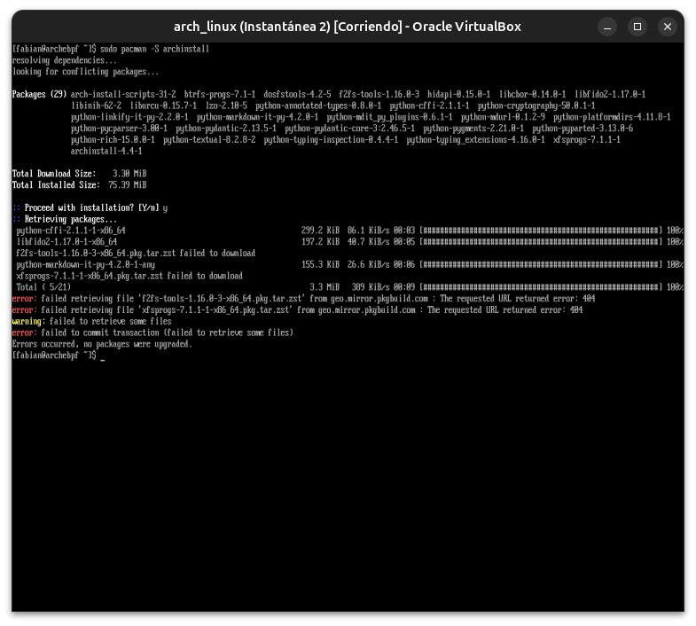

**02 — Reintento exitoso**
`pacman -Syy` + reinstalación completa, con regeneración de `initramfs`.

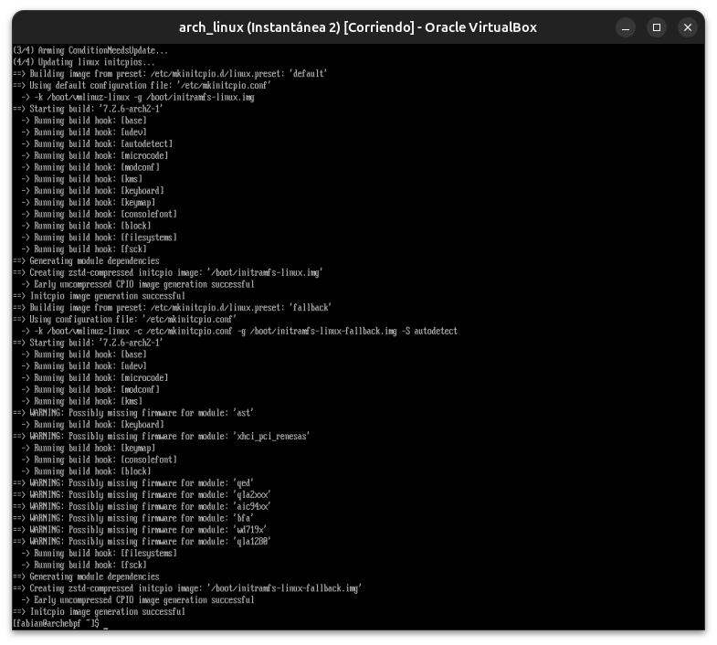

**03 — `archinstall --version`/`--help`: el flag `--dry-run`**
`archinstall 4.4` instalado. El `--help` revela `--dry-run`: genera configuración y sale sin instalar — la protección clave de este módulo.

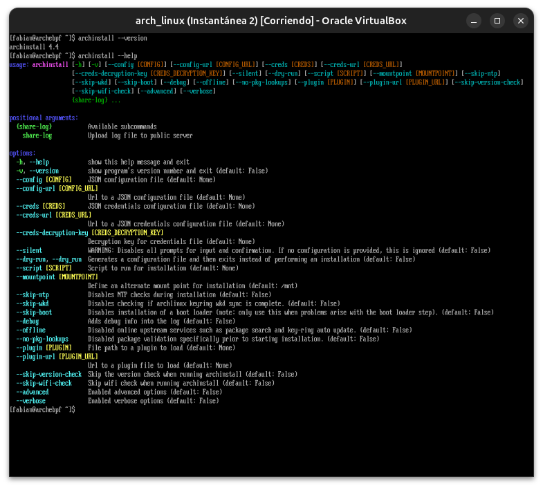

**04 — Menú principal (inglés)**
Primera vista del TUI de `archinstall` corrido con `--dry-run`.

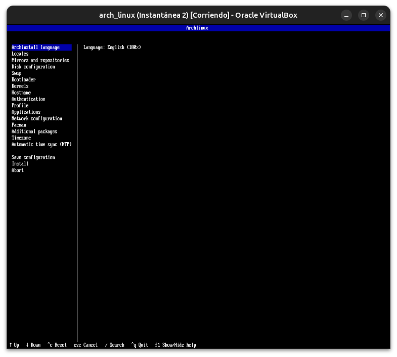

**05 — Locale `es_CO` seleccionado**
Hasta el propio menú de `archinstall` cambió a español tras elegir el idioma.

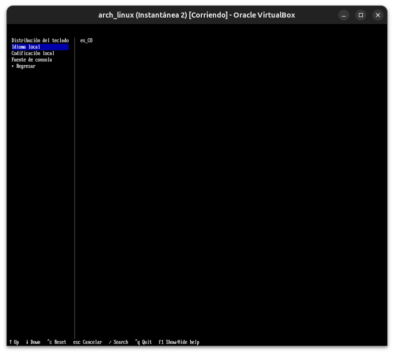

**06 — Configuración de disco: 3 opciones**
Diseño predeterminado, partición manual, o configuración premontada — comparado con la partición manual real hecha en el curso anterior.

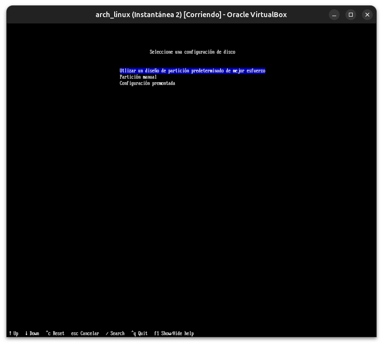

**07 — Selección de discos: partición real detectada**
`archinstall` reconoce `sda1` (fat32, boot, 1GiB) y `sda2` (ext4, 49.5GiB) — coincide exactamente con la auditoría del Módulo 01.

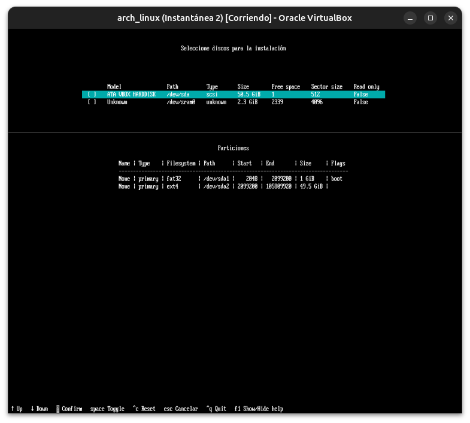

**08 — Pantalla de particionamiento, explorada sin confirmar**
Un paso más adentro del flujo destructivo, protegido por `--dry-run`, sin llegar a seleccionar nada.

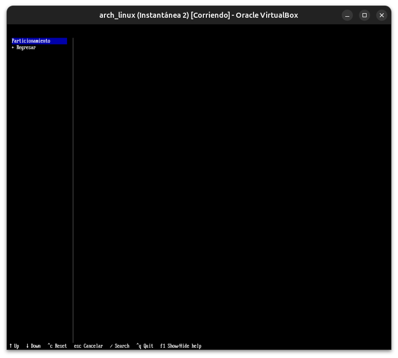

**09 — Gestor de arranque: Grub (+ Plymouth)**
`Grub` ya preseleccionado por defecto, coincidiendo con la instalación real. `Plymouth` (splash gráfico) es una opción que la instalación manual del curso anterior no configuró.

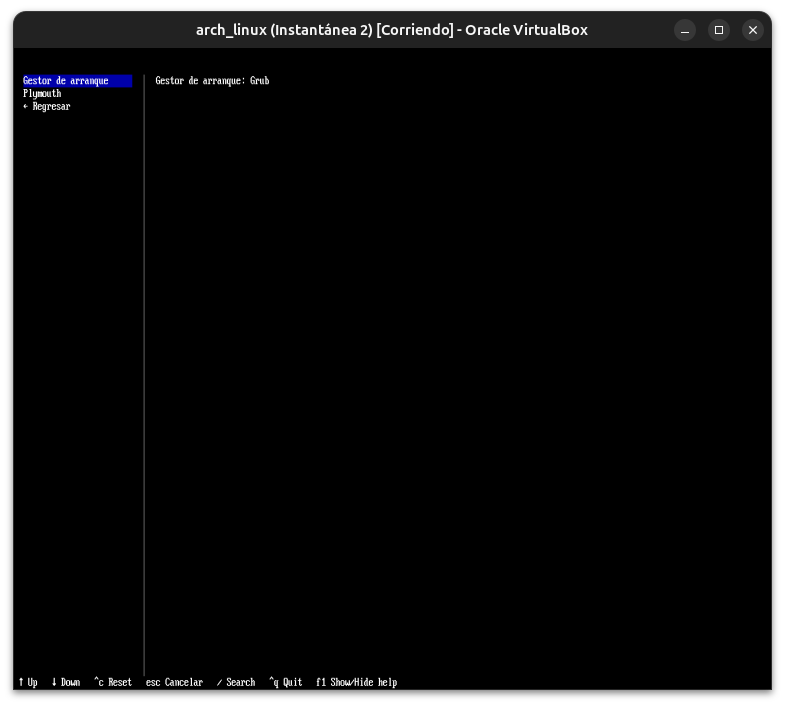

**10 — Guardar configuración: preview del JSON**
Vista previa completa del `user_configuration.json` antes de guardar — bootloader, hostname, locale, swap, todo consistente con lo esperado.

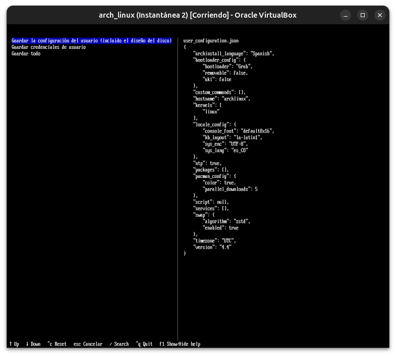

**11 — Directorio inválido (carpeta de proyectos)**
Primer intento de guardar en una carpeta que no existía.

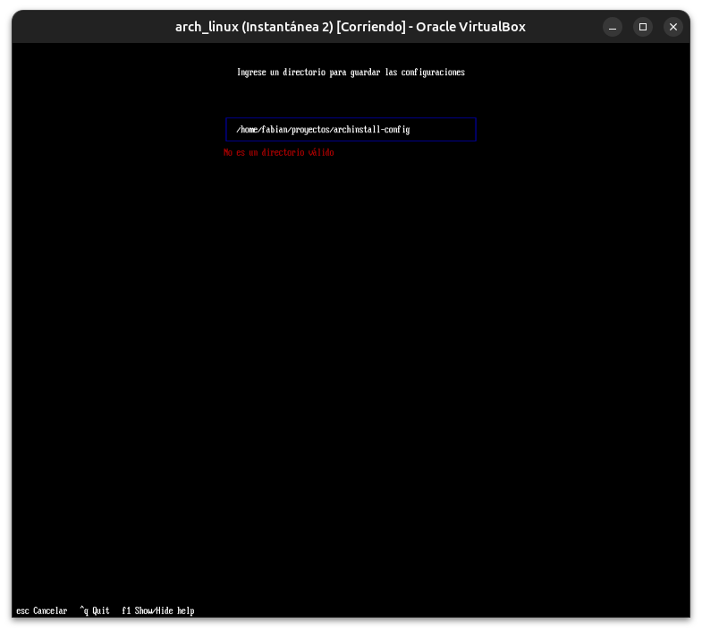

**12 — Directorio inválido (subcarpeta de /tmp)**
Segundo intento, misma causa: el subdirectorio no existe, `archinstall` no lo crea automáticamente.

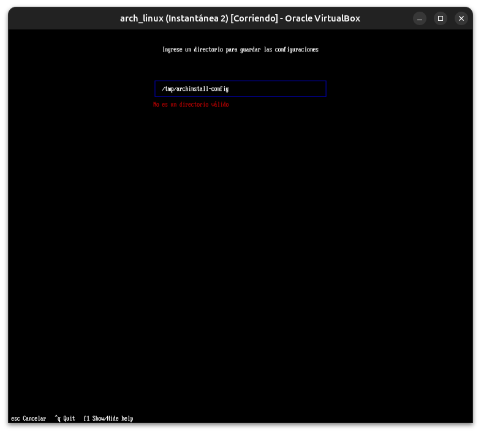

**13 — Confirmar guardar en `/tmp`**
Usando el directorio raíz `/tmp` (que sí existe), confirmado.

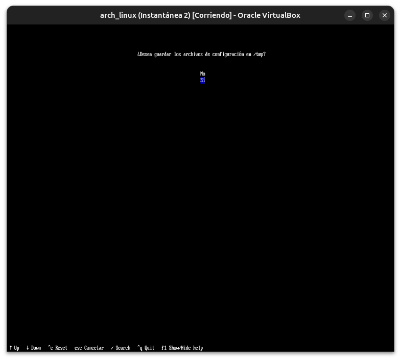

**14 — No encriptar credenciales**
Decisión razonable para este ejercicio de exploración, sin datos sensibles reales.

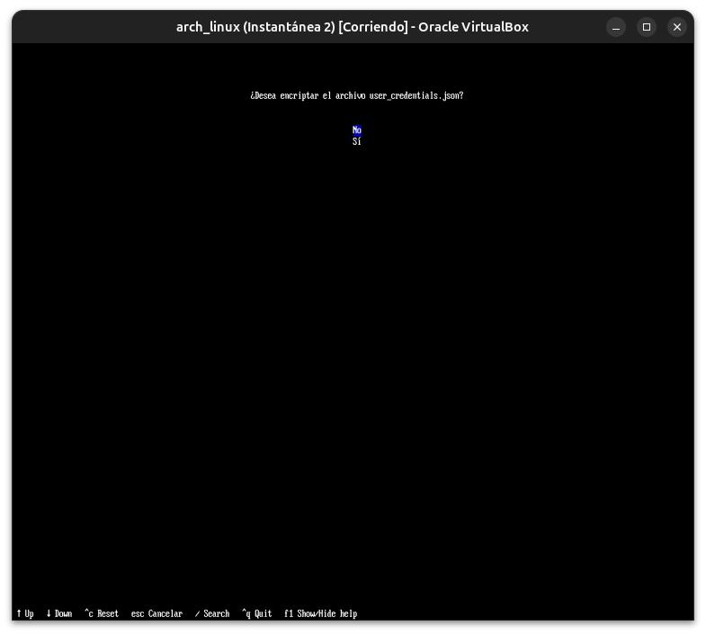

**15 — Menú principal final, antes de Abortar**
Configuración guardada, listo para salir sin instalar.

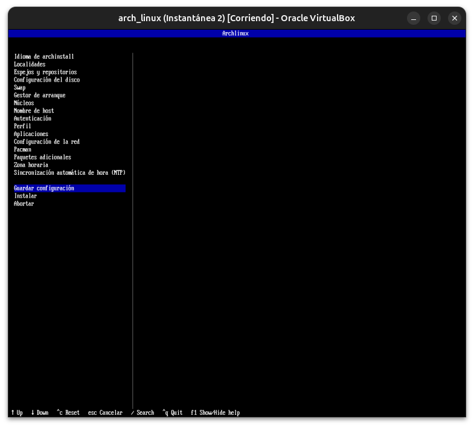

**16 — Programa cerrado sin instalar nada**
`archinstall --dry-run` terminó limpio, disco intacto.

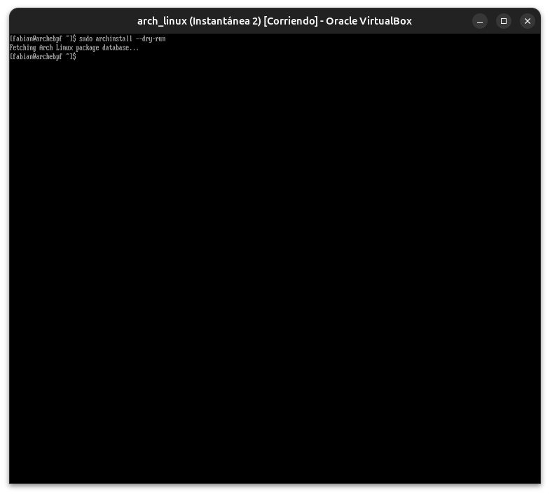

**17 — Error real de permisos: `Permission denied`**
El JSON fue creado por `root` (vía `sudo`); el usuario normal no podía leerlo — mismo principio del Módulo 04 del curso anterior.

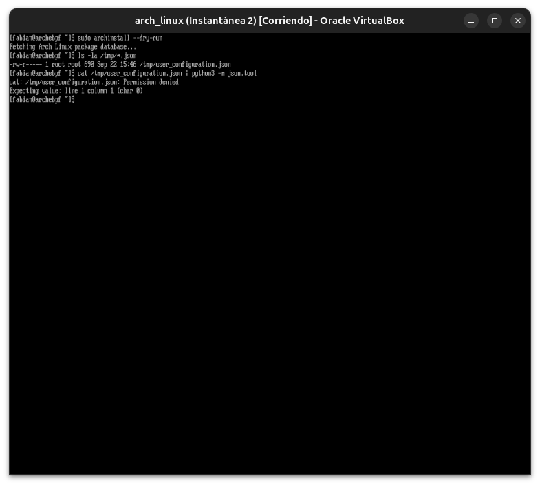

**18 — `sudo cat` exitoso: JSON final confirmado**
Configuración completa leída y comparada campo por campo contra la instalación real.

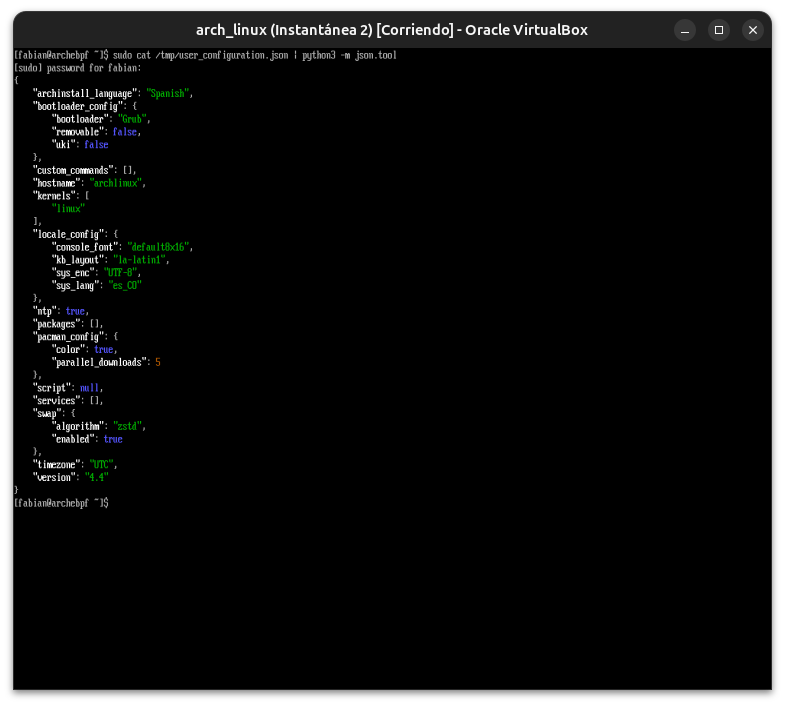

---

**Próximo módulo:** 03 — UEFI, Bootloaders & Secure Boot.
