# Módulo 03 — UEFI, Bootloaders & Secure Boot

**Fase 01 — Instalación real (en VM)**

> **Nota de adaptación:** tu sistema real es **BIOS legacy** (confirmado desde el Módulo 00 del curso anterior). Este módulo no puede auditar un UEFI real en tu instalación existente — en su lugar, vamos a arrancar el **ISO de Arch en una VM nueva y descartable, con firmware UEFI habilitado**, solo para explorar el entorno live (sin instalar nada), y así ver de primera mano lo que tu sistema real no tiene. Al final volvés a tu VM `arch_linux` de siempre, sin cambios.

---

## Objetivos del módulo

- Entender la arquitectura UEFI: NVRAM, boot manager, ESP (EFI System Partition).
- Entender Secure Boot: cadena de confianza, por qué existe, qué problema resuelve.
- Explorar variables UEFI reales en un entorno live, comparándolas contra tu sistema BIOS real.
- Instalar y entender `sbctl` (gestión de Secure Boot en Arch) a nivel conceptual/herramienta.

---

## 1. CONCEPTO: UEFI vs BIOS, en profundidad (más allá del Módulo 00/10 del curso anterior)

Ya sabés que BIOS lee los primeros 512 bytes de un disco y busca la firma `0x55 0xAA` (Módulo 30 del curso anterior — tu propio boot sector). UEFI resuelve varios problemas que ese modelo tiene:

| Problema de BIOS/MBR | Solución de UEFI/GPT |
|---|---|
| Máximo 4 particiones primarias | GPT soporta hasta 128 particiones |
| Límite de disco de 2TB | GPT soporta discos mucho más grandes (64-bit LBA) |
| Bootloader limitado a 512 bytes, en ensamblador real-mode | El firmware UEFI puede ejecutar programas `.efi` completos, en un entorno de 32/64-bit desde el arranque |
| Sin verificación de autenticidad del código de arranque | Secure Boot: cadena de firmas criptográficas |

**La ESP (EFI System Partition):** en un sistema UEFI, en vez de un boot sector de 512 bytes, existe una partición FAT32 dedicada (típicamente `/boot` o `/efi`) que contiene archivos `.efi` — programas reales, no un simple salto a `0x7C00`. El firmware UEFI lee directamente el sistema de archivos de esa partición (a diferencia de BIOS, que no entiende filesystems en absoluto).

---

## 2. CONCEPTO: NVRAM y boot manager

UEFI guarda **entradas de arranque** en una memoria no volátil de la placa madre (NVRAM) — no en el disco. Cada entrada apunta a un archivo `.efi` específico en una ESP. Esto permite tener **múltiples sistemas operativos instalados**, cada uno con su propia entrada, sin pelearse por "quién es el único bootloader" como pasa en MBR.

```bash
# (Esto NO funciona en tu sistema real BIOS — lo vas a correr en la VM live UEFI de la sección 4)
efibootmgr -v
```

---

## 3. CONCEPTO: Secure Boot — la cadena de confianza

**El problema que resuelve:** sin Secure Boot, cualquier código puede ejecutarse en la etapa de arranque, antes de que el sistema operativo (con sus propias protecciones) esté corriendo — un punto ciego ideal para malware de "bootkit" que se instala más profundo que cualquier antivirus.

**Cómo funciona:**
1. El firmware UEFI tiene claves criptográficas de confianza integradas (de Microsoft, del fabricante, etc.).
2. Cada archivo `.efi` que se intenta ejecutar debe estar **firmado digitalmente** con una clave que el firmware reconozca.
3. Si la firma no es válida o no está en la lista de confianza, el firmware **rechaza ejecutar ese código**.

**Por qué Arch Linux no viene firmado por defecto:** a diferencia de Windows (firmado por Microsoft) o Ubuntu (usa `shim` firmado por Microsoft como puente), Arch es una distribución que vos armás a mano — no hay una firma "de fábrica". Para usar Secure Boot con Arch, tenés que **firmar vos mismo** tu propio kernel y bootloader con tus propias claves (herramienta: `sbctl`), inscribiendo esas claves en el firmware en modo "Setup Mode".

---

## 4. HERRAMIENTA: explorar UEFI real en una VM live descartable

### 4.1 Crear la VM temporal

1. VirtualBox → **Nueva** → nombre `uefi-explorer` (o similar), tipo Linux/Arch.
2. En la configuración, **antes de arrancar**: `Sistema → Placa base → marcar "Habilitar EFI"`.
3. **No creés disco duro** (o creá uno mínimo que no vamos a usar) — vamos a arrancar el ISO en modo live únicamente, sin instalar nada.
4. Adjuntá el ISO de Arch (el mismo que ya tenés descargado, del Módulo 16 del curso anterior) al controlador IDE/óptico.
5. Arrancá la VM.

### 4.2 Explorar el entorno UEFI live

Una vez en el prompt del ISO live (`root@archiso ~ #`):

```bash
ls /sys/firmware/efi          # si esto EXISTE (a diferencia de tu sistema BIOS real), confirma que arrancaste en modo UEFI
efibootmgr -v                   # entradas de arranque actuales en la NVRAM (emulada por VirtualBox/OVMF)
cat /sys/firmware/efi/fw_platform_size   # 64 (UEFI de 64 bits) o 32
mount | grep efi                  # el ISO monta su propia ESP temporal para arrancar
```

Compará explícitamente: en tu VM `arch_linux` real, `ls /sys/firmware/efi` no existe (confirmado en el Módulo 00 del curso anterior). Acá sí.

---

## 5. HERRAMIENTA: `sbctl` — gestión de Secure Boot en Arch (a nivel conceptual)

```bash
sudo pacman -S sbctl
sbctl status
```

En tu sistema real (BIOS), `sbctl status` va a reportar que Secure Boot no aplica (no hay UEFI). Es esperado — el objetivo acá es conocer el flujo, no ejecutarlo de punta a punta:

```
sbctl create-keys        # generar tus propias claves de firma
sbctl enroll-keys          # inscribirlas en el firmware (requiere "Setup Mode" en UEFI real)
sbctl sign -s /boot/vmlinuz-linux    # firmar el kernel
sbctl verify                          # verificar qué archivos de arranque están firmados
```

**Por qué vale la pena conocerlo aunque no lo apliques hoy:** en cualquier laptop moderna real que instales Arch (fuera de esta VM), Secure Boot suele venir habilitado de fábrica — vas a necesitar exactamente este flujo si algún día instalás Arch en hardware físico y querés mantener Secure Boot activo en vez de deshabilitarlo.

---

## 6. PRÁCTICA

1. Creá la VM temporal UEFI, arrancá el ISO live, y confirmá que `/sys/firmware/efi` existe (a diferencia de tu sistema real).
2. Corré `efibootmgr -v` y `cat /sys/firmware/efi/fw_platform_size`.
3. Apagá y **borrá** esa VM temporal (Click derecho → Eliminar → "Eliminar todos los archivos") — era solo para explorar, no la necesitamos más.
4. En tu VM real (`arch_linux`), instalá `sbctl` y corré `sbctl status`, documentando que confirma que no hay UEFI/Secure Boot disponible.
5. Reflexión escrita: si mañana instalaras Arch en tu laptop física real (fuera de esta VM), y esa laptop tiene Secure Boot activado de fábrica — ¿qué pasos seguirías, en orden, usando lo aprendido en este módulo?

---

## 7. ERROR INTENCIONAL / DIAGNÓSTICO

En la VM temporal UEFI, antes de borrarla, probá:
```bash
cat /sys/firmware/efi/efivars/algo_que_no_existe
```

**Diagnóstico esperado:** `No such file or directory` — a diferencia de `/sys/firmware/efi` en sí (que si existe, confirma modo UEFI), las variables específicas dentro de `efivars/` son entradas reales que solo existen si algo las creó — no cualquier nombre funciona. Es un buen recordatorio de que `/sys` es una interfaz al estado real del kernel/firmware, no una lista fija.

---

## Checklist de cierre del módulo

- [ ] Entiendo la arquitectura UEFI: NVRAM, boot manager, ESP.
- [ ] Entiendo Secure Boot: cadena de confianza y por qué Arch no viene firmado de fábrica.
- [ ] Confirmé en una VM live temporal que `/sys/firmware/efi` existe en UEFI y no en BIOS.
- [ ] Instalé y exploré `sbctl` conceptualmente en mi sistema real.
- [ ] Puedo explicar, en orden, los pasos para instalar Arch con Secure Boot activo en hardware real.

---

## Evidencias

**01-04 — Creación de la VM temporal `uefi-explorer`**
Nombre, detección automática de "ArchLinux" como distribución, y el checkbox **"Use EFI"** marcado desde la creación — la VM nace con UEFI habilitado.

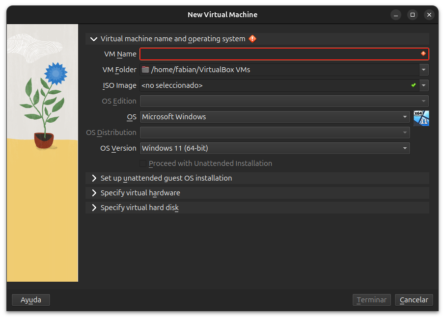
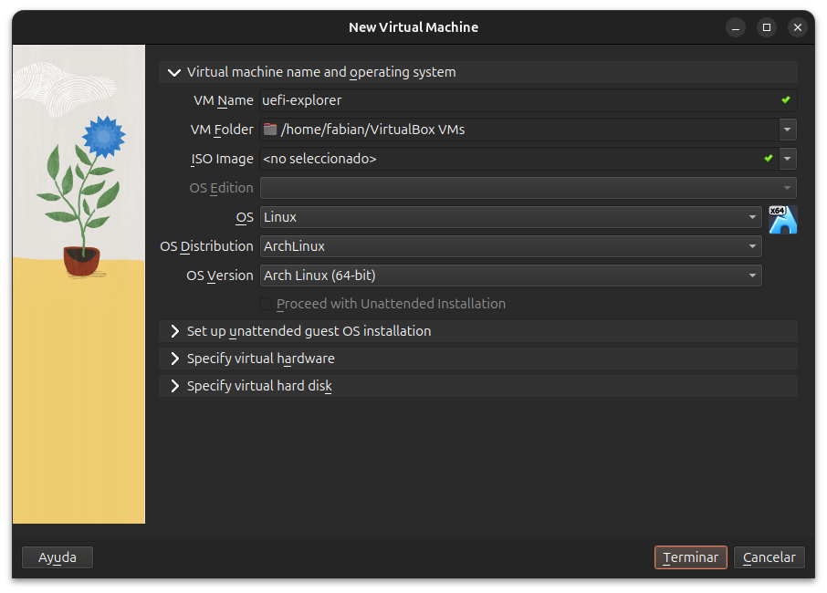
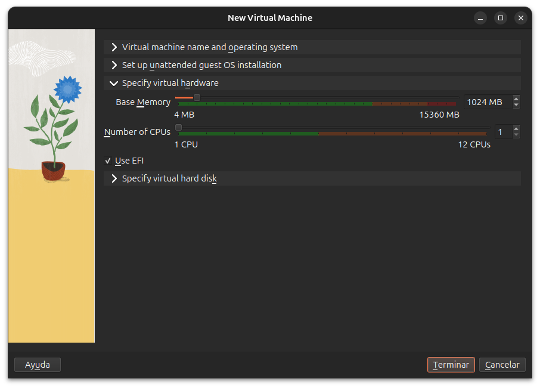
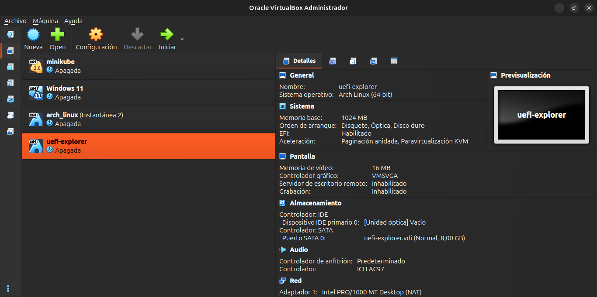

**05 — Nota real: "Boot Device Order (BIOS only)"**
Con EFI habilitado, esa lista de orden de arranque tradicional queda ignorada — UEFI usa sus propias entradas de NVRAM.

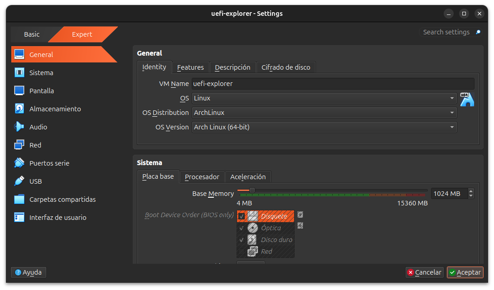

**06-11 — Adjuntar el ISO de Arch**
Navegación por Almacenamiento, selector de archivo (con detección del ISO corrupto de 57MB de un intento fallido anterior, descartado a favor del real de 1,6GB), y confirmación final.

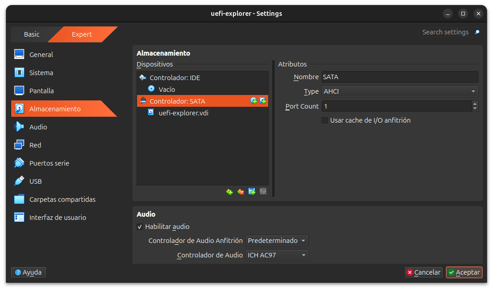
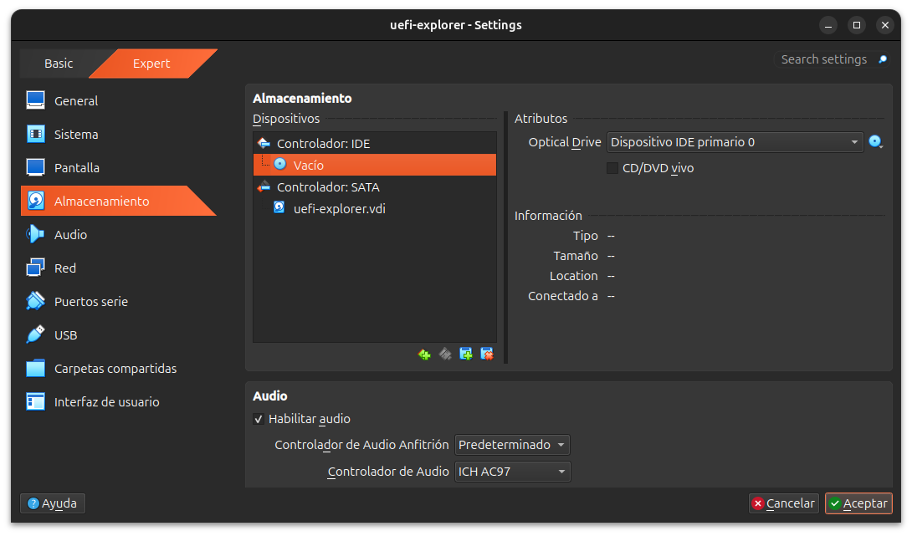
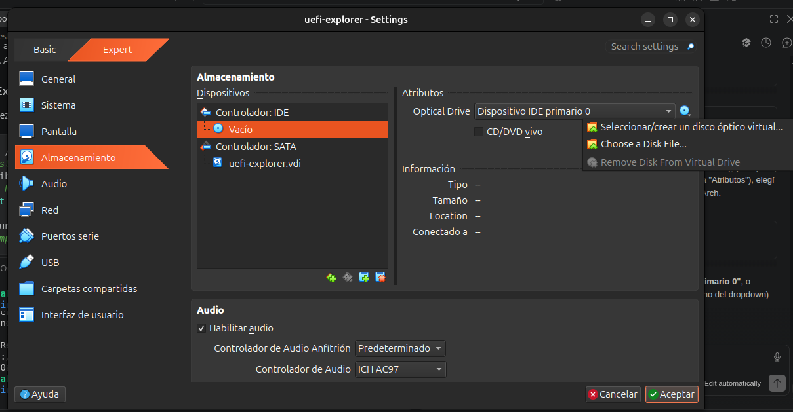
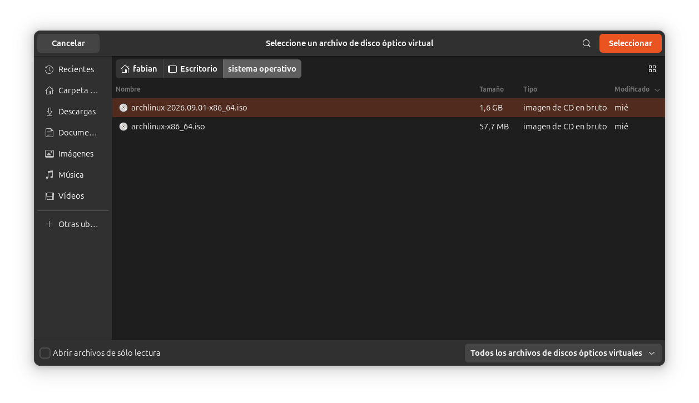
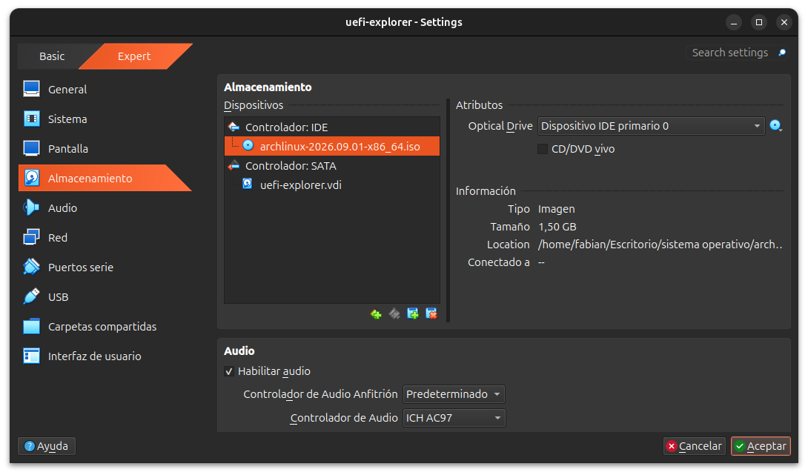
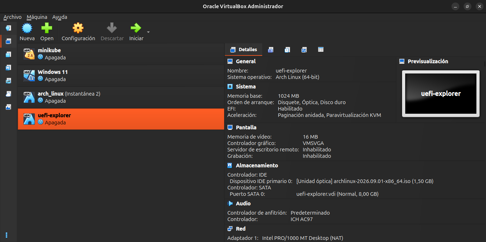

**12 — Menú de arranque: "UEFI" explícito + EFI Shell**
El propio menú de GRUB dice `(x86_64, UEFI)`, y aparecen opciones exclusivas de UEFI (`EFI Shell`, `Reboot Into Firmware Interface`) que no existen en modo BIOS.

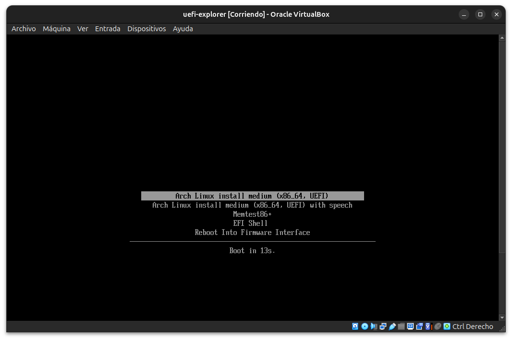

**13 — Log de arranque de systemd**
El entorno live completando su boot normal.

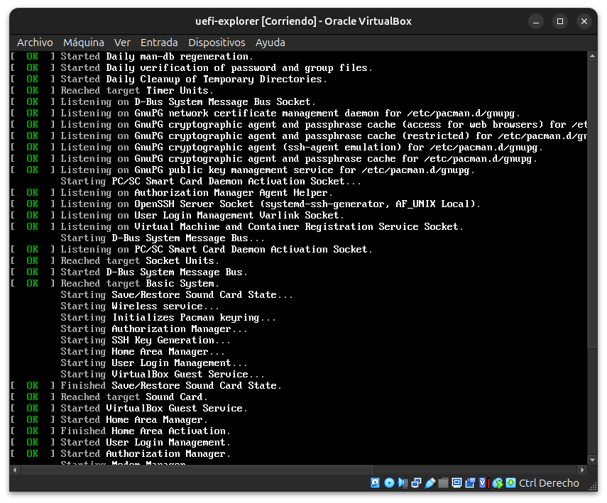

**14 — Login y exploración UEFI completa**
`ls /sys/firmware/efi` (existe, a diferencia del sistema real), `efibootmgr -v` (entradas reales de NVRAM: `UiApp`, `UEFI VBOX CD-ROM`, `UEFI VBOX HARDDISK`), y `fw_platform_size` = 64.

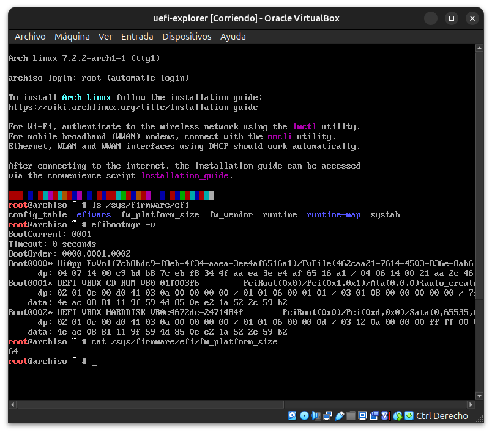

**15 — `mount | grep efi`: `efivarfs` confirmado**
El filesystem especial que expone las variables UEFI como archivos.

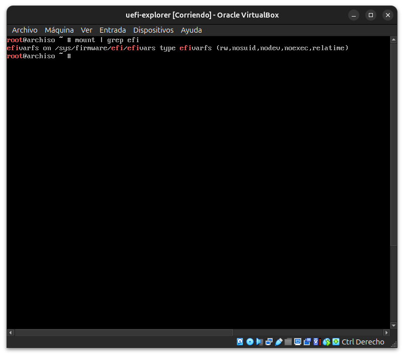

**16 — Error intencional: variable UEFI inexistente**
`No such file or directory` — confirma que no cualquier nombre funciona dentro de `efivars/`.

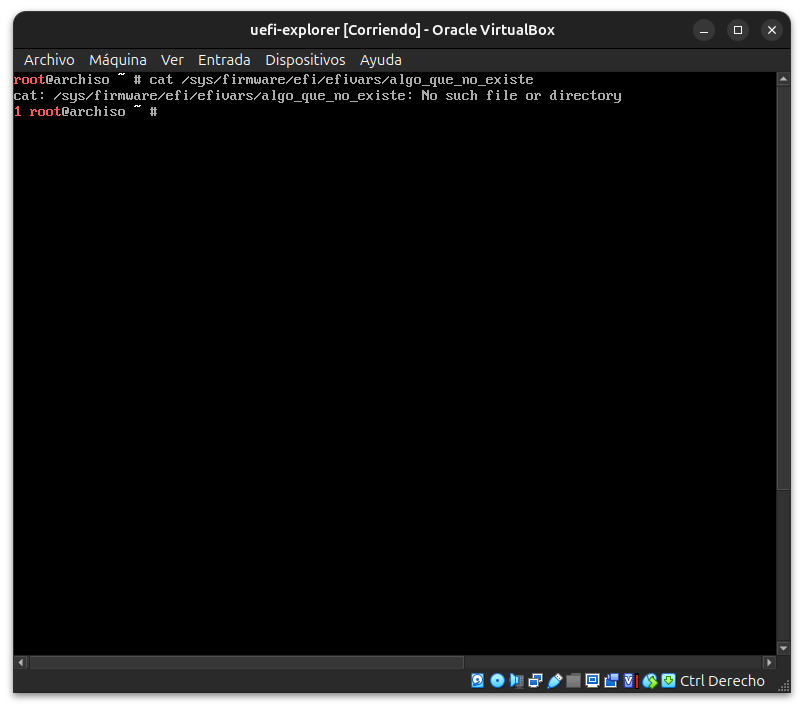

**17 — De vuelta en el sistema real: `sbctl` confirma "not booted with UEFI"**
Cierre del módulo con la comparación completa: UEFI real (VM temporal) vs. BIOS real (sistema principal). Bonus: se ve el hook automático de `sbctl` integrado en `mkinitcpio`, detectando que no hay claves de Secure Boot generadas todavía.

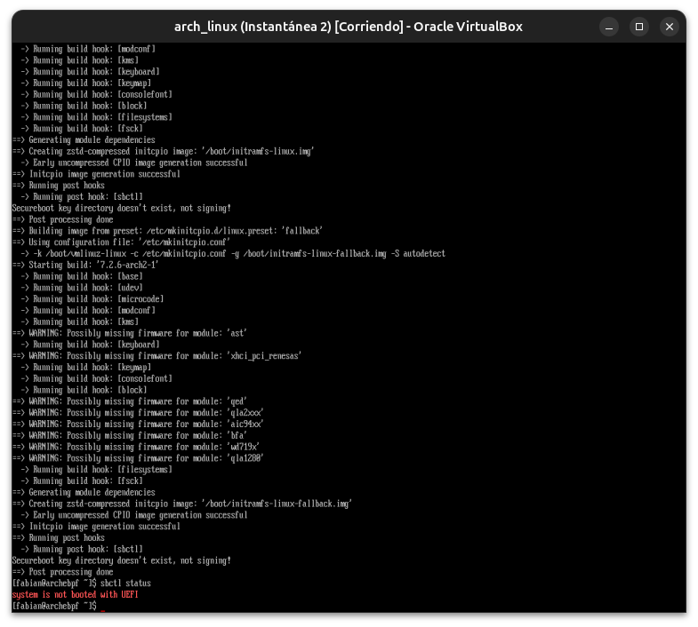

---

**Próximo módulo:** 04 — Graphics Architecture (inicio de la Fase 02 — Gráficos).
