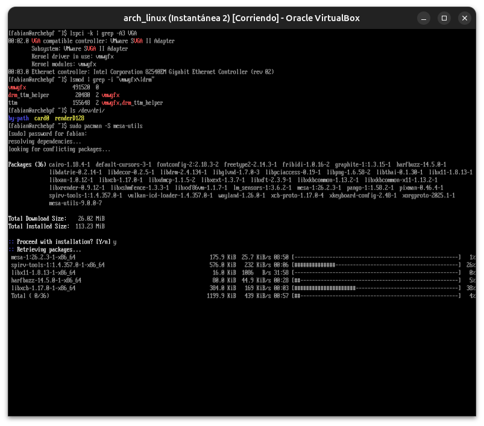
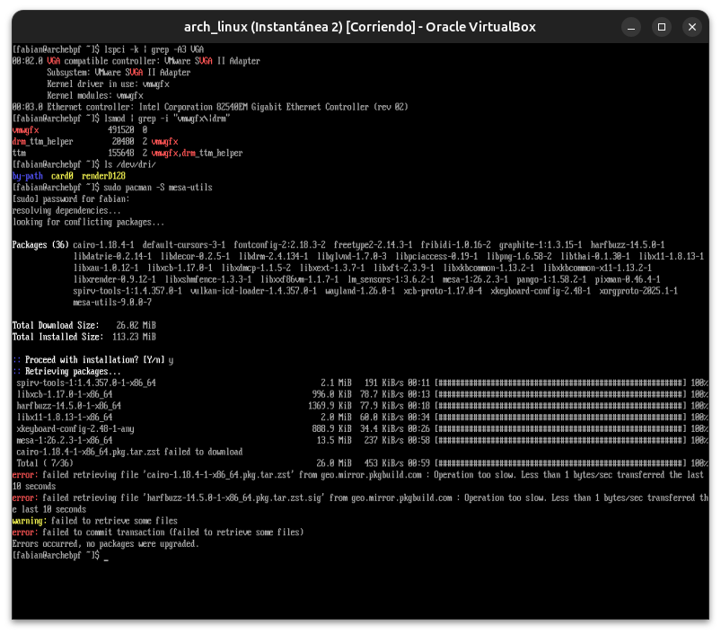
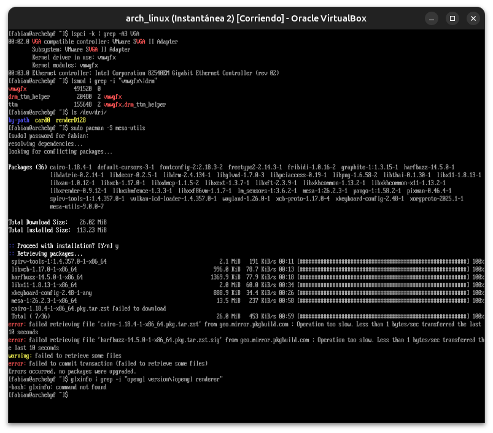
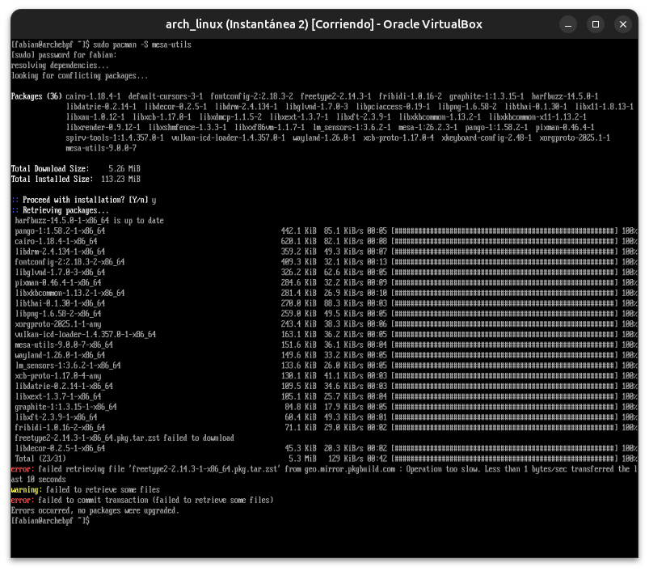
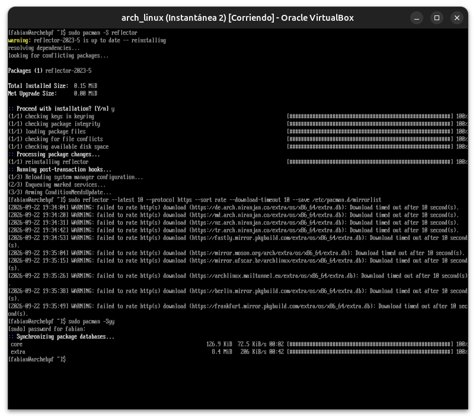
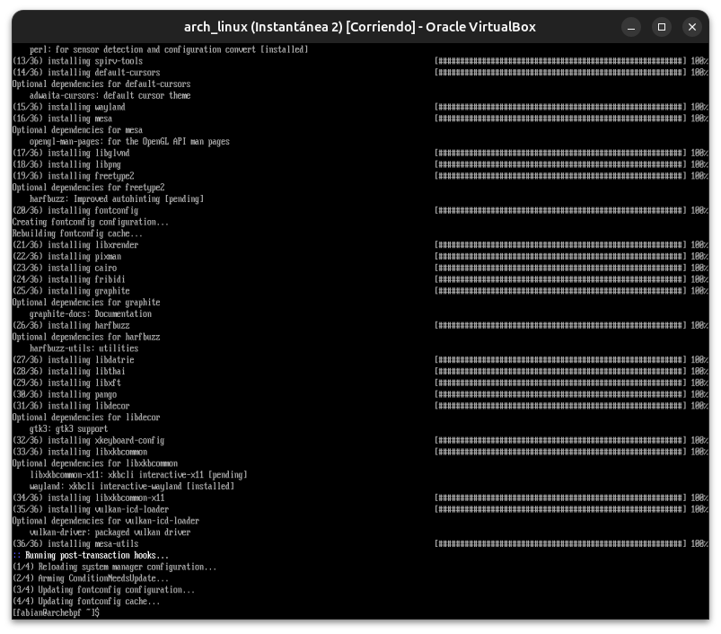
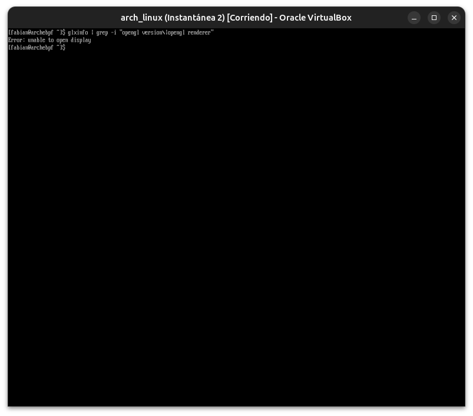

# Módulo 04 — Graphics Architecture

**Fase 02 — Gráficos**

> **Nota de adaptación:** tu VM usa el controlador gráfico virtual de VirtualBox (`vmwgfx`, ya lo viste en el Módulo 15 del curso anterior como un error benigno en `dmesg`). No hay GPU dedicada real ni aceleración 3D de hardware genuina — VirtualBox emula una tarjeta gráfica genérica (VMSVGA/VBoxVGA). Este módulo cubre la arquitectura conceptual completa (válida para cualquier sistema), y lo que se pueda inspeccionar realmente en tu VM se marca explícitamente.

---

## Objetivos del módulo

- Entender las capas de la arquitectura gráfica de Linux: kernel (DRM/KMS) → Mesa → API gráfica (OpenGL/Vulkan) → compositor → aplicación.
- Entender qué es DRM/KMS y por qué reemplazó al viejo modelo de Xorg gestionando el hardware directamente.
- Inspeccionar la configuración gráfica real de tu VM.
- Entender qué es la aceleración 3D en VirtualBox y sus limitaciones frente a una GPU física real.

---

## 1. CONCEPTO: las capas de la arquitectura gráfica moderna

```
Aplicación (navegador, juego, editor)
        ↓
API gráfica: OpenGL / Vulkan
        ↓
Mesa (implementación de esas APIs en software/drivers)
        ↓
DRM (Direct Rendering Manager) — módulo del KERNEL
        ↓
KMS (Kernel Mode Setting) — quién controla la resolución/modo de video
        ↓
Hardware (GPU real, o el dispositivo virtual que expone VirtualBox)
```

**Por qué existe esta separación en capas:** cada capa resuelve un problema específico sin que las de arriba necesiten saber los detalles de las de abajo. Una aplicación que dibuja con OpenGL no necesita saber si tu GPU es NVIDIA, AMD, Intel, o el dispositivo virtual de VirtualBox — Mesa y los drivers de abajo traducen esas llamadas genéricas al hardware específico.

---

## 2. POR QUÉ EXISTE: DRM/KMS reemplazando al modelo viejo

**El problema del modelo antiguo (pre-2010, aproximadamente):** Xorg (el servidor gráfico) gestionaba el hardware de video **directamente**, con privilegios de root, compitiendo con la consola de texto por el control del modo de video. Esto causaba parpadeos al cambiar entre consola y GUI, y cada servidor gráfico necesitaba su propio driver de bajo nivel duplicando trabajo.

**La solución: mover la gestión del hardware al kernel.** `DRM` es un subsistema del kernel Linux (conexión directa con el Módulo 22 del curso anterior: es, literalmente, un conjunto de módulos de kernel cargables) que centraliza el acceso a la GPU. `KMS` es la parte de DRM responsable de configurar resoluciones y modos de video **antes** de que arranque cualquier servidor gráfico — por eso ahora ves una consola de texto en alta resolución sin parpadeos al iniciar sesión.

**Por qué esto importa para lo que viene:** en el Módulo 05 vas a instalar Xorg y explorar Wayland — ambos son **clientes** de DRM/KMS, no reemplazos. Ninguno de los dos gestiona el hardware directamente hoy en día.

---

## 3. HERRAMIENTA: inspeccionar tu configuración gráfica real

```bash
lspci -k | grep -A3 VGA          # el dispositivo de video que ve el kernel, y qué driver lo maneja
lsmod | grep -i "vmwgfx\|drm"      # módulos DRM cargados
ls /dev/dri/                        # dispositivos DRM expuestos (card0, renderD128, etc.)
glxinfo | grep -i "opengl\|renderer" 2>/dev/null || echo "glxinfo no instalado"
```

Si `glxinfo` no está instalado:
```bash
sudo pacman -S mesa-utils
glxinfo | grep -i "opengl version\|opengl renderer"
```

---

## 4. CÓMO FUNCIONA: aceleración 3D en VirtualBox (y sus límites reales)

VirtualBox ofrece una opción de **"Aceleración 3D"** en la configuración de la VM (Pantalla → Aceleración), que vos ya tenés **habilitada** (confirmado en el Módulo 00 del curso anterior: "256MB/3D/BIOS"). Esto funciona mediante:

- **VMSVGA**: el dispositivo gráfico virtual que VirtualBox expone al huésped, con soporte parcial de aceleración 3D vía traducción de llamadas OpenGL hacia el host.

**Limitación real importante:** esto **no es una GPU física** — es una traducción de software de llamadas gráficas hacia el driver real de tu laptop (que corre Ubuntu como host). El rendimiento y la compatibilidad son notablemente menores que en hardware real. Para el resto de este curso (GNOME, KDE, compositores), esto alcanza para que las interfaces funcionen y sean navegables, pero no esperes rendimiento de gaming ni de edición de video pesada.

---

## 5. EJEMPLO

```bash
lspci -k | grep -A3 VGA
```
Deberías ver algo como:
```
00:02.0 VGA compatible controller: VMware SVGA II Adapter
        Kernel driver in use: vmwgfx
```

Esto confirma: el kernel detecta el dispositivo virtual y ya tiene el driver `vmwgfx` cargado (el mismo que generó el warning benigno que viste en el Módulo 15 del curso anterior).

---

## 6. PRÁCTICA

1. Corré los 4 comandos de la sección 3 y documentá qué dispositivo/driver detecta tu sistema.
2. Instalá `mesa-utils` si hace falta, y confirmá qué versión de OpenGL reporta `glxinfo` (nota: en muchos casos con VMSVGA vas a ver un renderer de software tipo "llvmpipe", que es Mesa renderizando por CPU en vez de GPU — anotalo, es un dato real, no un error).
3. Confirmá en VirtualBox (Configuración de tu VM `arch_linux` → Pantalla) que la aceleración 3D está habilitada y cuánta memoria de video tiene asignada.
4. Reflexión: ¿por qué creés que `llvmpipe` (si es lo que ves) todavía permite que GNOME/KDE funcionen (próximos módulos), aunque sea mucho más lento que una GPU real?

---

## 7. ERROR INTENCIONAL / DIAGNÓSTICO

```bash
sudo rmmod vmwgfx
```

**Diagnóstico esperado:** esto probablemente va a fallar (`rmmod: ERROR: Module vmwgfx is in use`) porque el driver gráfico está activamente en uso por la sesión actual — no podés descargar el módulo del kernel que está renderizando la propia pantalla en la que estás escribiendo el comando. Es un buen paralelo con lo que aprendiste en el Módulo 22 del curso anterior sobre módulos de kernel en uso.

---

## Checklist de cierre del módulo

- [ ] Entiendo las capas: aplicación → API gráfica → Mesa → DRM/KMS → kernel → hardware.
- [ ] Entiendo por qué DRM/KMS reemplazó la gestión directa de hardware por Xorg.
- [ ] Inspeccioné el dispositivo gráfico real de mi VM y su driver (`vmwgfx`).
- [ ] Entiendo la diferencia entre aceleración 3D virtualizada y una GPU física real.
- [ ] Intenté descargar el módulo del driver gráfico en uso y entendí por qué falla.

---

## Evidencias

**01 — Hardware detectado: `vmwgfx` + DRM**
`lspci -k` confirma `VMware SVGA II Adapter` con `Kernel driver in use: vmwgfx`; `lsmod` muestra los módulos DRM cargados (`vmwgfx`, `drm_ttm_helper`, `ttm`); `/dev/dri/` expone `card0` y `renderD128`.



**02-04 — Mirrors inestables (patrón conocido)**
Varios intentos de instalar `mesa-utils` fallaron por timeouts de red en distintos archivos, y `glxinfo` no estaba disponible todavía.





**05-06 — Solución: `reflector` + instalación exitosa**
Tras refrescar la lista de mirrors, la sincronización y la instalación de `mesa-utils` (36 paquetes) completaron sin errores.




**07 — `glxinfo`: "unable to open display"**
Resultado real y esperado: sin un servidor gráfico (Xorg/Wayland) corriendo todavía, no hay "display" al cual consultar — el puente perfecto hacia el Módulo 05.



---

**Próximo módulo:** 05 — Xorg vs Wayland.
