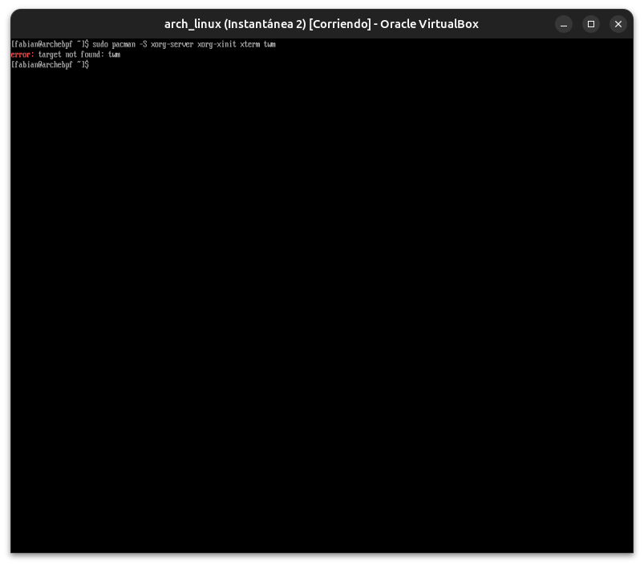
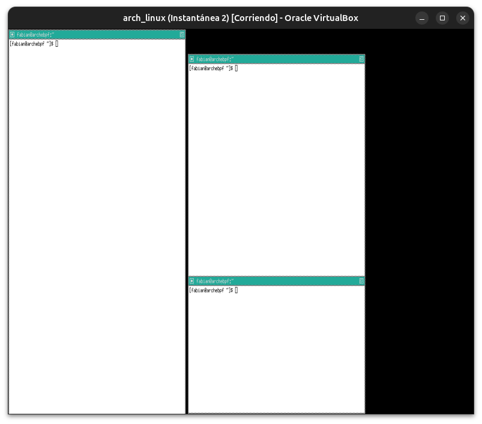
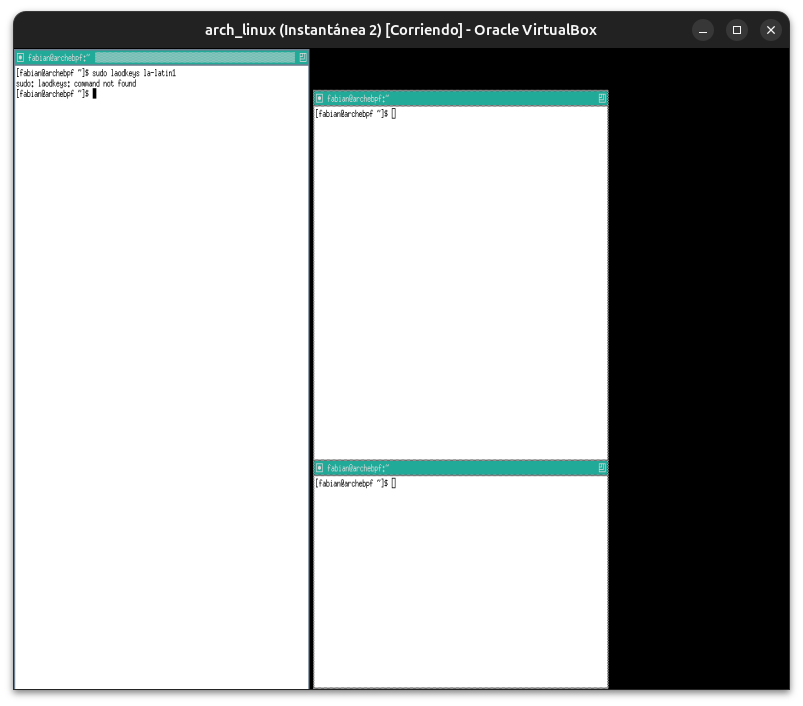
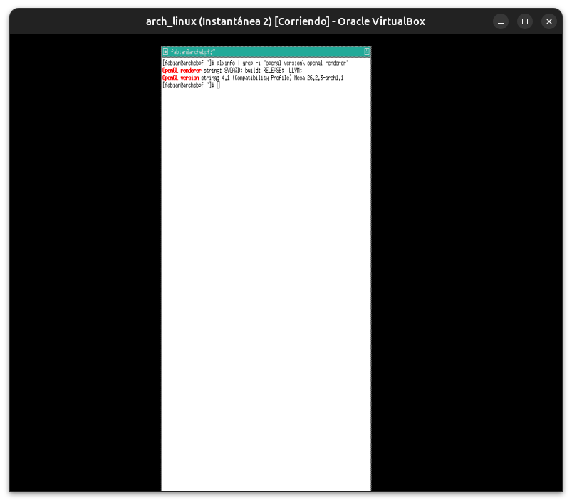
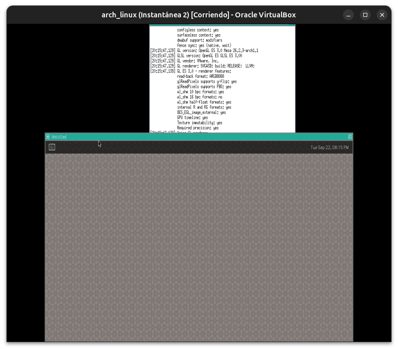
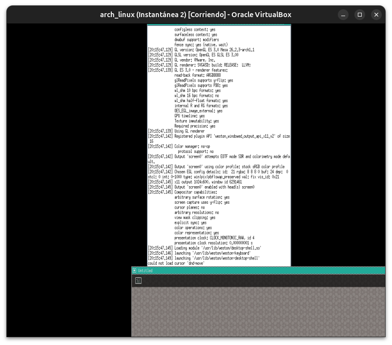
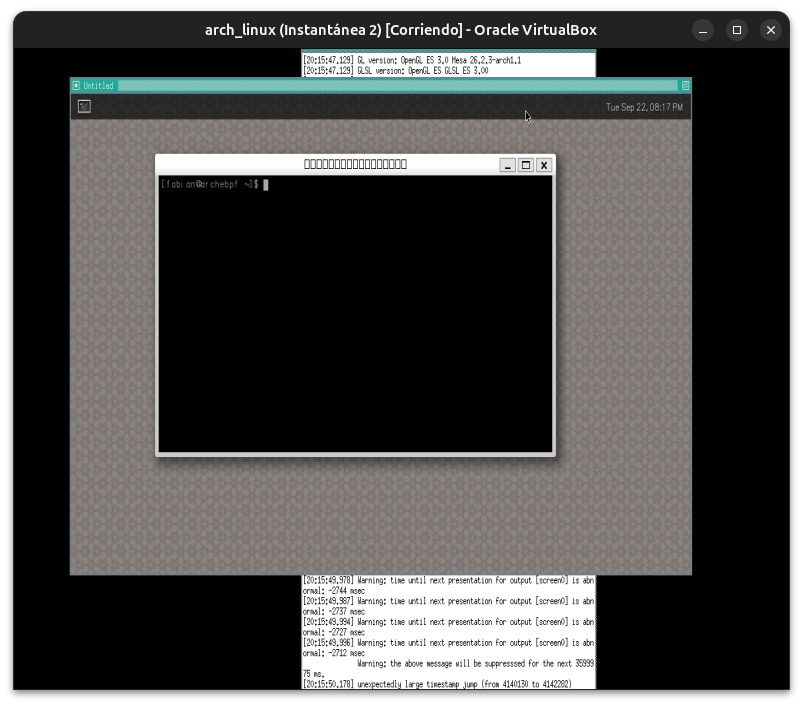
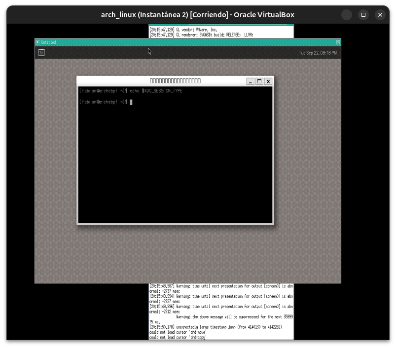
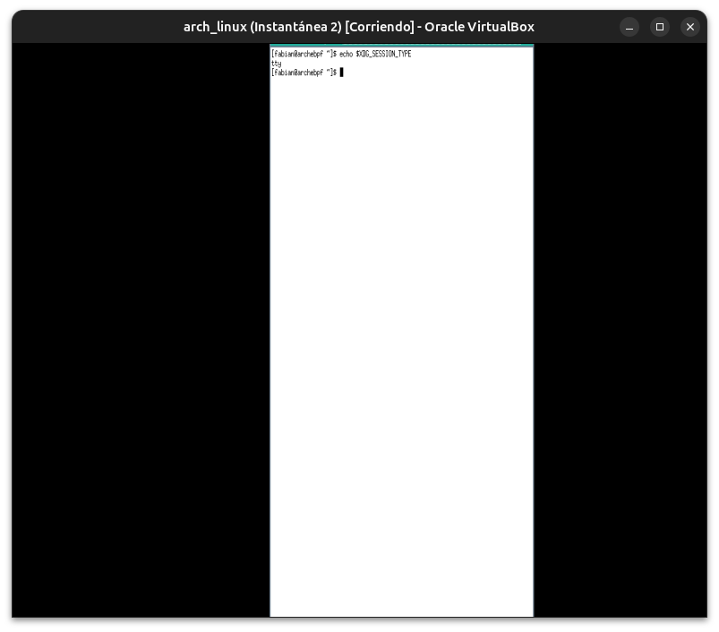

# Módulo 05 — Xorg vs Wayland

**Fase 02 — Gráficos**

---

## Objetivos del módulo

- Entender la arquitectura cliente-servidor de Xorg (X11) y por qué se diseñó así en los 80.
- Entender el modelo de Wayland: el compositor hace todo, protocolo mucho más simple.
- Instalar Xorg mínimo y conseguir tu primer entorno gráfico real (aunque sea solo un `xterm`).
- Instalar Weston (compositor de referencia de Wayland) y compararlo.
- Correr `glxinfo` **con éxito** esta vez — cerrando lo que quedó pendiente del Módulo 04.

---

## 1. CONCEPTO: la arquitectura cliente-servidor de X11

X11 (el protocolo detrás de Xorg) se diseñó en 1984, pensado para que **el "servidor" X corra en tu máquina local, y los "clientes" (las aplicaciones) puedan correr en otra máquina de la red**, mostrando su ventana en tu pantalla. Esto era revolucionario en la era de terminales conectadas a mainframes.

```
┌─────────────────┐         red / socket local        ┌──────────────────┐
│  Servidor X       │ ◄──────────────────────────────► │  Cliente (app)     │
│  (controla el       │                                  │  (Firefox, xterm)   │
│  hardware/pantalla)   │                                  │                       │
└─────────────────┘                                    └──────────────────┘
```

**Por qué esto importa hoy:** esa flexibilidad (correr una app en un servidor remoto, viendo su ventana en tu laptop) sigue siendo real y útil — es la razón por la que `ssh -X` (Módulo 13 del curso anterior) funciona. Pero tiene un costo: el protocolo es viejo, complejo, y varias tareas (como componer ventanas con transparencias, o gestionar múltiples GPUs/monitores con distinto DPI) terminaron implementándose **por fuera** del servidor X (en un "compositor" aparte), generando capas sobre capas.

---

## 2. CONCEPTO: el modelo de Wayland

Wayland (diseñado desde ~2008, madurando en la década siguiente) parte de una premisa distinta: **el compositor ES el servidor de video**. No hay separación entre "quien dibuja las ventanas" y "quien las compone en pantalla" — es el mismo proceso. El protocolo es mucho más simple porque no necesita replicar 40 años de compatibilidad histórica.

| | Xorg (X11) | Wayland |
|---|---|---|
| Diseño | 1984, cliente-servidor genérico | ~2008+, compositor = servidor |
| Renderizado remoto | Nativo, protocolo pensado para eso | No nativo (necesita capas extra como Waypipe) |
| Seguridad entre ventanas | Débil (una app puede espiar/inyectar eventos a otra por diseño) | Fuerte (aislamiento por diseño) |
| Complejidad del protocolo | Alta (décadas de extensiones acumuladas) | Baja (protocolo core minimalista) |
| Adopción actual | GNOME/KDE lo soportan por compatibilidad | Default en GNOME y KDE modernos |

**Por qué no "ya todos usan Wayland":** aplicaciones viejas, ciertos drivers propietarios (NVIDIA históricamente), y herramientas de captura/control remoto de pantalla todavía dependen de X11 o necesitan capas de compatibilidad (`XWayland`, que corre aplicaciones X11 dentro de una sesión Wayland).

---

## 3. HERRAMIENTA: instalar Xorg mínimo

```bash
sudo pacman -S xorg-server xorg-xinit xterm twm
```

- `xorg-server`: el servidor X en sí.
- `xorg-xinit`: `startx`, el comando que arranca una sesión X desde la consola de texto.
- `xterm`: una terminal gráfica mínima (tu primera "aplicación cliente" real).
- `twm`: un gestor de ventanas minimalista (sin él, las ventanas no tendrían bordes/movimiento — es literalmente lo mínimo indispensable, vas a instalar algo real como GNOME/KDE en los Módulos 08-09).

```bash
startx
```

Esto debería abrir una sesión X mínima con `xterm` y `twm` — tu primer entorno gráfico real en esta VM. Desde dentro de esa terminal gráfica, corré:

```bash
glxinfo | grep -i "opengl version\|opengl renderer"
```

**Esta vez sí debería funcionar** — ya hay un servidor X corriendo al cual `glxinfo` puede consultarle. Anotá qué te reporta como `renderer` (muy probablemente `llvmpipe`, confirmando lo que anticipamos en el Módulo 04: renderizado por software, no GPU real).

Para salir de la sesión X: cerrá todas las ventanas `xterm`, o usá el menú de `twm` (clic derecho en el fondo) para salir.

---

## 4. HERRAMIENTA: instalar y probar Weston (Wayland)

```bash
sudo pacman -S weston
weston
```

Esto abre una ventana (o pantalla completa) con el compositor de referencia de Wayland, incluyendo su propio `terminal` mínimo. Explorá brevemente la interfaz (muy básica, a propósito — Weston es una referencia técnica, no un entorno de escritorio real).

Para salir: cerrá la terminal de Weston o usá `Ctrl+Alt+Backspace` si hace falta forzar la salida.

---

## 5. CÓMO FUNCIONA: comparar ambos

| Comando | Bajo Xorg | Bajo Weston |
|---|---|---|
| `echo $XDG_SESSION_TYPE` | `x11` | `wayland` |
| `glxinfo \| grep renderer` (dentro de cada sesión) | llvmpipe (probablemente) | llvmpipe también, vía Mesa igual |

**Qué confirma esta comparación:** tanto Xorg como Wayland, en esta VM, terminan usando el **mismo Mesa/DRM/KMS por debajo** (Módulo 04) — la diferencia entre ellos no está en el renderizado de GPU en sí, sino en **cómo se gestionan las ventanas, la composición, y la seguridad** entre aplicaciones.

---

## 6. PRÁCTICA

1. Instalá Xorg mínimo, corré `startx`, y confirmá que `glxinfo` ahora funciona (a diferencia del Módulo 04).
2. Anotá el `renderer` exacto que reporta.
3. Instalá y corré `weston`, confirmá `$XDG_SESSION_TYPE`.
4. Completá la tabla comparativa de la sección 5 con tus propios resultados.
5. Reflexión: ¿por qué `ssh -X` (Módulo 13 del curso anterior) es mucho más simple de lograr con Xorg que con Wayland?

---

## 7. ERROR INTENCIONAL / DIAGNÓSTICO

```bash
startx
```
(mientras ya tenés una sesión X corriendo, sin haber salido de la anterior — abrí otra terminal virtual con `Ctrl+Alt+F2` si hace falta para ejecutar esto en paralelo)

**Diagnóstico esperado:** un error indicando que ya hay un servidor X corriendo en ese display (`Fatal server error: Server is already active for display 0`) — solo puede haber un servidor X controlando el hardware de video a la vez, coherente con todo lo aprendido sobre DRM/KMS en el Módulo 04 (el kernel no permite que dos procesos compitan por el mismo dispositivo de video).

---

## Checklist de cierre del módulo

- [ ] Entiendo la arquitectura cliente-servidor de X11 y por qué se diseñó así.
- [ ] Entiendo el modelo "compositor = servidor" de Wayland y sus ventajas de seguridad/simplicidad.
- [ ] Corrí `startx` y conseguí una sesión gráfica real por primera vez en esta VM.
- [ ] `glxinfo` funcionó dentro de la sesión X, y anoté el renderer real.
- [ ] Instalé y probé Weston, comparando `$XDG_SESSION_TYPE`.
- [ ] Entiendo por qué ambos terminan usando el mismo Mesa/DRM por debajo.

---

## Evidencias

**01 — Error real: `twm` renombrado**
El paquete correcto en Arch es `xorg-twm` (con prefijo), no `twm` a secas.



**02 — `startx`: primer entorno gráfico real**
Configuración por defecto de Xorg: 3 ventanas `xterm` gestionadas por `twm` — tu primera sesión gráfica en esta VM.



**03 — `loadkeys` no aplica bajo X11**
Bajo una sesión X11, el teclado se gestiona con `setxkbmap`, no `loadkeys` (ese es solo para consola de texto).



**04 — Typo real: `gre` en vez de `grep`**
Error de tipeo simple, corregido al toque.


**05 — `glxinfo` exitoso: `SVGA3D` confirmado bajo Xorg**
`OpenGL renderer string: SVGA3D` — el driver Gallium3D de VirtualBox, no `llvmpipe` puro. Confirma que la aceleración 3D de la VM está activa.



**06 — Instalando Weston**
25 paquetes, incluyendo dependencias opcionales de backend (X11, pipewire, RDP, VNC, Vulkan).



**07 — Weston lanzado: mismo `SVGA3D` confirmado**
`GL renderer: SVGA3D` — idéntico al de Xorg, confirmando que ambos comparten el mismo Mesa/DRM por debajo. Desktop shell de Weston visible con reloj.



**08 — `weston-terminal` abierta**
Terminal nativa de Weston, corriendo dentro de la sesión Wayland.



**09-10 — `$XDG_SESSION_TYPE`: resultado con matices**
Un intento dentro de `weston-terminal` no mostró un valor claro, y otro (fuera de la sesión activa) mostró `tty`. Nota real: al lanzar Weston manualmente desde una consola (sin un gestor de sesión/display manager de por medio), esta variable no siempre se actualiza de forma confiable — es una limitación del método de prueba manual, no una contradicción de la teoría. La confirmación más sólida del módulo sigue siendo el renderer `SVGA3D` compartido (evidencias 05 y 07).




---

**Próximo módulo:** 06 — GPU Drivers, Mesa & Vulkan.
