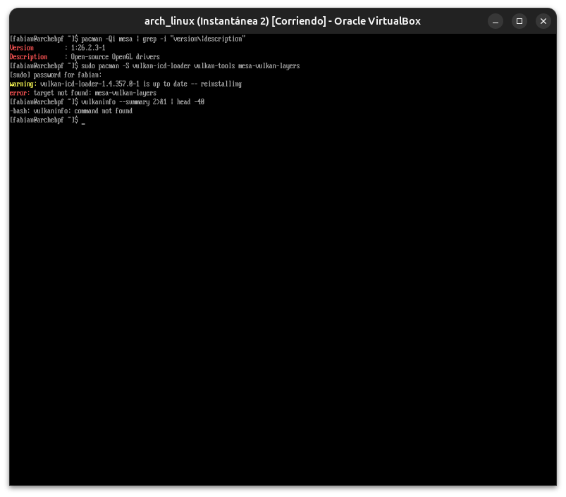
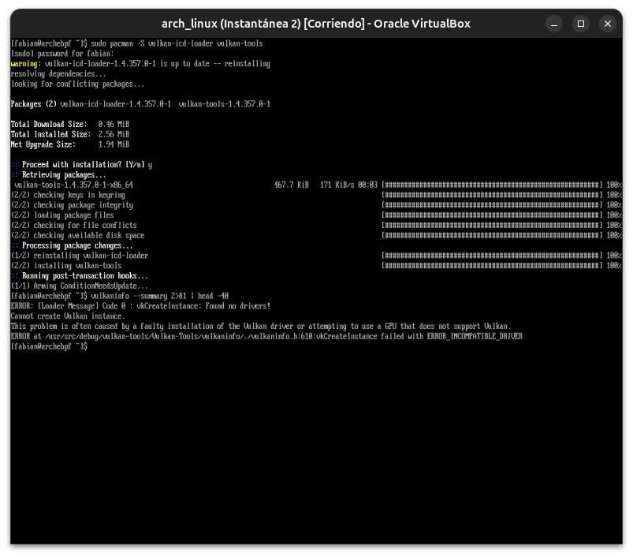

# Módulo 06 — GPU Drivers, Mesa & Vulkan

**Fase 02 — Gráficos**

---

## Objetivos del módulo

- Entender la diferencia entre drivers de kernel (DRM) y drivers de espacio de usuario (Mesa).
- Entender qué es Vulkan y por qué coexiste con OpenGL en vez de reemplazarlo.
- Instalar y verificar el stack completo de Vulkan en tu VM.
- Entender por qué NVIDIA es un caso especial en el ecosistema Linux.

---

## 1. CONCEPTO: dos niveles de "driver" que ya tocaste sin nombrarlos

Ya usaste ambos niveles en los Módulos 04 y 05, sin que los separáramos formalmente:

| Nivel | Qué hace | Ejemplo en tu VM |
|---|---|---|
| **Driver de kernel (DRM)** | Habla directamente con el hardware: modo de video, memoria de GPU, sincronización | `vmwgfx` (Módulo 04) |
| **Driver de espacio de usuario (Mesa)** | Traduce llamadas de API (OpenGL, Vulkan) al lenguaje que el driver de kernel entiende | El renderer `SVGA3D` que viste en `glxinfo` (Módulo 05) |

**Por qué existen separados:** el driver de kernel necesita privilegios y estabilidad extrema (un crash ahí puede colgar todo el sistema — conexión con el Módulo 22 del curso anterior sobre riesgos de módulos de kernel). El driver de espacio de usuario (Mesa) puede actualizarse con mucha más frecuencia, sin tocar el kernel, porque corre como cualquier biblioteca de programa normal.

---

## 2. CONCEPTO: qué es Mesa, exactamente

Mesa es un proyecto de código abierto que implementa las **APIs gráficas estándar** (OpenGL, OpenGL ES, Vulkan) sobre una gran variedad de hardware (Intel, AMD, NVIDIA vía nouveau, y dispositivos virtuales como el `svga` que ya viste). Cuando actualizaste el sistema en módulos anteriores y viste `mesa-26.2.3-arch1.1` pasar por `pacman`, eso es Mesa actualizándose — sin ningún cambio en el kernel.

```bash
pacman -Qi mesa | grep -i "version\|description"
```

---

## 3. CONCEPTO: Vulkan — por qué coexiste con OpenGL en vez de reemplazarlo

**OpenGL** (desde 1992) es una API de **alto nivel**: le pedís "dibujá este triángulo" y el driver decide cómo hacerlo, ocultándote la complejidad. Esto es cómodo, pero le da al driver mucho trabajo interno (validaciones, gestión de estado) que cuesta rendimiento, especialmente en aplicaciones que necesitan control fino (juegos AAA, motores gráficos profesionales).

**Vulkan** (desde 2016) es una API de **bajo nivel**: le das control directo y explícito de la GPU al programador — mucho más rápido en manos expertas, pero mucho más código necesario para lograr lo mismo que unas pocas líneas de OpenGL.

**Por qué no reemplaza a OpenGL:** la mayoría del software (interfaces de escritorio, aplicaciones normales, GNOME/KDE que vas a instalar en los próximos módulos) no necesita ese nivel de control — seguir usando OpenGL es más simple y suficiente. Vulkan brilla en juegos, motores 3D, y cómputo GPU intensivo.

---

## 4. HERRAMIENTA: instalar y verificar Vulkan en tu VM

```bash
sudo pacman -S vulkan-icd-loader vulkan-tools mesa-vulkan-layers
vulkaninfo --summary 2>&1 | head -40
```

**Nota importante para tu VM:** el driver Vulkan de VMware/VirtualBox (`vulkan-icd-loader` con el ICD de `swrast` o `virtio`, según tu configuración) puede no estar disponible completamente — VirtualBox tiene soporte más limitado y menos maduro para Vulkan que para OpenGL. Si `vulkaninfo` falla o no encuentra ningún dispositivo, **es un resultado esperado y real** en este entorno, no un error tuyo — documentalo como tal, es información legítima sobre las limitaciones de esta VM.

---

## 5. CONCEPTO: por qué NVIDIA es un caso especial

Hasta acá, todo lo que instalaste (Mesa, drivers DRM) es **código abierto**, mantenido por la comunidad y/o los fabricantes de hardware colaborando públicamente (Intel y AMD contribuyen activamente a Mesa). **NVIDIA históricamente no lo hizo** — su driver principal (`nvidia`, propietario) es cerrado, se instala como paquete separado, y no usa Mesa para la mayoría de sus funciones (tiene su propia implementación completa de OpenGL/Vulkan).

```bash
# Esto NO aplica a tu VM (sin GPU NVIDIA), pero documentá el comando para el futuro:
# sudo pacman -S nvidia nvidia-utils    # driver propietario
# sudo pacman -S mesa vulkan-nouveau      # alternativa open-source (nouveau), más lenta pero libre
```

**Desde 2022, NVIDIA abrió parcialmente sus drivers de kernel** (`nvidia-open`), pero la parte de espacio de usuario (equivalente a Mesa) sigue siendo propietaria. Esto es relevante para el Módulo 46 (Troubleshooting) más adelante: muchos problemas de pantalla en Linux con laptops reales están relacionados específicamente a este driver.

---

## 6. PRÁCTICA

1. Corré `pacman -Qi mesa` y confirmá la versión instalada.
2. Instalá el stack de Vulkan y corré `vulkaninfo --summary`. Documentá el resultado exacto, sea éxito o el error esperado de esta VM.
3. Compará: ¿`glxinfo` (Módulo 05) encontró un renderer real (`SVGA3D`), pero `vulkaninfo` no encuentra nada? Explicá por qué eso es coherente con las limitaciones de VirtualBox mencionadas en la sección 4.
4. Reflexión: si mañana instalás Arch en tu laptop física real (con una GPU Intel/AMD integrada, mencionado en el Módulo 00 del curso anterior), ¿esperarías que Vulkan funcione mejor ahí que en esta VM? ¿Por qué?

---

## 7. ERROR INTENCIONAL / DIAGNÓSTICO

```bash
VK_ICD_FILENAMES=/ruta/que/no/existe.json vulkaninfo
```

**Diagnóstico esperado:** un error indicando que no pudo cargar el ICD (Installable Client Driver) especificado — confirma cómo Vulkan usa variables de entorno para encontrar sus drivers (a diferencia de OpenGL/Mesa, que resuelve esto más automáticamente por debajo).

---

## Checklist de cierre del módulo

- [ ] Entiendo la diferencia entre driver de kernel (DRM) y driver de espacio de usuario (Mesa).
- [ ] Entiendo qué es Vulkan y por qué coexiste con OpenGL en vez de reemplazarlo.
- [ ] Instalé el stack de Vulkan y documenté el resultado real en mi VM (éxito o limitación esperada).
- [ ] Entiendo por qué NVIDIA es un caso especial en el ecosistema de drivers gráficos de Linux.

---

## Evidencias

**01 — Mesa confirmado + error real de paquete**
`mesa 1:26.2.3-1` ("Open-source OpenGL drivers") confirmado. El paquete `mesa-vulkan-layers` no existe con ese nombre — `pacman` abortó toda la transacción, por lo que `vulkan-tools` tampoco llegó a instalarse esa vez.



**02 — `vulkaninfo`: "Found no drivers!" (limitación real de VirtualBox)**
Instalación correcta de `vulkan-icd-loader` + `vulkan-tools`, pero `vulkaninfo` confirma que no hay ningún ICD de Vulkan disponible en este entorno virtualizado — a diferencia de OpenGL (`SVGA3D`, Módulo 05), VirtualBox no expone soporte Vulkan al sistema huésped. Resultado esperado, documentado como tal.



---

**Próximo módulo:** 07 — Desktop Architecture (inicio de la Fase 03 — Desktop Environments).
