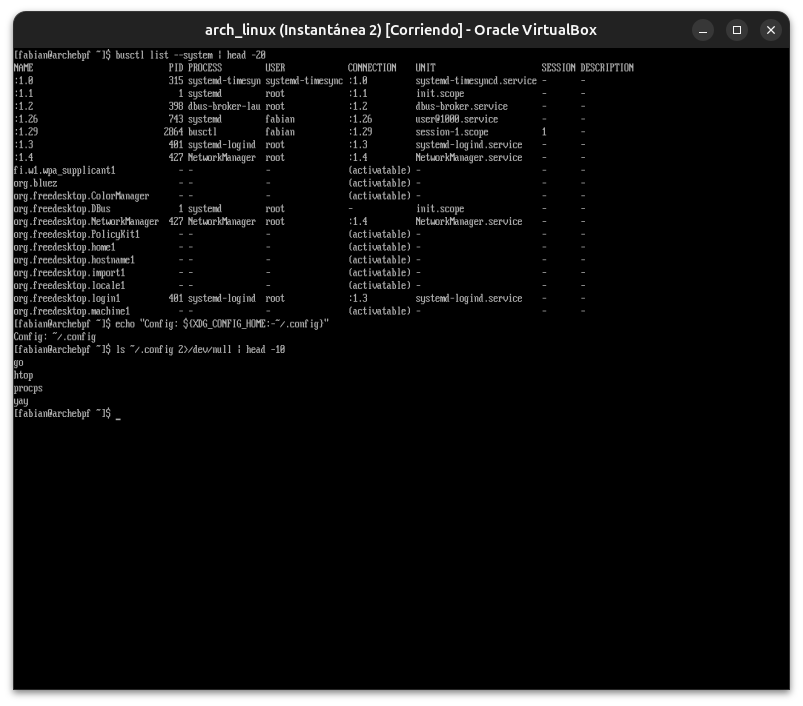
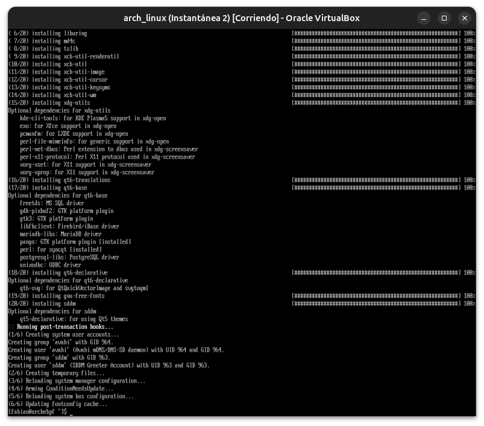
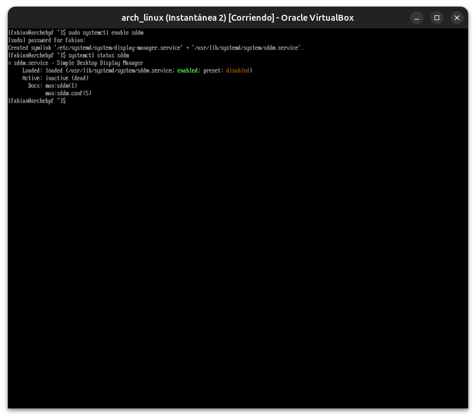

# Módulo 07 — Desktop Architecture

**Fase 03 — Desktop Environments**

---

## Objetivos del módulo

- Entender la diferencia entre gestor de ventanas, compositor y "entorno de escritorio" completo.
- Entender qué es un display manager y por qué existe.
- Entender D-Bus y su rol central en el escritorio moderno.
- Entender la especificación XDG Base Directory.
- Instalar un display manager, preparando el terreno para GNOME (Módulo 08) y KDE (Módulo 09).

---

## 1. CONCEPTO: las piezas que forman un "entorno de escritorio"

Ya viste piezas sueltas de esto en los Módulos 04-06 (`twm` como gestor de ventanas mínimo, Weston como compositor Wayland). Un **entorno de escritorio completo** (GNOME, KDE) agrupa mucho más:

```
Entorno de escritorio (GNOME/KDE)
├── Gestor de ventanas / Compositor   (posiciona y dibuja ventanas — ya lo viste con twm/Weston)
├── Panel / barra de tareas             (reloj, menú de apps, indicadores)
├── Gestor de archivos                    (Nautilus, Dolphin)
├── Demonio de configuración                (temas, atajos de teclado, fondo de pantalla)
├── Gestor de sesión                          (qué se inicia al loguearte, qué se cierra al salir)
└── Aplicaciones integradas                     (calculadora, editor de texto, configuración del sistema)
```

**Por qué importa distinguir esto:** cuando en el Módulo 10 veas gestores de ventanas "solos" (i3, Hyprland) sin todo lo demás, vas a entender exactamente qué te estás perdiendo (panel, gestor de archivos integrado) y qué ganás (control total, ligereza) — es una decisión consciente, no una versión "incompleta" de un escritorio.

---

## 2. CONCEPTO: display manager — el eslabón que falta

Hasta ahora arrancaste tu sesión gráfica **manualmente** con `startx` (Módulo 05) desde la consola de texto. Esto funciona, pero no es lo que ves en un sistema de escritorio real: una pantalla de login gráfica que aparece automáticamente al arrancar.

Eso lo provee un **display manager** (a veces llamado "login manager"): un servicio systemd que arranca automáticamente, muestra una pantalla de login gráfica, y al autenticarte, lanza la sesión gráfica completa (Xorg o Wayland + el entorno de escritorio elegido).

| Display manager | Asociado típicamente a |
|---|---|
| GDM | GNOME |
| SDDM | KDE Plasma |
| LightDM | Ligero, agnóstico (cualquier DE) |

**Por qué existe como servicio separado, no parte del DE:** te permite elegir **qué** entorno de escritorio o sesión arrancar (si tenés varios instalados) desde la misma pantalla de login, sin acoplar la autenticación a un DE específico.

---

## 3. CONCEPTO: D-Bus — el sistema nervioso del escritorio

Ya viste `D-Bus` mencionado en los logs de `systemd` desde el Módulo 09 del curso anterior (`Listening on D-Bus System Message Bus`), sin profundizar. Ahora es momento: **D-Bus es un mecanismo de comunicación entre procesos (IPC)** que permite que aplicaciones y servicios del sistema se "hablen" entre sí sin conocerse directamente de antemano.

**Ejemplo real que vas a usar constantemente:** cuando bajás el volumen con las teclas multimedia, o cuando una app pide permiso para acceder a tu cámara, o cuando conectás un USB y aparece una notificación — todo eso viaja por D-Bus, coordinando el kernel (udev), el entorno de escritorio, y las aplicaciones, sin que cada una tenga que saber los detalles internos de las demás.

```bash
sudo pacman -S d-feet 2>/dev/null || echo "d-feet no disponible, usaremos busctl"
busctl list --system | head -20        # servicios del bus de sistema
busctl --user list | head -20 2>&1 || echo "bus de usuario no disponible sin sesión activa"
```

---

## 4. CONCEPTO: XDG Base Directory — dónde vive la configuración

Antes de que existiera este estándar, cada aplicación tiraba sus archivos de configuración directo en tu `$HOME` (`~/.apprc`, `~/.appconfig`, docenas de archivos sueltos). La especificación **XDG Base Directory** ordena esto:

```bash
echo "Config: ${XDG_CONFIG_HOME:-~/.config}"
echo "Datos: ${XDG_DATA_HOME:-~/.local/share}"
echo "Cache: ${XDG_CACHE_HOME:-~/.cache}"
ls ~/.config 2>/dev/null | head -10
```

**Por qué importa para lo que viene:** cuando instales GNOME/KDE, y más adelante cuando gestiones tus dotfiles (Módulos 33-34), vas a estar constantemente navegando `~/.config/` — entender que existe por una especificación deliberada (no es un accidente) te ayuda a predecir dónde buscar la configuración de cualquier aplicación nueva.

---

## 5. HERRAMIENTA: instalar un display manager

Vamos a instalar `SDDM`, ya que lo vas a usar con KDE Plasma en el Módulo 09 (y funciona perfectamente bien también como puerta de entrada genérica antes de eso):

```bash
sudo pacman -S sddm
sudo systemctl enable sddm
```

**Importante: no lo habilitamos con `--now` todavía.** Como no tenés ningún entorno de escritorio real instalado aún (solo `twm`/Weston de prueba), arrancar `sddm` ahora te daría una pantalla de login sin nada real para lanzar. Lo vamos a activar (`start`) recién en el Módulo 08 o 09, cuando ya tengas GNOME o KDE instalados.

```bash
systemctl status sddm    # confirmá que está habilitado (enabled) pero inactive/dead por ahora
```

---

## 6. PRÁCTICA

1. Corré los comandos de D-Bus de la sección 3 y documentá qué servicios ves listados en el bus de sistema.
2. Corré los comandos de XDG de la sección 4 y confirmá los valores reales en tu sistema.
3. Instalá `sddm` y habilitalo (sin arrancarlo todavía), confirmando el estado con `systemctl status`.
4. Reflexión: ahora que instalaste `sddm` pero sin ningún DE real detrás, ¿qué creés que pasaría si lo arrancaras ahora mismo con `systemctl start sddm`? (No lo hagas todavía — respondé conceptualmente, y lo vas a comprobar en el próximo módulo cuando sí tengas GNOME instalado).

---

## 7. ERROR INTENCIONAL / DIAGNÓSTICO

```bash
busctl --user status
```

(corrido desde una sesión de consola de texto pura, sin ninguna sesión gráfica de usuario activa)

**Diagnóstico esperado:** probablemente un error o falta de respuesta, porque el bus de sesión de usuario (`--user`, distinto del bus de sistema) normalmente lo levanta el propio gestor de sesión al iniciar sesión gráfica — sin una sesión de escritorio activa, ese bus específico puede no estar disponible de la misma forma. Es un buen ejemplo de la diferencia entre el bus **de sistema** (siempre activo, gestiona hardware/servicios) y el bus **de sesión** (por usuario, ligado a su sesión de escritorio).

---

## Checklist de cierre del módulo

- [ ] Entiendo las piezas que forman un entorno de escritorio completo (más allá del gestor de ventanas).
- [ ] Entiendo qué es un display manager y por qué es un servicio separado del DE.
- [ ] Entiendo D-Bus como mecanismo de comunicación entre procesos, y la diferencia entre bus de sistema y de sesión.
- [ ] Entiendo la especificación XDG Base Directory y dónde vive la configuración de las apps.
- [ ] Instalé `sddm`, lo habilité, y entiendo por qué todavía no lo arrancamos.

---

## Evidencias

**01 — D-Bus real + XDG_CONFIG_HOME confirmado**
`busctl list --system` muestra servicios reales (`dbus-broker`, `NetworkManager`, `systemd-logind`, `org.freedesktop.PolicyKit1`, `ColorManager`). `~/.config` contiene subcarpetas reales de módulos anteriores (`go`, `htop`, `procps`, `yay`).



**02 — Instalando SDDM (con Qt6)**
28 paquetes, arrastrando toda la base Qt6 — un adelanto visual del peso que va a traer KDE Plasma en el Módulo 09.



**03 — SDDM habilitado, inactivo (a propósito)**
`systemctl status sddm` confirma `enabled` + `inactive (dead)` — exactamente el estado esperado antes de tener un entorno de escritorio real instalado.



---

**Próximo módulo:** 08 — GNOME.
