# Módulo 09 — KDE Plasma

**Fase 03 — Desktop Environments**

---

## Objetivos del módulo

- Entender la arquitectura de KDE Plasma: Plasma Shell, KWin (compositor), Qt/KDE Frameworks, KConfig.
- Instalar Plasma **junto a** GNOME (ya instalado en el Módulo 08) y elegir sesión desde SDDM.
- Comparar directamente KDE vs GNOME en la misma VM: filosofía de diseño, configuración, rendimiento percibido.
- Entender KConfig como el equivalente de KDE a GSettings/dconf.

---

## 1. CONCEPTO: arquitectura de KDE Plasma

```
Plasma Shell (la interfaz: panel, menú de aplicaciones, widgets)
        ↓ construido sobre
KWin (el compositor — equivalente a Mutter en GNOME)
        ↓
Qt + KDE Frameworks (el toolkit gráfico — mucho más modular que GTK)
        ↓
KConfig (el sistema de configuración — archivos .ini estructurados, NO una base de datos binaria como dconf)
```

**Diferencia filosófica clave con GNOME:** KDE apuesta por **modularidad y configurabilidad extrema** — casi todo tiene una opción visible en la interfaz de configuración, y las piezas (Plasma Shell, KWin, las apps) están más desacopladas entre sí que en GNOME. Esto no es "mejor" ni "peor" que la cohesión de GNOME (Módulo 08) — es un trade-off distinto: más control vs. más simplicidad por defecto.

---

## 2. HERRAMIENTA: instalar KDE Plasma junto a GNOME

```bash
sudo pacman -S plasma kde-applications-meta
```

**Nota:** esto es un grupo aún más grande que GNOME — puede tardar bastante y pedir varios GB. Como ya tenés GNOME instalado (Módulo 08), vas a terminar con **dos entornos de escritorio completos** conviviendo en la misma VM, algo perfectamente normal y soportado — SDDM te va a dejar elegir cuál usar en cada login.

```bash
sudo systemctl restart sddm    # o simplemente cerrá sesión de GNOME
```

En la pantalla de login, buscá el selector de **"Session"** (arriba a la izquierda, donde antes decía "GNOME") y cambialo a **"Plasma"** antes de ingresar tu contraseña.

---

## 3. EJEMPLO: primera exploración de Plasma

Una vez dentro de tu sesión Plasma:

```bash
echo $XDG_SESSION_TYPE            # wayland (Plasma moderno también usa Wayland por defecto)
echo $XDG_CURRENT_DESKTOP           # "KDE"
glxinfo | grep -i "opengl renderer"   # ¿sigue siendo SVGA3D, o cambia algo bajo KWin?
```

Explorá la interfaz: el menú de aplicaciones (esquina inferior izquierda), la bandeja del sistema, y **"Configuración del Sistema"** (`systemsettings`) — mucho más densa en opciones que la de GNOME, a propósito.

---

## 4. CONCEPTO: KConfig — el equivalente de KDE a GSettings/dconf

A diferencia de la base de datos binaria centralizada de GNOME (`dconf`), KDE usa **archivos de texto `.ini` estructurados**, organizados bajo `~/.config/`:

```bash
ls ~/.config/*rc 2>/dev/null | head -10
cat ~/.config/kdeglobals 2>/dev/null | head -20
```

```bash
kreadconfig5 --file kdeglobals --group General --key ColorScheme 2>/dev/null || \
kreadconfig6 --file kdeglobals --group General --key ColorScheme
```

**Por qué esta diferencia de enfoque importa:** los archivos de KDE son directamente legibles/editables con cualquier editor de texto (conexión con Bash/grep/sed del curso anterior) — más simple de inspeccionar y versionar (dotfiles, Módulos 33-34) que la base binaria de `dconf`, aunque pierde algunas garantías de validación de tipos que sí tiene GSettings.

---

## 5. CÓMO FUNCIONA: comparar el mismo cambio de tema en ambos DEs

En GNOME usaste `gsettings set org.gnome.desktop.interface color-scheme`. En Plasma, el equivalente pasa por su propia herramienta:

```bash
plasma-apply-colorscheme --list-schemes    # ver esquemas de color disponibles
plasma-apply-colorscheme BreezeDark          # aplicar uno oscuro
plasma-apply-colorscheme BreezeLight           # volver a uno claro
```

---

## 6. PRÁCTICA

1. Instalá `plasma` + `kde-applications-meta` junto a tu GNOME existente.
2. Reiniciá SDDM o cerrá sesión, y elegí explícitamente la sesión **"Plasma"** esta vez.
3. Confirmá `$XDG_SESSION_TYPE` y `$XDG_CURRENT_DESKTOP` desde dentro de Plasma.
4. Explorá `~/.config/kdeglobals` y compará su formato (texto plano `.ini`) contra el modelo binario de `dconf` que viste en GNOME.
5. Cambiá el esquema de color con `plasma-apply-colorscheme` y confirmá el efecto visual.
6. Reflexión comparativa: después de haber usado ambos DEs en la misma VM, ¿qué diferencias notaste en la cantidad de opciones visibles por defecto? ¿Cuál se sintió más "opinado" (GNOME) y cuál más "configurable de entrada" (KDE)?

---

## 7. ERROR INTENCIONAL / DIAGNÓSTICO

```bash
plasma-apply-colorscheme EsteEsquemaNoExiste
```

**Diagnóstico esperado:** un error indicando que no encontró ese esquema — a diferencia del error de `gsettings` (Módulo 08), que era una validación de **enum** interna, acá el error viene de que la herramienta busca un **archivo** de esquema con ese nombre exacto en el sistema (otra diferencia de enfoque entre el modelo de configuración de KDE vs GNOME: archivos reales vs. valores validados en una base de datos).

---

## Checklist de cierre del módulo

- [ ] Entiendo la arquitectura Plasma Shell + KWin + Qt/KDE Frameworks + KConfig.
- [ ] Instalé KDE Plasma junto a GNOME, sin conflictos, ambos coexistiendo.
- [ ] Elegí explícitamente la sesión Plasma desde SDDM y confirmé `$XDG_CURRENT_DESKTOP=KDE`.
- [ ] Comparé el modelo de configuración por archivos `.ini` (KDE) vs. base de datos binaria (GNOME).
- [ ] Cambié un esquema de color con `plasma-apply-colorscheme` y vi el efecto real.
- [ ] Puedo articular, con mi propia experiencia, la diferencia filosófica entre ambos DEs.

---

## Evidencias

**01 — Primer intento falla: mirror `niranjan.co` inestable**
73/617 paquetes ya descargados cuando un mirror específico empezó a fallar con 404s y timeouts consistentes.

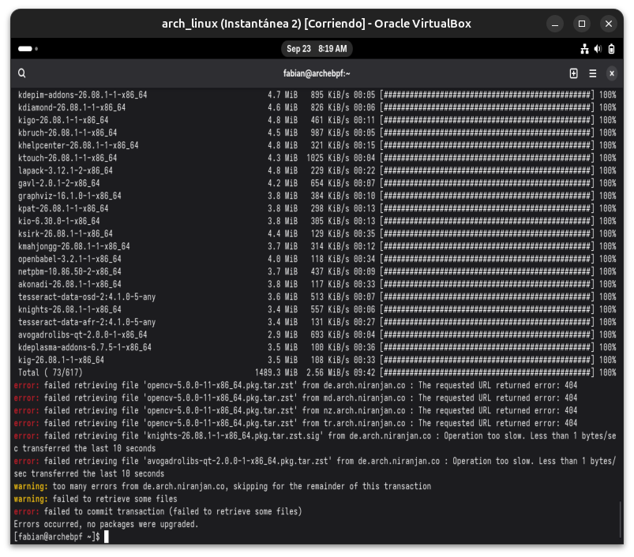

**02 — `reflector`: mirrors inestables al refrescar**
Varios mirrors fallaron por timeout, uno incluso con error de verificación de certificado SSL.

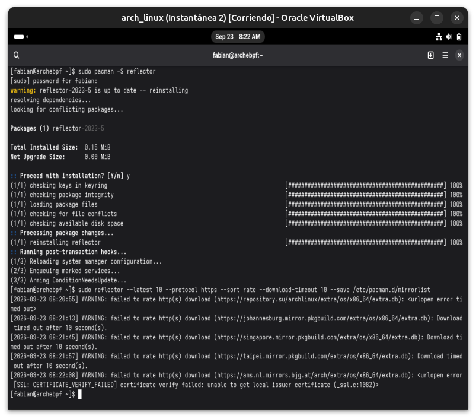

**03 — Conflicto real de dependencias (partial upgrade)**
`gst-plugins-base-libs` vs `gstreamer` en versiones incompatibles — el clásico error de "partial upgrade" (sincronizar sin actualizar todo) visto por primera vez en el curso `arch-linux-mastery`.

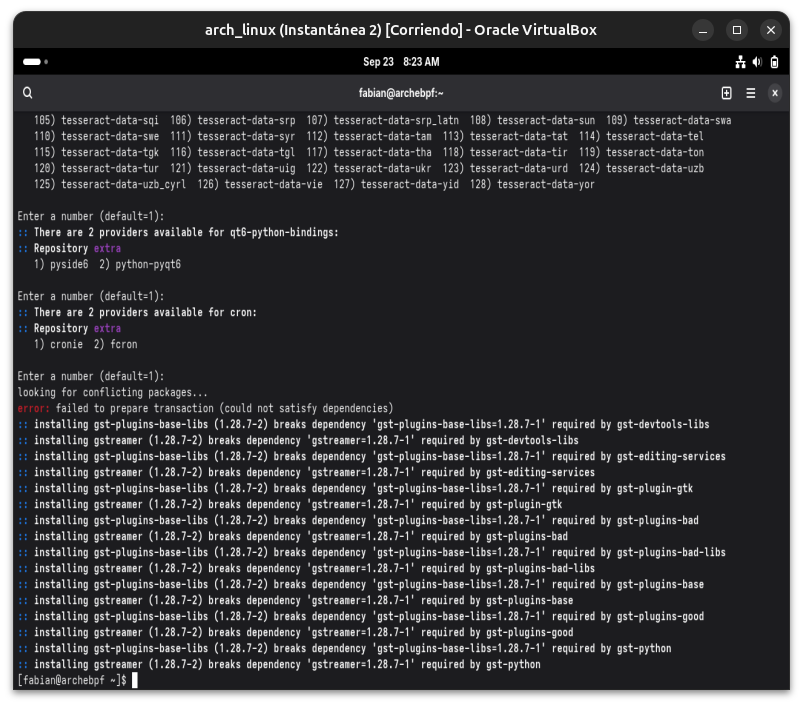

**04 — `pacman -Syu`: actualización completa del sistema**
Solución al conflicto: llevar todo el sistema a versiones consistentes antes de instalar Plasma.

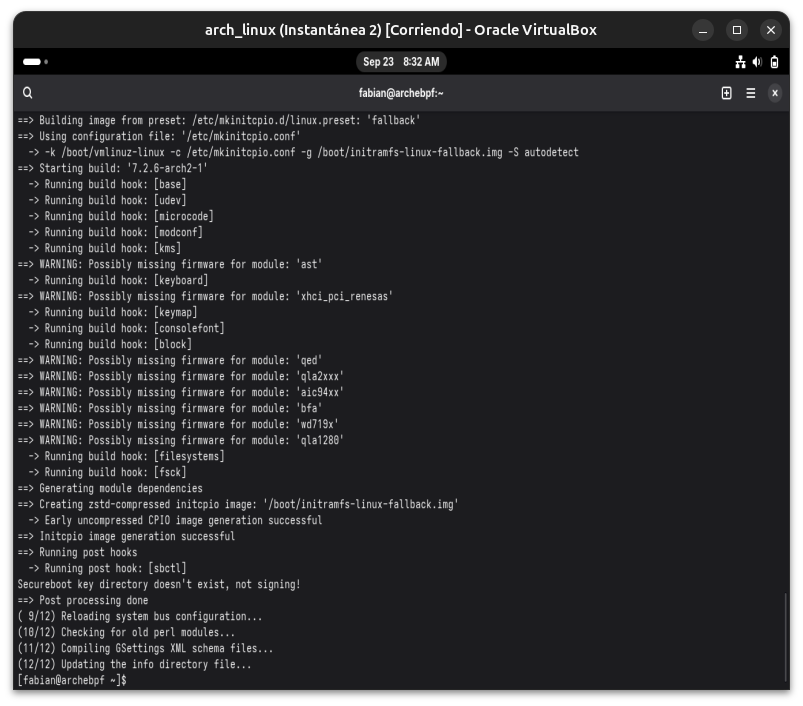

**05 — Instalación de Plasma: 546 paquetes**
Tras resolver todos los selectores de proveedores (qt6-multimedia, tessdata, qt6-python-bindings), la instalación real arrancó.

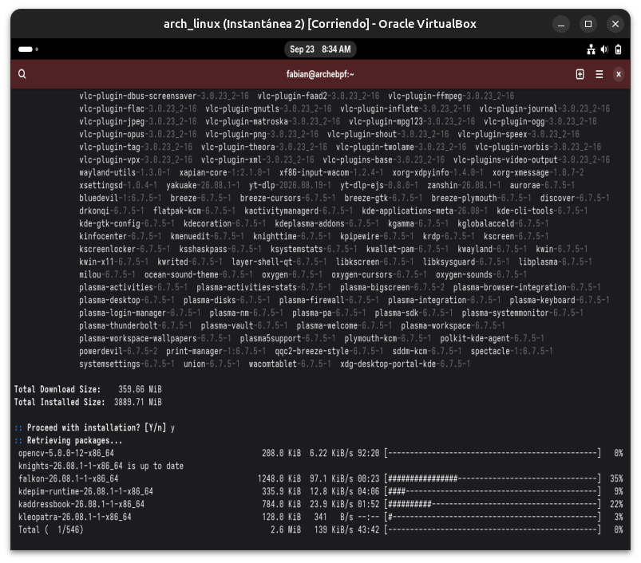

**06 — Instalación completada**
20/20 post-transaction hooks, incluyendo generación de bundles EFI.

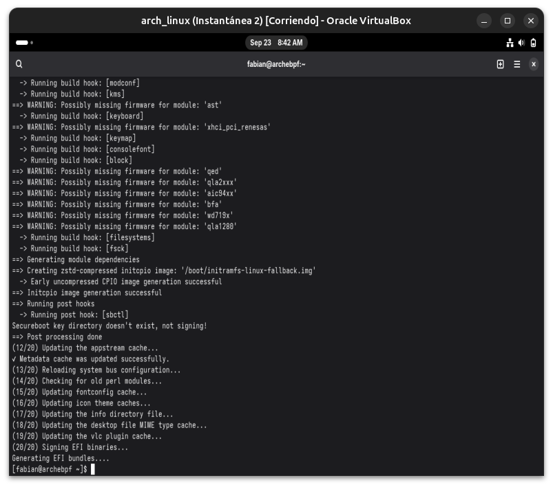

**07-08 — SDDM: eligiendo la sesión Plasma**
De "GNOME" (sesión por defecto) a "Plasma (Wayland)" seleccionado explícitamente.


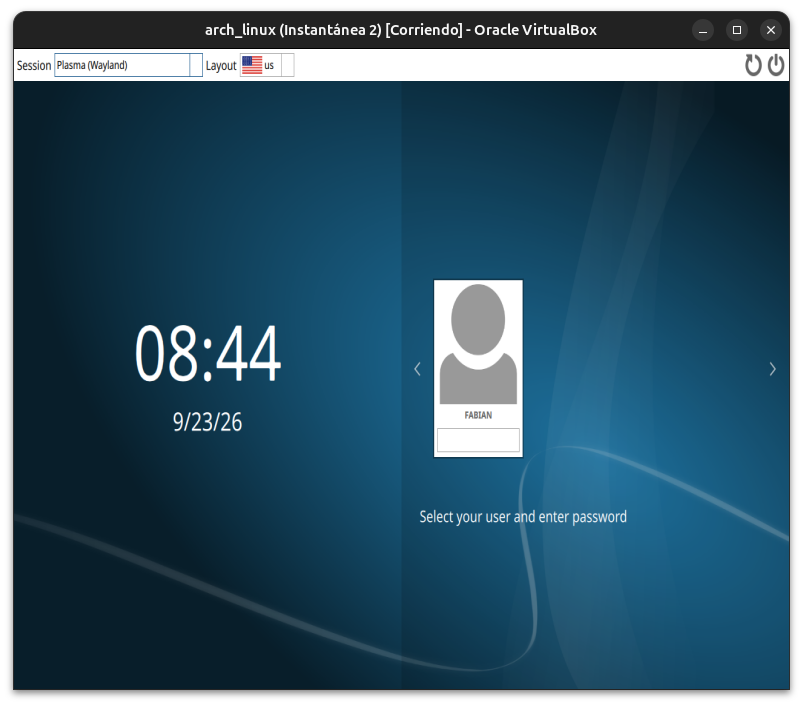

**09-11 — Arranque y escritorio de Plasma completo**
Splash de carga, Welcome Center con la mascota Konqi (y un error benigno de "Plasma Bigscreen", componente opcional no instalado), y el escritorio final con fondo animado.

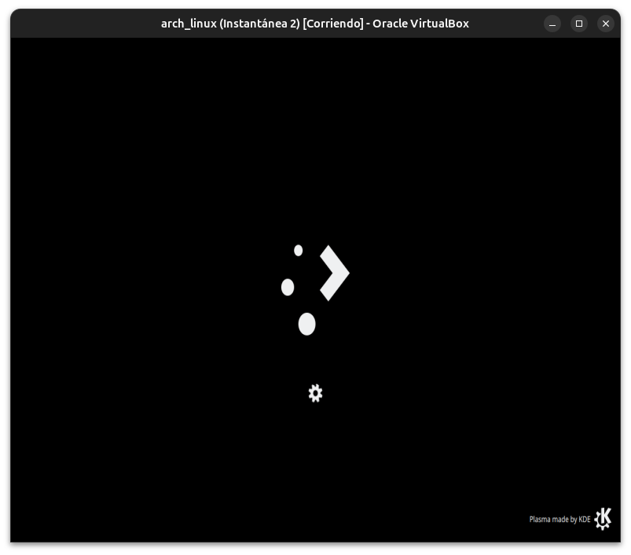
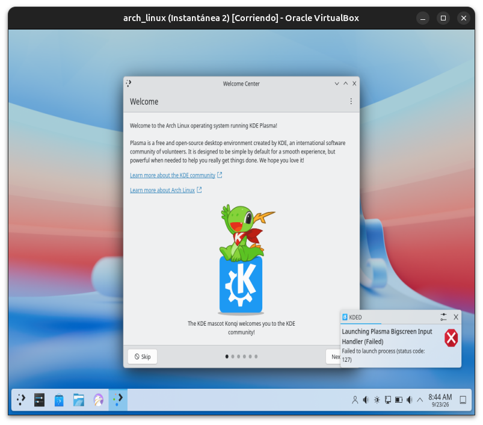
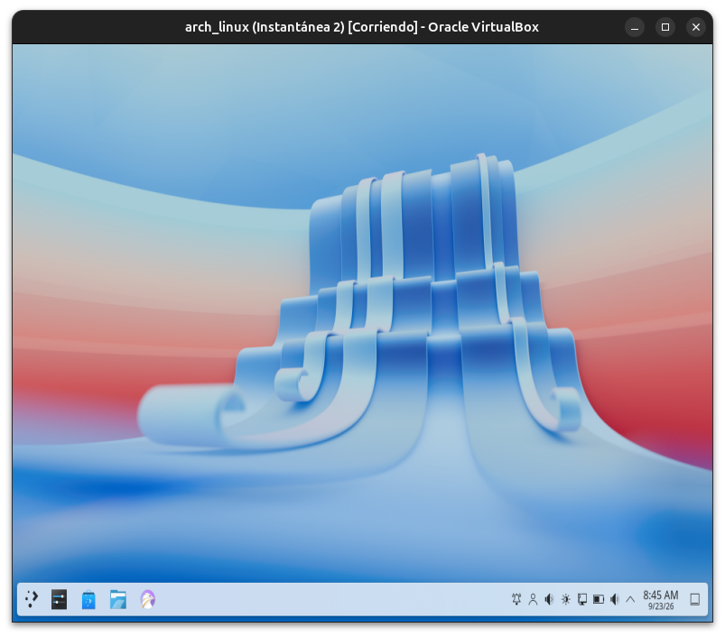

**12-13 — Menú de aplicaciones y Konsole**
Explorando la interfaz de Plasma y abriendo la terminal nativa.

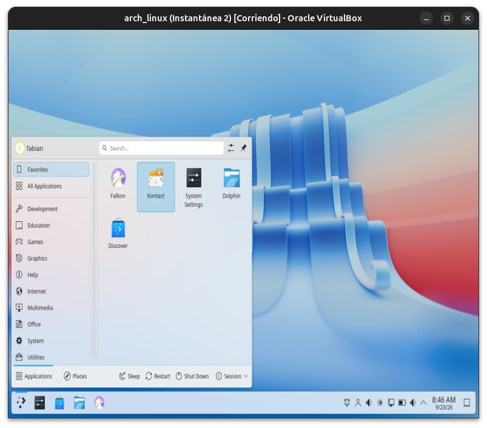
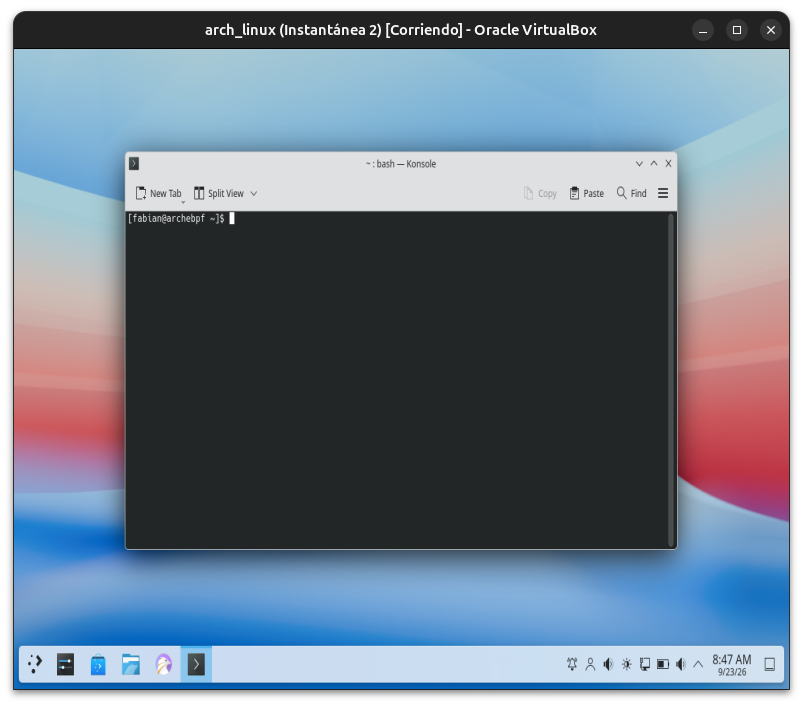

**14 — Confirmación: Wayland + KDE + SVGA3D**
Mismo patrón exacto que GNOME (Módulo 08): `wayland`, `KDE`, y el renderer `SVGA3D` compartido.

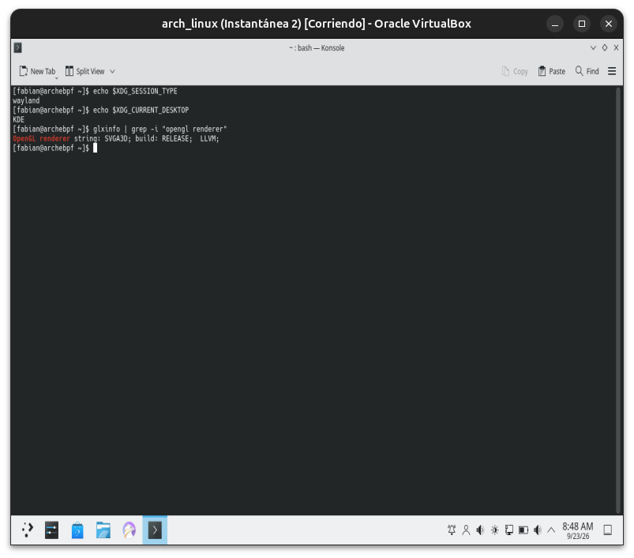

**15 — `kdeglobals`: configuración en texto plano**
Contraste directo con el modelo binario `dconf` de GNOME — archivos `.ini` legibles con cualquier editor.

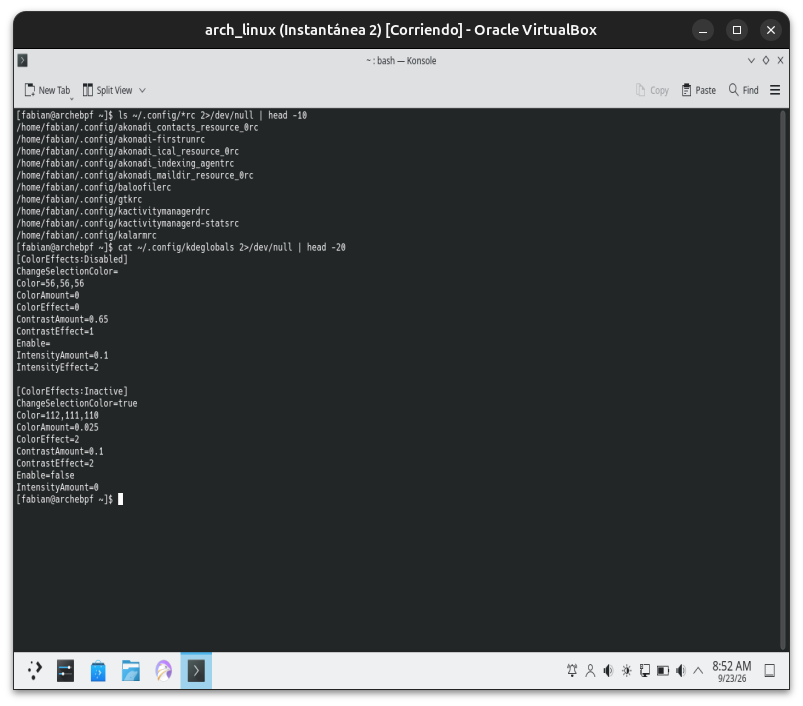

**16-17 — `plasma-apply-colorscheme`: cambio de tema real**
Lista de esquemas disponibles, y aplicación exitosa de `BreezeDark` con efecto visual confirmado en la interfaz.

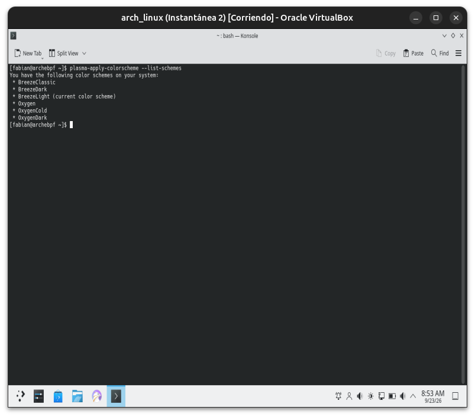
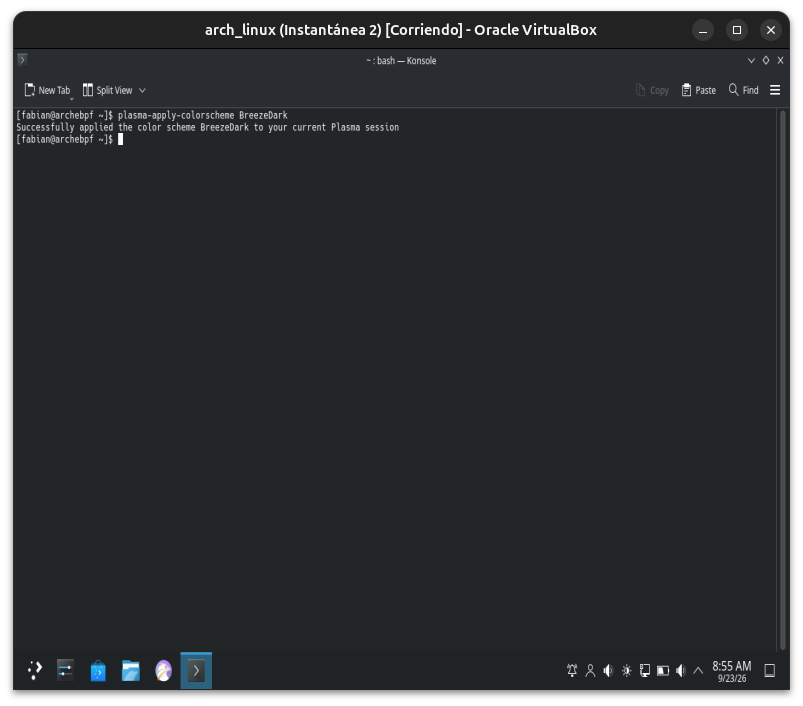

---

**Próximo módulo:** 10 — Window Managers & Compositors.
