# Módulo 10 — Window Managers & Compositors

**Fase 03 — Desktop Environments**

Con este módulo cerramos la Fase 03.

---

## Objetivos del módulo

- Entender la diferencia entre un gestor de ventanas "solo" y un entorno de escritorio completo (repaso aplicado del Módulo 07).
- Entender tiling vs. floating como filosofías de gestión de ventanas.
- Instalar y usar `i3` (tiling, Xorg) — control total, configuración por texto.
- Medir y comparar el uso de recursos real: `i3` vs. GNOME vs. KDE, en la misma VM.

---

## 1. CONCEPTO: qué te da (y qué no) un window manager "solo"

Ya viste, en el Módulo 05, `twm` — el gestor de ventanas más mínimo posible. GNOME (Módulo 08) y KDE (Módulo 09) son entornos completos, con panel, gestor de archivos integrado, demonio de configuración, etc. Un **window manager standalone** como `i3` está en el medio: mucho más usable que `twm`, pero sin todo lo que trae un DE completo.

```
twm  <────────────────── control/ligereza ──────────────────>  GNOME/KDE
     i3, bspwm, dwm                                    (completo, opinado)
     (WM standalone, configuración manual de cada pieza)
```

**Qué perdés al usar solo un WM:** panel (hay que agregarlo vos, ej. `polybar`), gestor de archivos integrado, applet de red/volumen gráficos (hay que instalarlos por separado), configuración centralizada gráfica.

**Qué ganás:** rendimiento (menos procesos corriendo), control total sobre cada atajo de teclado y comportamiento, y — para el uso profesional de terminal/sysadmin que fue el foco de tu primer curso — una experiencia mucho más veloz para trabajar 100% con teclado.

---

## 2. CONCEPTO: tiling vs. floating

**Floating** (el modelo "de toda la vida", el que usaste en GNOME/KDE): las ventanas flotan libremente, las movés y redimensionás a mano, se pueden superponer.

**Tiling** (el modelo de `i3`): las ventanas se organizan automáticamente en una cuadrícula sin superposición, dividiendo el espacio disponible. Abrís una ventana nueva y el gestor la ubica automáticamente, redimensionando lo demás.

**Por qué existe el modelo tiling:** para trabajo intensivo en terminal (justo el perfil que construiste en el curso `arch-linux-mastery`), mover y redimensionar ventanas a mano es fricción constante. El tiling elimina esa fricción — todo el espacio de pantalla se usa automáticamente, sin gestos de mouse.

---

## 3. HERRAMIENTA: instalar y usar `i3`

```bash
sudo pacman -S i3-wm i3status i3lock dmenu
```

```bash
sudo systemctl restart sddm
```

En la pantalla de login, cambiá la sesión a **"i3"** (debería aparecer automáticamente en la lista, junto a GNOME y Plasma).

### Atajos esenciales de `i3` (todos con la tecla "Mod", por defecto Alt o la tecla Windows/Super)

| Atajo | Acción |
|---|---|
| `Mod+Enter` | Abrir una terminal |
| `Mod+d` | Abrir `dmenu` (lanzador de aplicaciones por texto) |
| `Mod+flechas` | Moverte entre ventanas |
| `Mod+Shift+flechas` | Mover la ventana activa |
| `Mod+h` / `Mod+v` | Cambiar dirección de división (horizontal/vertical) |
| `Mod+f` | Pantalla completa |
| `Mod+Shift+q` | Cerrar la ventana activa |
| `Mod+Shift+r` | Recargar configuración |
| `Mod+Shift+e` | Salir de i3 |

---

## 4. CONCEPTO: la configuración de `i3` — todo en un archivo de texto

```bash
cat ~/.config/i3/config | head -30
```

**Diferencia radical con GNOME/KDE:** no hay interfaz gráfica de configuración — todo (atajos, colores, comportamiento) vive en este único archivo de texto plano, editable con cualquier editor y versionable con git (conexión directa con lo que vas a hacer en los Módulos 33-34, dotfiles).

---

## 5. HERRAMIENTA: medir el uso real de recursos — i3 vs. GNOME vs. KDE

Esta es la comparación más concreta del módulo. Desde una sesión de `i3`:

```bash
free -h
ps aux --sort=-%mem | head -10
```

Anotá el uso de memoria total. Después, iniciá sesión en GNOME (Módulo 08) y repetí exactamente los mismos comandos. Después en KDE (Módulo 09). Compará los tres resultados.

**Qué esperar (orden aproximado, de más liviano a más pesado):** `i3` << KDE Plasma < GNOME, aunque las diferencias exactas dependen de qué tengas corriendo en cada sesión. Lo importante no es el número exacto, sino **confirmar con datos reales** una afirmación que hasta ahora fue solo teórica.

---

## 6. PRÁCTICA

1. Instalá `i3` y sus dependencias, iniciá sesión en esa sesión desde SDDM.
2. Practicá los atajos de la tabla: abrí 3 terminales, organizalas en tiling, cambiá entre ellas, cerrá una.
3. Explorá `~/.config/i3/config` y encontrá la línea que define la tecla "Mod".
4. Corré `free -h` y `ps aux --sort=-%mem | head -10` en `i3`, y en GNOME/KDE, y armá una tabla comparativa con los 3 resultados.
5. Reflexión: dado el uso que le diste al curso anterior (terminal, SSH, administración de sistemas), ¿en qué escenario elegirías `i3` sobre GNOME/KDE para tu propio flujo de trabajo?

---

## 7. ERROR INTENCIONAL / DIAGNÓSTICO

```bash
cp ~/.config/i3/config ~/.config/i3/config.backup
echo "esto rompe la sintaxis de i3 {{{" >> ~/.config/i3/config
```

Recargá la configuración con `Mod+Shift+r` (o cerrá sesión y volvé a entrar).

**Diagnóstico esperado:** `i3` debería mostrar un diálogo de error indicando la línea exacta con el problema de sintaxis, y **ofrecerte continuar con la configuración anterior** en vez de simplemente fallar — un buen ejemplo de manejo de errores defensivo en herramientas de sistema. Restaurá el archivo original:

```bash
cp ~/.config/i3/config.backup ~/.config/i3/config
```

---

## Checklist de cierre del módulo (y de la Fase 03 completa)

- [ ] Entiendo qué gana y qué pierde un WM standalone frente a un DE completo.
- [ ] Entiendo tiling vs. floating como filosofías distintas de gestión de ventanas.
- [ ] Instalé y usé `i3`, dominando los atajos básicos.
- [ ] Exploré la configuración de `i3` como archivo de texto plano.
- [ ] Medí y comparé el uso real de recursos entre `i3`, GNOME y KDE, con datos concretos.
- [ ] Provoqué y diagnostiqué un error de sintaxis en la configuración de `i3`.

---

## Evidencias

**01 — Typo real: `i3-vm` en vez de `i3-wm`**
Error de tipeo corregido al toque.

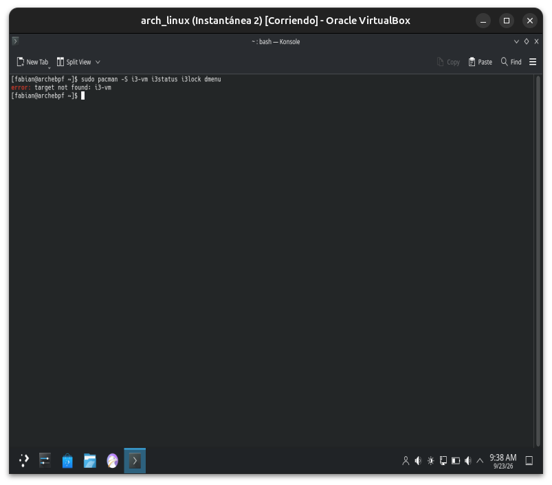

**02-03 — Instalación de `i3` completa**
8 paquetes en total (1.25 MiB de descarga) — extremadamente liviano comparado con GNOME (466 paquetes) o KDE (546 paquetes).

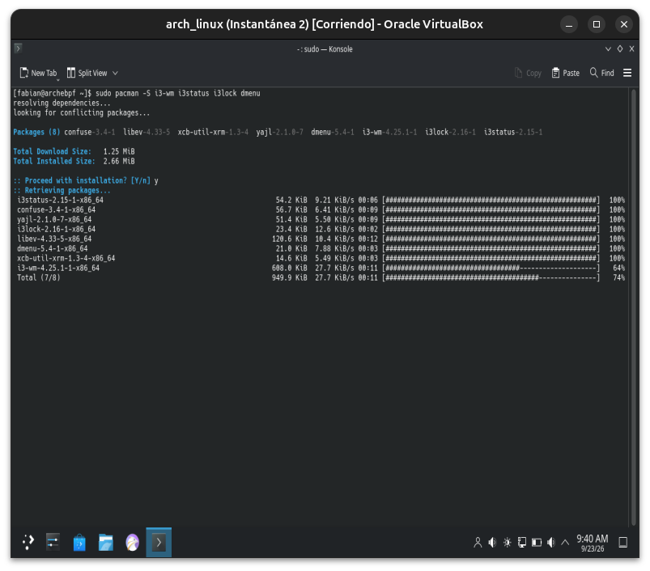
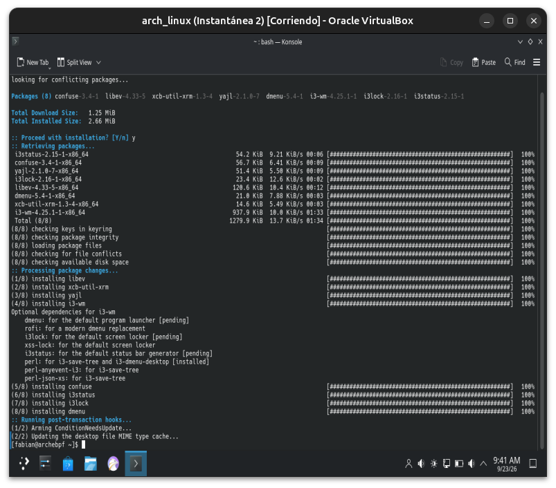

**04 — SDDM: "i3" ya disponible en la lista de sesiones**
Junto a GNOME, Plasma, Plasma Bigscreen y Weston — todos coexistiendo sin conflicto.

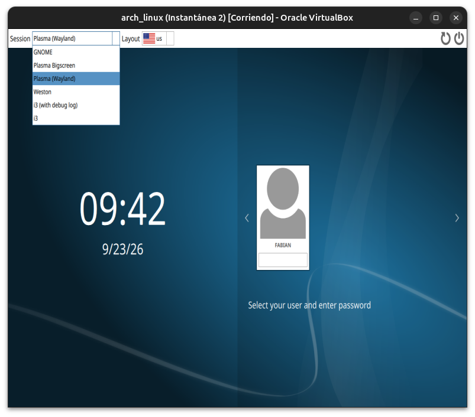

**05-06 — Primera configuración de `i3`**
Asistente inicial generando `~/.config/i3/config`, eligiendo `Win` como tecla modificadora.

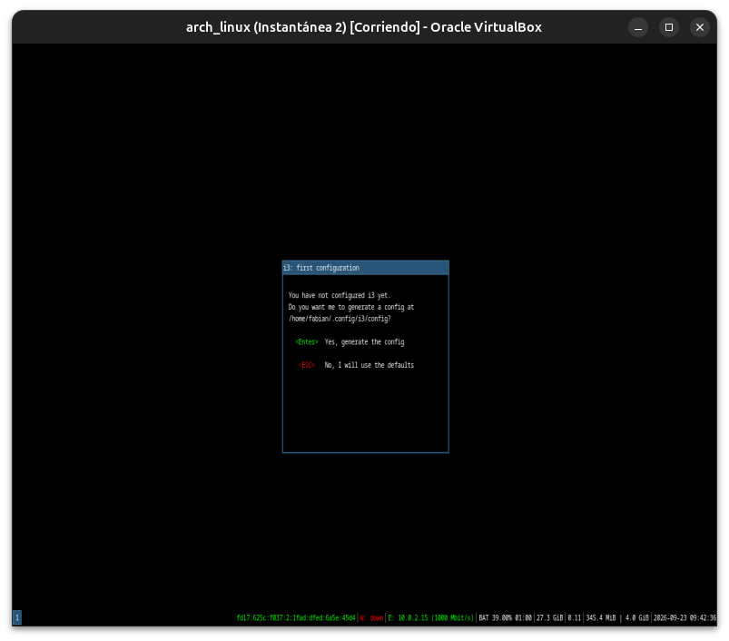
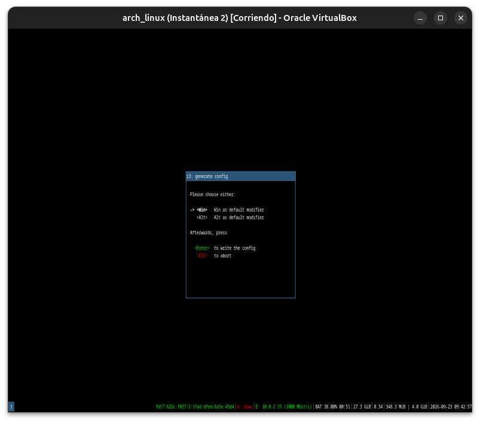

**07 — El "escritorio" de i3: vacío, solo la barra de estado**
Pantalla completamente negra con `i3status` mostrando red, batería, memoria y hora en tiempo real — la esencia del minimalismo tiling.

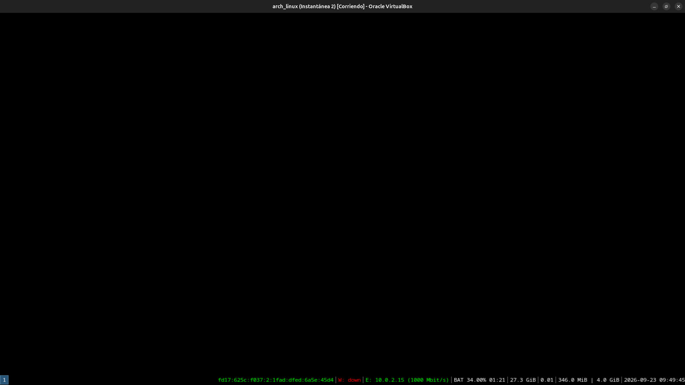

**08-09 — Tiling en acción: de una terminal a dos divididas automáticamente**
`Mod+Enter` abre una terminal a pantalla completa; una segunda `Mod+Enter` divide el espacio automáticamente, sin mover ni redimensionar nada a mano.

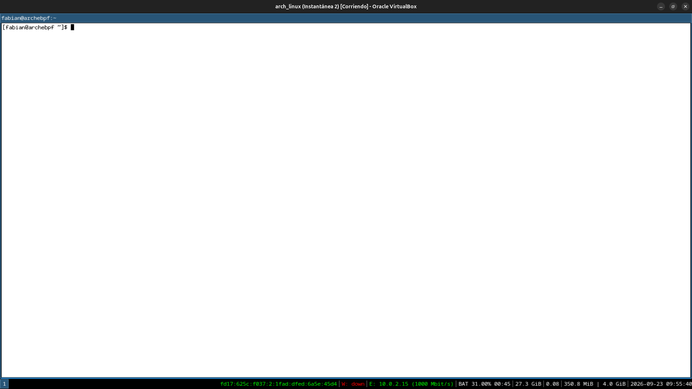
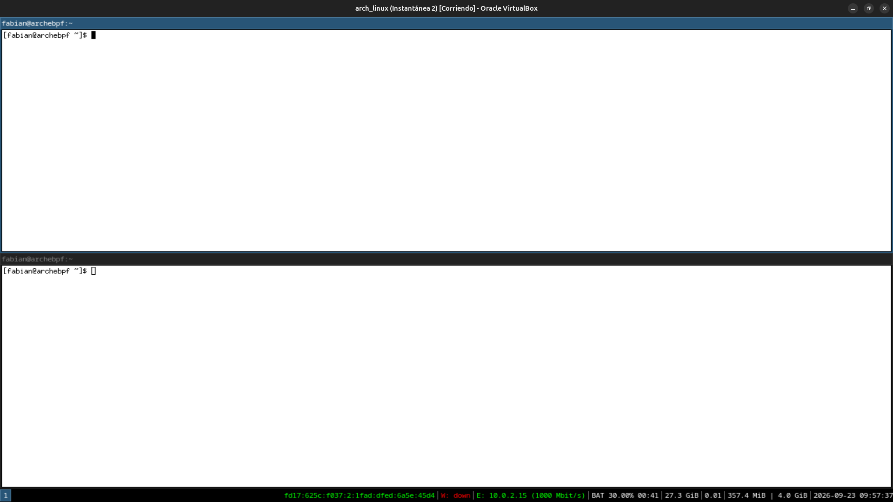

**10-11 — Comparación real de recursos**
Primer intento con `--sort=%mem` (typo, orden ascendente, mostró los procesos más livianos). Corregido a `--sort=-%mem`: `i3` en sí ocupa apenas **0.9% / ~45MB de RAM** — confirmación concreta y medible de la teoría del módulo.

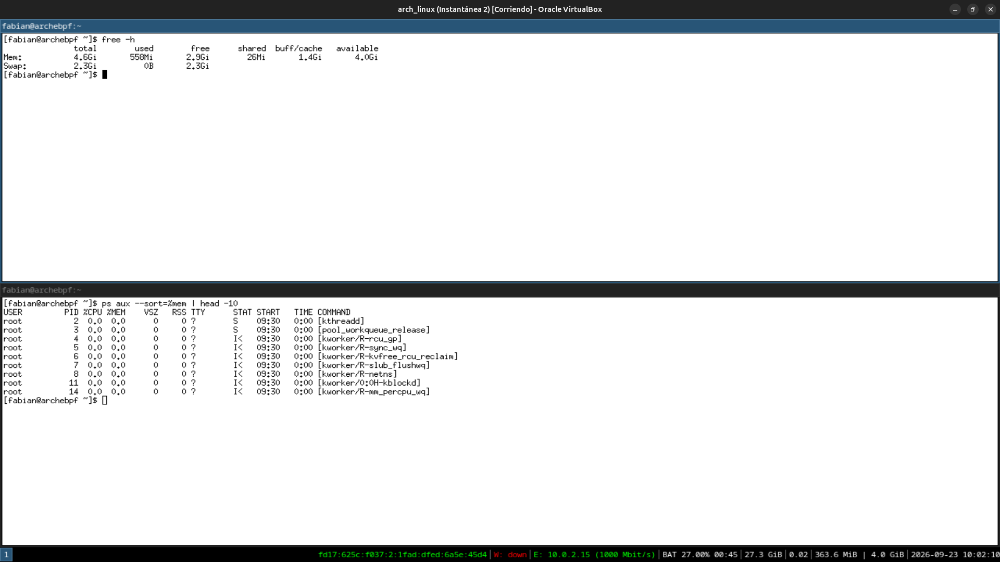
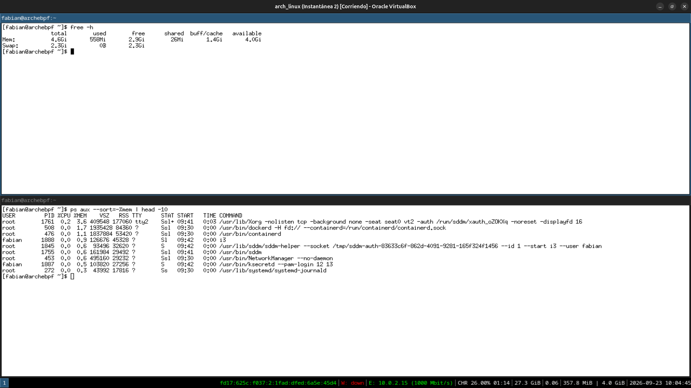

---

## Cierre de Fase 03 — Desktop Environments

Con este módulo termina la Fase 03: arquitectura de escritorio (D-Bus, display managers, XDG), dos entornos completos (GNOME, KDE Plasma), y un gestor de ventanas standalone (i3) — todos corriendo y comparados en la misma VM, con datos reales de uso de recursos respaldando cada afirmación teórica.

---

**Próximo módulo:** 11 — Laptop Power Management (inicio de la Fase 04 — Power Management).
