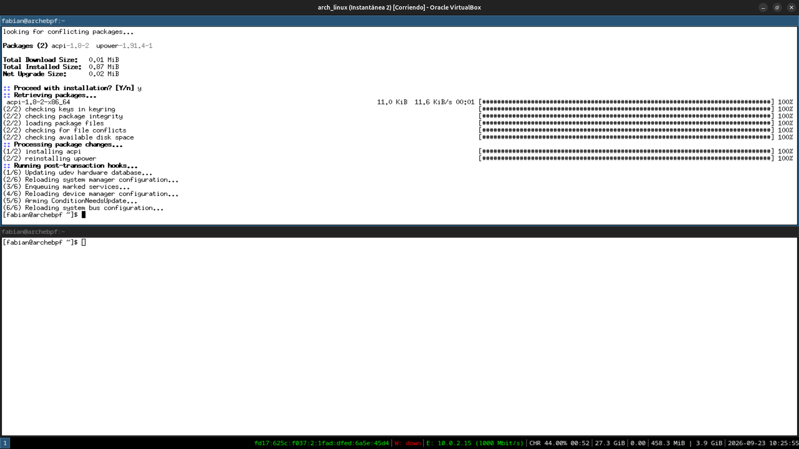
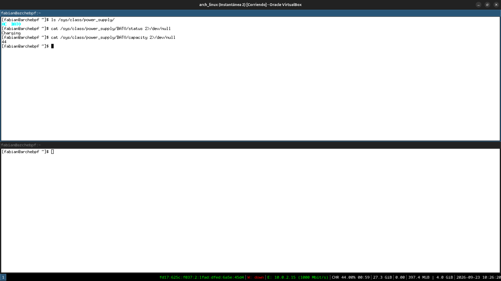
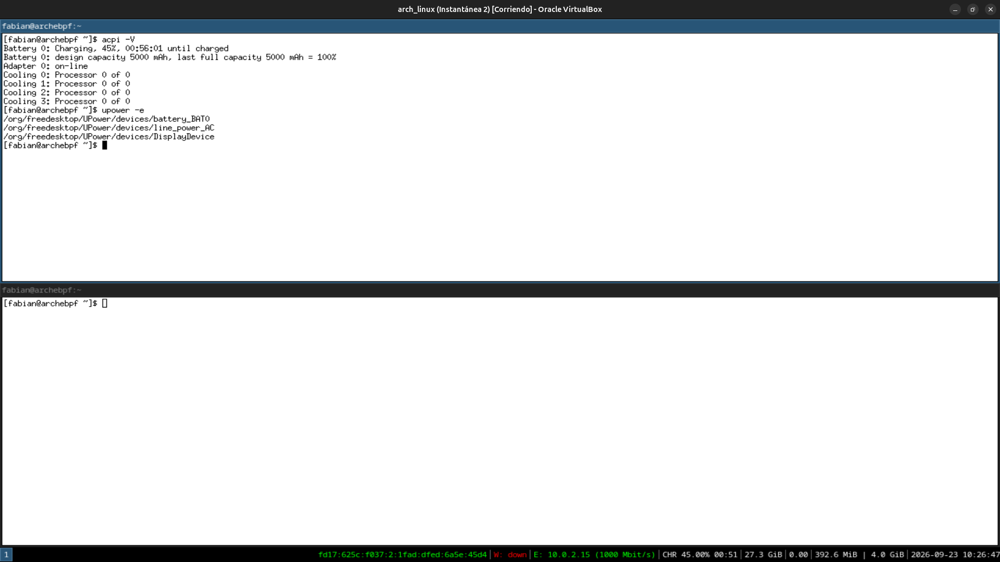
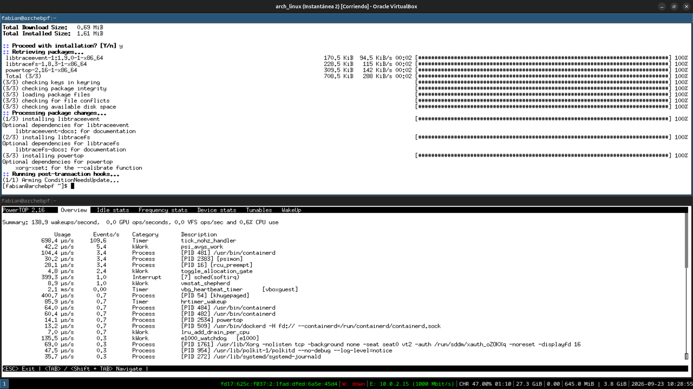
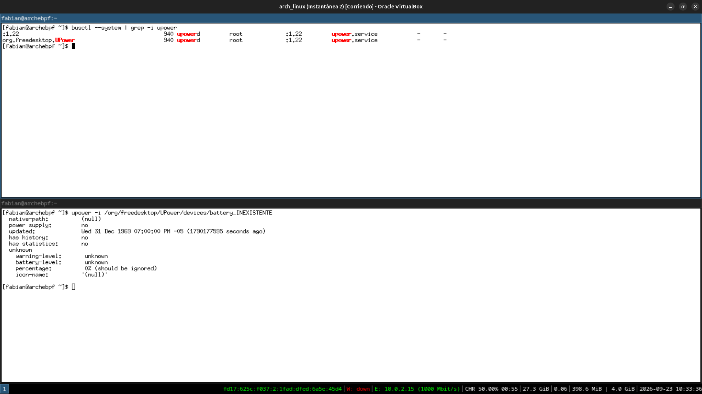

# Módulo 11 — Laptop Power Management

**Fase 04 — Power Management (teórico en VM)**

> **Nota de adaptación:** este módulo está marcado como "teórico en VM" en la guía — pero hay una sorpresa real: fijate en la barra de estado de `i3` (Módulo 10) que **ya viste** `BAT 39.00%`, `BAT 34.00%`, etc. — ¡VirtualBox **emula una batería virtual**! Esto nos permite usar las herramientas reales de gestión de energía contra un dispositivo simulado, entendiendo la arquitectura completa aunque no sea hardware físico.

---

## Objetivos del módulo

- Entender ACPI: la interfaz estándar entre firmware, kernel y hardware de energía.
- Instalar y usar `acpi`, `upower` y `powertop` contra la batería virtual de tu VM.
- Entender qué SÍ y qué NO podés aprender de energía en una VM vs. hardware físico real.
- Preparar el terreno conceptual para los Módulos 12-13 (batería/suspend real y optimización).

---

## 1. CONCEPTO: ACPI — la interfaz estándar de gestión de energía

**ACPI** (Advanced Configuration and Power Interface) es un estándar que define cómo el firmware (Módulo 03 del curso: UEFI/BIOS) expone información y control de energía al sistema operativo: batería, estados de suspensión, temperatura, ventiladores, brillo de pantalla.

```
Hardware real (batería, sensores)
        ↓
Firmware (tablas ACPI: describe qué hardware de energía existe y cómo controlarlo)
        ↓
Kernel Linux (subsistema ACPI — expone todo esto en /sys/class/power_supply/, /proc/acpi)
        ↓
Herramientas de espacio de usuario (upower, acpi, powertop, TLP)
        ↓
Entorno de escritorio (el ícono de batería que viste en GNOME/KDE, Módulos 08-09)
```

**Por qué esto importa incluso en tu VM:** VirtualBox implementa un dispositivo ACPI virtual completo (por eso `i3status` pudo mostrar `BAT`) — el kernel no distingue entre una batería real y una emulada correctamente, porque ambas hablan el mismo protocolo ACPI. Esto es una demostración práctica del valor de los estándares: el software que escribís (o instalás) funciona igual sin importar si el hardware de abajo es real o virtual, siempre que respete la interfaz.

---

## 2. HERRAMIENTA: explorar la interfaz `/sys/class/power_supply`

```bash
ls /sys/class/power_supply/
cat /sys/class/power_supply/BAT0/status 2>/dev/null || ls /sys/class/power_supply/
cat /sys/class/power_supply/BAT0/capacity 2>/dev/null
```

**Nota:** el nombre exacto puede variar (`BAT0`, `BAT1`) — usá el primer `ls` para confirmar el nombre real en tu sistema.

---

## 3. HERRAMIENTA: `acpi` y `upower`

```bash
sudo pacman -S acpi upower
acpi -V
```

`acpi -V` te da un resumen legible: porcentaje de batería, estado (cargando/descargando), y a veces temperatura de sensores térmicos virtuales.

```bash
upower -e                          # enumerar dispositivos de energía detectados
upower -i $(upower -e | grep BAT)    # información detallada de la batería
```

**Comparar con lo que ya viste:** `upower` es exactamente la fuente de datos que usa el applet de batería de GNOME/KDE (Módulos 08-09) — ahora estás viendo los mismos datos "crudos", sin la capa gráfica encima.

---

## 4. HERRAMIENTA: `powertop` — análisis de consumo (con matiz importante en VM)

```bash
sudo pacman -S powertop
sudo powertop
```

`powertop` normalmente analiza qué procesos/dispositivos consumen más energía, y sugiere optimizaciones (relevante en el Módulo 13). **En una VM, estos números son en gran parte ficticios** — no hay consumo eléctrico real que medir, solo estimaciones basadas en actividad de CPU virtualizada. Documentá esta limitación explícitamente: es la herramienta correcta, pero los datos concretos de consumo solo van a ser significativos en hardware físico real.

Salí con `q`.

---

## 5. CONCEPTO: qué SÍ y qué NO aprendés de energía en esta VM

| Se puede aprender en la VM | Requiere hardware físico real |
|---|---|
| Arquitectura ACPI y su cadena firmware→kernel→userspace | Consumo eléctrico real medido por `powertop` |
| Comandos y sintaxis de `acpi`, `upower` | Comportamiento real de la batería (ciclos de carga, degradación) |
| Cómo se estructura `/sys/class/power_supply/` | Diferencias reales entre estados de suspensión (S3 vs. S0ix) |
| Los conceptos de los Módulos 12-13 | Efectos reales de optimización de CPU/GPU en autonomía |

---

## 6. PRÁCTICA

1. Explorá `/sys/class/power_supply/` y confirmá el nombre exacto de tu batería virtual.
2. Instalá `acpi` y `upower`, y corré ambos contra la batería virtual.
3. Instalá y abrí `powertop` brevemente, documentando qué ves (aunque los números sean simulados).
4. Reflexión: ahora que conocés la cadena completa (ACPI → kernel → `/sys` → herramientas → DE), explicá con tus propias palabras por qué el ícono de batería que viste en GNOME (Módulo 08) mostraba información en tiempo real sin que ninguna aplicación tuviera que "inventar" cómo leer el hardware.

---

## 7. ERROR INTENCIONAL / DIAGNÓSTICO

```bash
upower -i /org/freedesktop/UPower/devices/battery_INEXISTENTE
```

**Diagnóstico esperado:** un error indicando que ese dispositivo no existe en el bus D-Bus de UPower (conexión directa con el Módulo 07: `upower` expone su información **vía D-Bus**, no archivos sueltos — podés confirmarlo con `busctl --system | grep -i upower`).

---

## Checklist de cierre del módulo

- [ ] Entiendo la cadena ACPI: firmware → kernel → `/sys/class/power_supply` → herramientas → DE.
- [ ] Exploré la batería virtual de VirtualBox con `acpi` y `upower`.
- [ ] Entiendo por qué `powertop` da datos poco significativos en una VM.
- [ ] Puedo distinguir qué aspectos de gestión de energía son aprendibles en VM y cuáles requieren hardware real.
- [ ] Confirmé que `upower` se comunica vía D-Bus, conectando con el Módulo 07.

---

## Evidencias

**01 — `acpi` y `upower` instalados**
Sin errores, instalación mínima (0.87 MiB).



**02 — `/sys/class/power_supply/`: la batería virtual confirmada**
`AC` y `BAT0` listados; `status` = `Charging`, `capacity` = `44` — datos reales, generados por el dispositivo ACPI virtual de VirtualBox.



**03 — `acpi -V` y `upower -e` completos**
`Battery 0: Charging, 45%, 00:56:01 until charged`, `design capacity 5000 mAh`. `upower -e` confirma 3 dispositivos: `battery_BAT0`, `line_power_AC`, `DisplayDevice`.



**04 — `powertop` corriendo, con datos reales de actividad**
Procesos reales (`containerd`, `khugepaged`, `dockerd`, `Xorg`, `polkitd`) — útil para ver actividad, aunque los datos de consumo eléctrico no son significativos en una VM.



**05 — `busctl` confirma D-Bus + comportamiento real del error intencional**
`upowerd` registrado en `org.freedesktop.UPower`. Al consultar un dispositivo inexistente, `upower` no lanza un error duro — devuelve una estructura con campos `null`/`unknown` y un explícito `"0% (should be ignored)"`, un diseño defensivo distinto al anticipado en la teoría.



---

**Próximo módulo:** 12 — Battery, ACPI, Suspend & Hibernate.
