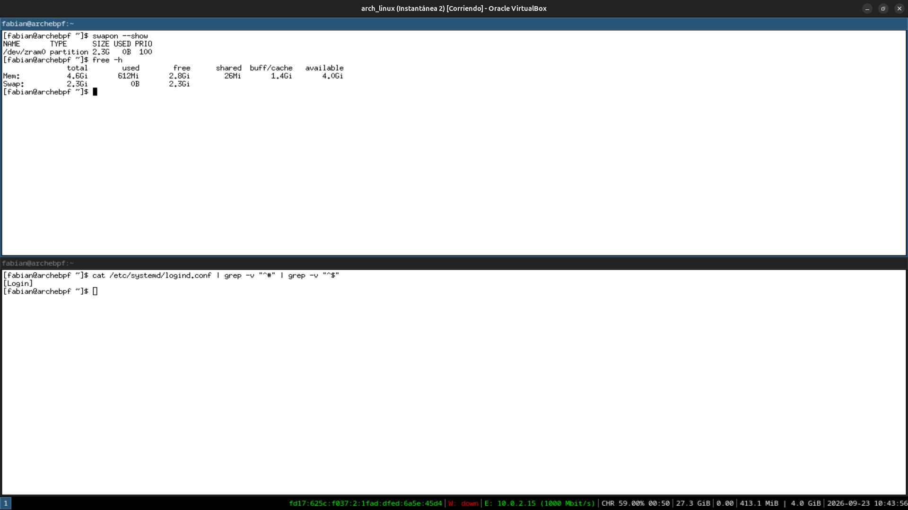
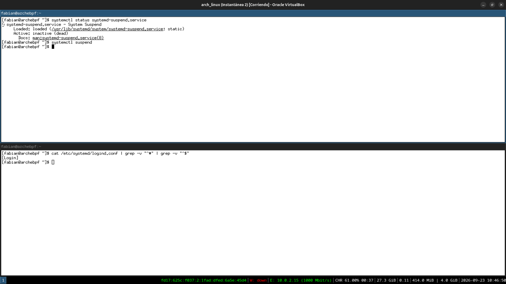

# Módulo 12 — Battery, ACPI, Suspend & Hibernate

**Fase 04 — Power Management (teórico en VM, con partes probables)**

---

## Objetivos del módulo

- Entender los estados de energía ACPI: S0 (activo), S3 (suspender a RAM), S4 (hibernar a disco), s2idle.
- Entender por qué tu swap actual (`zram`, Módulo 11 del curso anterior) es **incompatible** con hibernación real — un hallazgo conceptual importante.
- Probar `systemctl suspend` contra tu VM y documentar el resultado real (funcione o no).
- Entender `logind.conf` y cómo se configura el comportamiento ante tapa cerrada/botón de energía.

---

## 1. CONCEPTO: los estados de energía ACPI

| Estado | Nombre | Qué pasa | Consumo | Tiempo de recuperación |
|---|---|---|---|---|
| S0 | Activo | Todo funcionando normal | Máximo | — |
| S0ix / s2idle | Suspensión moderna ("standby") | CPU en estados de bajo consumo, RAM activa | Bajo | Casi instantáneo |
| S3 | Suspender a RAM (suspend) | Casi todo apagado, **RAM sigue energizada** conservando el estado | Muy bajo | 1-3 segundos |
| S4 | Hibernar (hibernate) | Contenido de RAM se escribe a **disco**, la máquina se apaga completamente | Cero | 10-30 segundos |
| S5 | Apagado | Apagado completo, sin estado conservado | Cero | Arranque completo |

**La diferencia clave entre S3 y S4:** en S3 (suspend), la RAM necesita energía continua para no perder su contenido — por eso una laptop en suspensión sigue gastando algo de batería. En S4 (hibernate), el contenido completo de la RAM se vuelca a la **partición/archivo de swap en disco**, y la máquina se apaga totalmente — cero consumo, pero necesita ese espacio de swap disponible.

---

## 2. CONCEPTO: por qué tu `zram` (Módulo 11 del curso anterior) NO sirve para hibernar

Recordá: en el Módulo 11 del curso `arch-linux-mastery`, tu sistema usa **`zram`** como swap — memoria **RAM comprimida**, no espacio en disco real.

**El problema es directo:** hibernar significa "volcar el contenido de la RAM a un lugar que sobreviva sin energía, y después apagar la máquina completamente". Si tu "swap" es en realidad más RAM comprimida (`zram`), al apagar la máquina **también se pierde el zram** — es circular e imposible. Hibernar **requiere** swap respaldado por disco real (una partición de swap tradicional, o un archivo de swap en un filesystem persistente).

```bash
swapon --show    # confirmá que tu swap actual es zram, no una partición/archivo real
free -h
```

**Esto es exactamente el tipo de detalle que separa la teoría superficial de entender un sistema de verdad:** "tengo swap" no es suficiente para hibernar — importa **dónde vive** ese swap.

---

## 3. HERRAMIENTA: probar suspensión real contra tu VM

```bash
systemctl status systemd-suspend.service
loginctl show-session $(loginctl | grep $(whoami) | awk '{print $1}') -p CanSuspend
```

```bash
systemctl suspend
```

**Documentá lo que pase realmente** — hay 3 resultados posibles, todos válidos como aprendizaje:
1. La VM se "congela" visualmente y necesitás hacer clic o mover el mouse para "despertarla" (VirtualBox sí soporta señales ACPI de suspend).
2. VirtualBox ignora la señal y no pasa nada visible.
3. Algún error aparece indicando que el sistema no puede suspender en este entorno virtualizado.

Ninguno de los tres es un "error tuyo" — es información real sobre cómo VirtualBox implementa (o no) los estados ACPI de suspensión.

---

## 4. CONCEPTO: `logind.conf` — comportamiento ante eventos de energía

```bash
cat /etc/systemd/logind.conf | grep -v "^#" | grep -v "^$"
```

Directivas clave (todas comentadas por defecto, usando valores razonables):
```
HandleLidSwitch=suspend        # qué hacer al cerrar la tapa
HandlePowerKey=poweroff          # qué hacer al apretar el botón de encendido
HandleSuspendKey=suspend           # tecla dedicada de suspensión, si existe
```

**Por qué esto importa (conexión con el Módulo 07):** `logind` es el mismo componente de `systemd` que gestiona tus sesiones de usuario (lo viste indirectamente cuando exploraste D-Bus) — acá controla explícitamente la política de energía a nivel de sistema, independientemente de qué DE estés usando (GNOME, KDE, i3 — todos respetan esta configuración central).

---

## 5. PRÁCTICA

1. Confirmá que tu swap es `zram` (`swapon --show`), y explicá por escrito por qué eso hace inviable la hibernación real en este sistema tal como está configurado.
2. Probá `systemctl suspend` contra tu VM y documentá (con capturas) exactamente qué pasó.
3. Explorá `/etc/systemd/logind.conf` y identificá qué pasaría actualmente si tu VM tuviera un evento de "tapa cerrada" (no aplica físicamente, pero el comportamiento configurado sigue siendo real).
4. Reflexión: si quisieras habilitar hibernación real en esta VM (hipotéticamente), ¿qué tendrías que cambiar primero, en términos de almacenamiento? (Pista: recordá el Módulo 11 del curso anterior — LVM, particiones).

---

## 6. ERROR INTENCIONAL / DIAGNÓSTICO

```bash
systemctl hibernate
```

**Diagnóstico esperado:** un error indicando que no hay suficiente/ningún swap disponible para hibernar, o que la operación no está soportada — la confirmación práctica y directa de la incompatibilidad `zram`/hibernate que explicamos en la sección 2. Este es un caso donde **provocar el error a propósito confirma la teoría con evidencia real**, en vez de solo creerla.

---

## Checklist de cierre del módulo

- [ ] Entiendo los estados ACPI: S0, s2idle, S3, S4, S5, y sus trade-offs de consumo/tiempo de recuperación.
- [ ] Entiendo por qué `zram` es incompatible con hibernación real.
- [ ] Probé `systemctl suspend` contra mi VM y documenté el resultado real, sea cual sea.
- [ ] Exploré `logind.conf` y entiendo su rol independiente del DE elegido.
- [ ] Provoqué el fallo de `systemctl hibernate` y lo interpreté como confirmación, no como error a temer.

---

## Evidencias

**01 — `swapon --show` confirma `zram`, `logind.conf` sin directivas activas**
`/dev/zram0 partition 2.3G` — único swap, incompatible con hibernación real. `logind.conf` solo con `[Login]`, todo por defecto.



**02 — `systemctl suspend` ejecutado**
El comando volvió al prompt inmediatamente, sin error — pero la VM quedó congelada poco después (no visible todavía en esta captura).



**03 — VM recuperada tras colgarse: pantalla de login normal**
Después del reset forzado desde VirtualBox (Machine → Reset), el sistema volvió a arrancar limpio, con la sesión "i3" recordada por SDDM — confirmando que la falla de suspensión fue un problema de la capa de virtualización, no una corrupción del sistema.


---

**Próximo módulo:** 13 — CPU/GPU Power Optimization.
