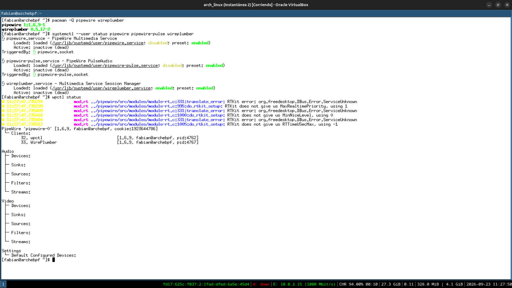
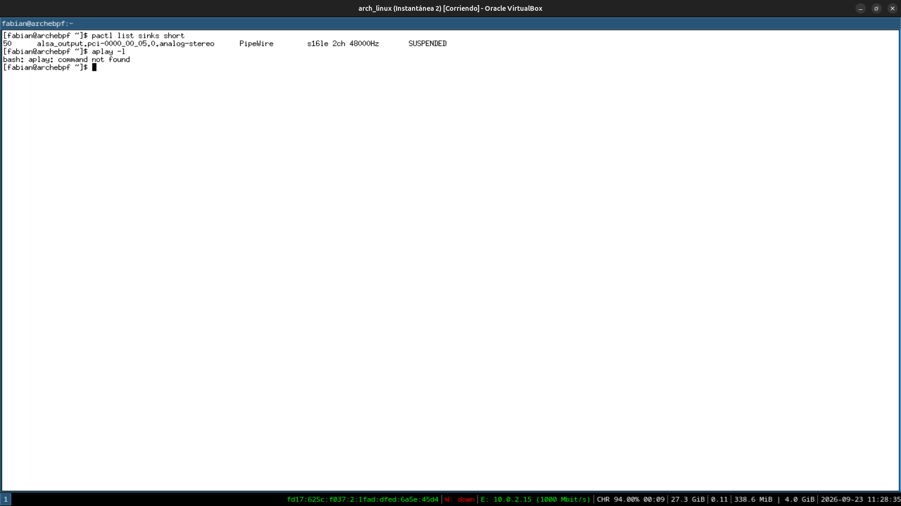
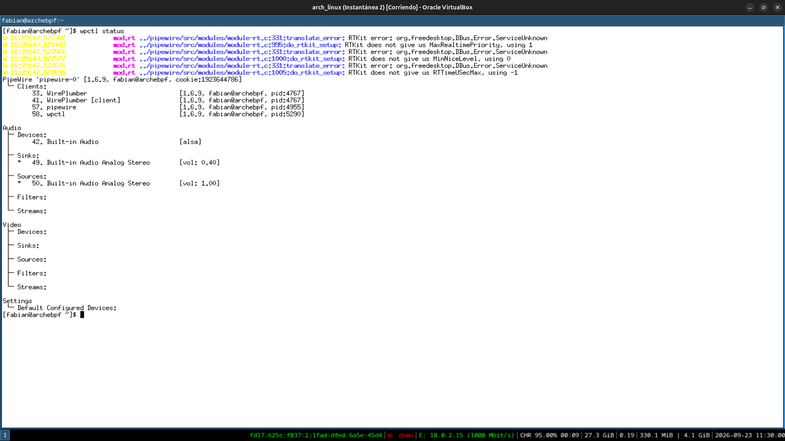
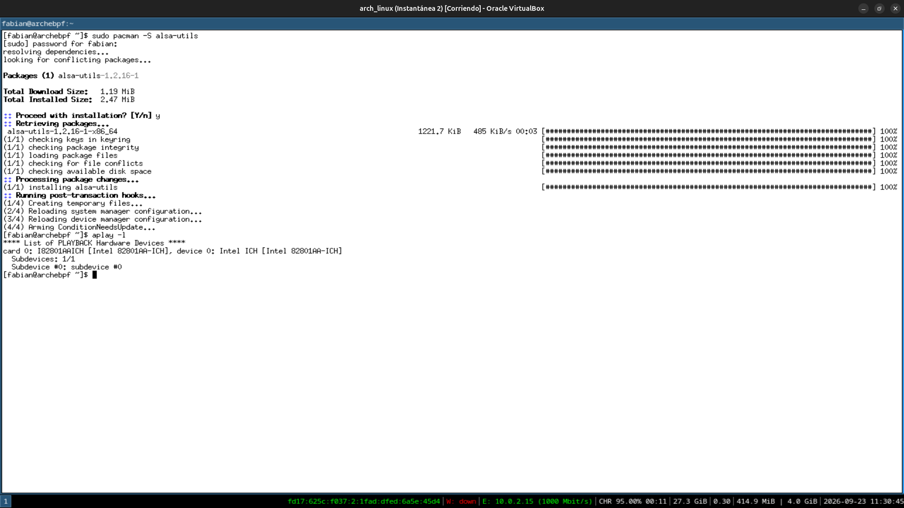
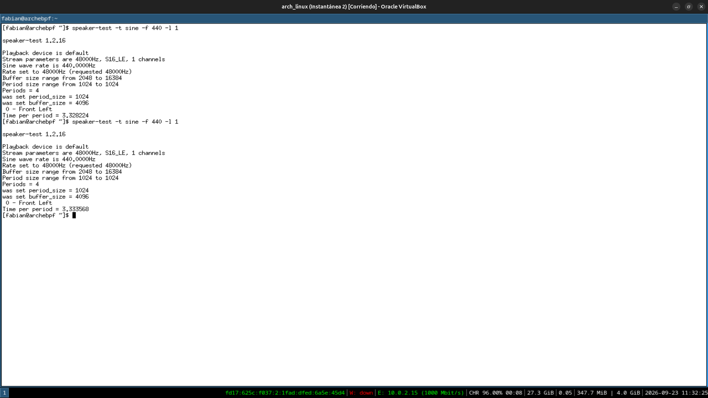

# Módulo 14 — Audio Architecture

**Fase 05 — Audio**

---

## Objetivos del módulo

- Entender las capas del stack de audio en Linux moderno: kernel (ALSA) → PipeWire → WirePlumber → aplicaciones.
- Entender por qué PipeWire reemplazó a PulseAudio (y a JACK, para audio profesional) en vez de coexistir como una tercera opción más.
- Instalar y verificar el stack de audio real en tu VM (VirtualBox emula una tarjeta de sonido).
- Inspeccionar dispositivos y streams de audio con `pactl`/`wpctl`.

---

## 1. CONCEPTO: las capas del stack de audio moderno

```
Aplicación (navegador, reproductor de música)
        ↓ usa la API de PipeWire (o compatibilidad con PulseAudio/JACK)
PipeWire (el servidor de audio/video — gestiona streams, mezcla, enruta)
        ↓
WirePlumber (el "session manager" — decide políticas: qué dispositivo es el default, qué stream va a dónde)
        ↓
ALSA (Advanced Linux Sound Architecture) — el subsistema del KERNEL que habla directo con el hardware
        ↓
Hardware de audio (real, o el dispositivo virtual que expone VirtualBox)
```

**Por qué existe esta separación (mismo patrón que ya viste en gráficos, Módulo 04):** ALSA en el kernel es el equivalente de DRM/KMS — la capa de bajo nivel que habla con el hardware. PipeWire es el equivalente de Mesa/el compositor — la capa de espacio de usuario que coordina múltiples aplicaciones queriendo usar el audio a la vez.

---

## 2. POR QUÉ EXISTE: PipeWire reemplazando a PulseAudio y JACK

**El problema histórico:** Linux tuvo, durante años, **dos ecosistemas de audio separados**: `PulseAudio` (para uso de escritorio general — música, llamadas, notificaciones) y `JACK` (para audio profesional de baja latencia — producción musical, edición). Cada aplicación tenía que elegir a cuál conectarse, y hacer que ambos convivieran bien era complicado.

**La solución de PipeWire:** un único servidor de audio (y también video — cámaras, capturas de pantalla) que implementa **compatibilidad con ambas APIs** (PulseAudio y JACK) por debajo, unificando el ecosistema. Una aplicación que "cree" estar hablando con PulseAudio en realidad está hablando con PipeWire, sin saberlo — y puede coexistir sin fricción con una aplicación profesional que "cree" estar hablando con JACK.

---

## 3. HERRAMIENTA: instalar el stack de PipeWire

```bash
sudo pacman -S pipewire pipewire-alsa pipewire-pulse pipewire-jack wireplumber
```

**Nota:** en GNOME y KDE (Módulos 08-09) esto probablemente ya venía instalado como dependencia — confirmalo antes de reinstalar:

```bash
pacman -Q pipewire wireplumber 2>&1
```

```bash
systemctl --user status pipewire pipewire-pulse wireplumber
```

**Detalle importante (conexión con el Módulo 07):** estos son servicios de **usuario** (`systemctl --user`, no `sudo systemctl`) — corren dentro de tu sesión de escritorio, no como servicios de sistema. Esto tiene sentido: el audio pertenece a la sesión de un usuario específico, no es infraestructura compartida como `sshd` o `NetworkManager`.

---

## 4. HERRAMIENTA: inspeccionar dispositivos y streams

```bash
wpctl status                    # vista general: dispositivos de salida/entrada, streams activos
pactl list sinks short            # "sinks" = dispositivos de salida (compatibilidad PulseAudio)
pactl list sources short           # "sources" = dispositivos de entrada (micrófonos)
pactl info                          # resumen del servidor de audio activo
```

```bash
aplay -l    # dispositivos vistos directamente por ALSA (la capa de kernel, sin PipeWire de por medio)
```

**Comparando `aplay -l` contra `wpctl status`:** el primero te muestra lo que el **kernel** ve (la capa ALSA), el segundo lo que **PipeWire** expone hacia arriba — mismo patrón de "capas independientes hablando el mismo protocolo estándar" que ya viste con ACPI (Módulo 11) y DRM (Módulo 04).

---

## 5. EJEMPLO: generar un tono de prueba

```bash
speaker-test -t sine -f 440 -l 1
```

(Ctrl+C para detenerlo después de confirmar que corre sin error)

**Nota de adaptación:** aunque tu VM detecte un dispositivo de audio virtual y PipeWire lo reconozca, **es posible que no escuches nada realmente** — depende de si VirtualBox tiene habilitada la salida de audio hacia tu host, y si tu host (Ubuntu) tiene el audio configurado para esa VM. Lo importante para este módulo es que el **pipeline completo corra sin errores** (kernel → ALSA → PipeWire → comando), no necesariamente que escuches el tono — documentá honestamente cuál de los dos casos te tocó.

---

## 6. PRÁCTICA

1. Confirmá qué paquetes del stack de PipeWire ya tenías instalados (por GNOME/KDE) y cuáles faltaban.
2. Corré `wpctl status` y documentá qué dispositivos de audio detecta tu sistema.
3. Corré `aplay -l` y compará contra lo que ve PipeWire — ¿coinciden los dispositivos?
4. Probá `speaker-test`, documentando honestamente si escuchaste sonido o no (y por qué, según lo que sepas de tu configuración de audio del host).
5. Reflexión: ¿por qué tiene sentido que `pipewire`/`wireplumber` corran como servicios de **usuario** y no de sistema, a diferencia de `sshd` o `NetworkManager`?

---

## 7. ERROR INTENCIONAL / DIAGNÓSTICO

```bash
systemctl --user stop pipewire
pactl info
```

**Diagnóstico esperado:** `pactl info` va a fallar indicando que no puede conectarse al servidor de audio (`Connection refused` o similar) — confirmando que **todas** las herramientas de audio (incluida la compatibilidad con PulseAudio) dependen de que PipeWire esté corriendo. Reiniciá el servicio:

```bash
systemctl --user start pipewire
pactl info    # debería volver a funcionar
```

---

## Checklist de cierre del módulo

- [x] Entiendo las capas: ALSA (kernel) → PipeWire → WirePlumber → aplicaciones.
- [x] Entiendo por qué PipeWire unificó PulseAudio y JACK en vez de coexistir como una tercera opción.
- [x] Confirmé qué parte del stack ya tenía instalado desde GNOME/KDE.
- [x] Inspeccioné dispositivos con `wpctl status`, `pactl list sinks`, y `aplay -l`.
- [x] Probé `speaker-test` y documenté honestamente el resultado real (con o sin audio audible).
- [x] Entiendo por qué el audio corre como servicio de usuario, no de sistema.

---

## Evidencias

**01 — `wpctl status`: primera corrida, sin dispositivos listados**
`pacman -Q pipewire wireplumber` confirma el stack instalado (`1:1.6.9-1` / `0.5.17-2`), pero los tres servicios (`pipewire`, `pipewire-pulse`, `wireplumber`) aparecen `inactive (dead)` — socket-activated, todavía no despertados. `wpctl status` corre sin error pero muestra Audio/Devices, Sinks, Sources todos vacíos, junto con warnings esperables de RTKit (`org.freedesktop.DBus.Error.ServiceUnknown` — no hay demonio RTKit en esta VM, PipeWire cae a valores por defecto sin problema).



**02 — `pactl` sí ve el sink, `aplay` no está instalado**
`pactl list sinks short` confirma un sink real (`alsa_output.pci-0000_00_05.0.analog-stereo`, `PipeWire`, `SUSPENDED`) — PipeWire ya despertó por socket activation al primer cliente. `aplay -l` falla con `command not found`: `alsa-utils` no viene como dependencia de `pipewire-alsa`, hay que instalarlo aparte.



**03 — `wpctl status` de nuevo: ahora sí, dispositivo completo**
Repetido un par de minutos después: `Built-in Audio [alsa]` como Device, con Sink y Source activos (`Built-in Audio Analog Stereo`) — simple diferencia de timing/indexado de PipeWire respecto a la primera corrida, no un error real.



**04 — `alsa-utils` instalado, `aplay -l` confirma la capa de kernel**
Tras `sudo pacman -S alsa-utils`, `aplay -l` muestra `card 0: I82801AAICH [Intel 82801AA-ICH]` — el chip de audio Intel ICH que VirtualBox emula, visto directamente por ALSA en el kernel, sin PipeWire de por medio.



**05 — `speaker-test`: pipeline completo corriendo, audio realmente escuchado**
Dos corridas de `speaker-test -t sine -f 440 -l 1`, ambas completando el período sin error (`Time per period ≈ 3.33s`). Confirmado con audífonos puestos: el tono se escuchó — pipeline completo (kernel → ALSA → PipeWire → salida) funcionando de punta a punta, sin ninguna limitación de virtualización en este módulo.



---

**Próximo módulo:** 15 — PipeWire, WirePlumber & ALSA.
