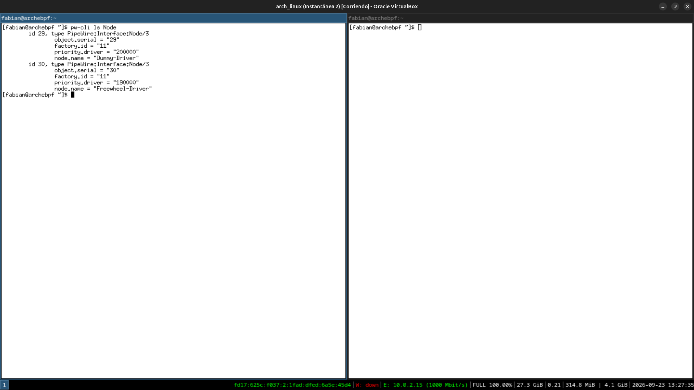
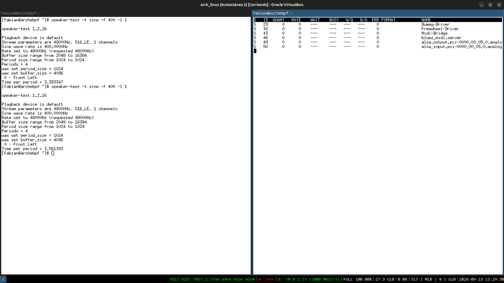
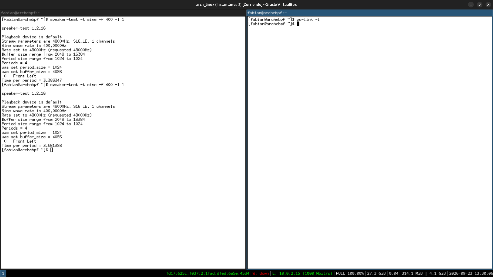
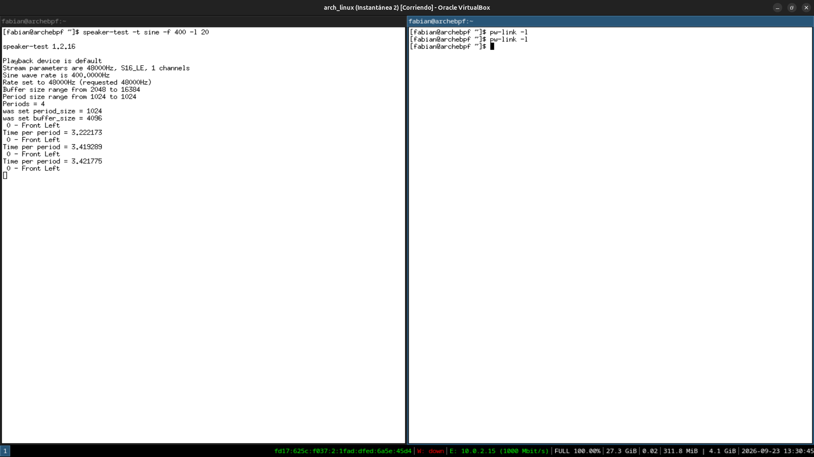
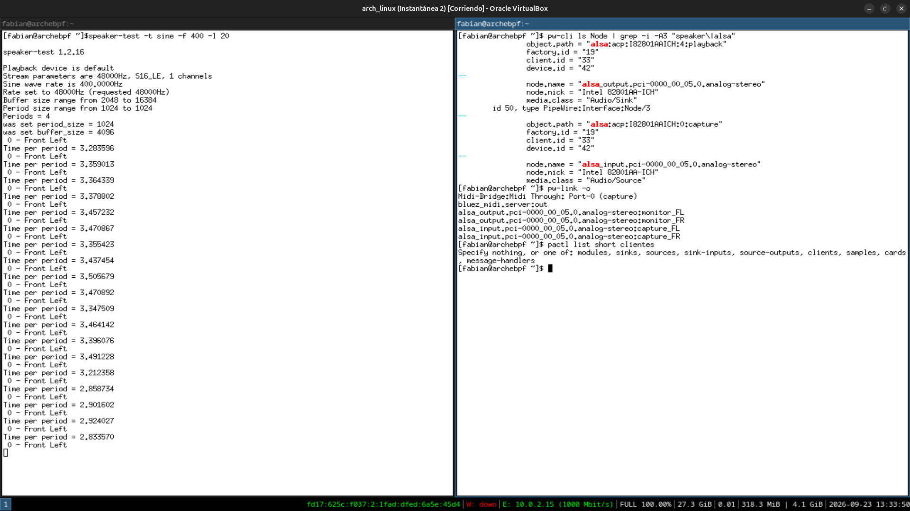
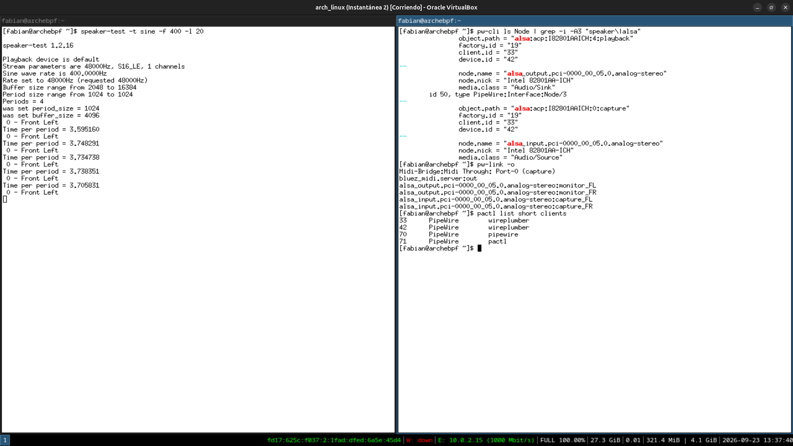
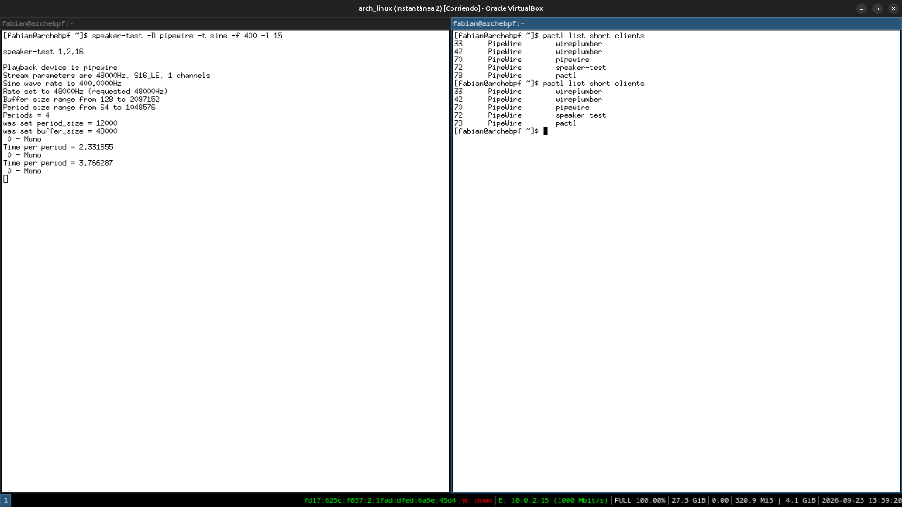
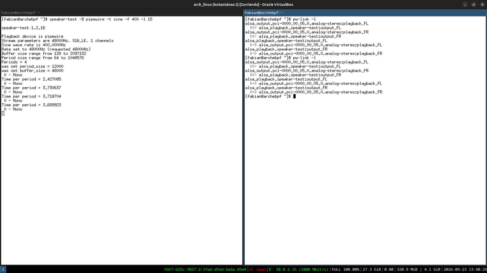
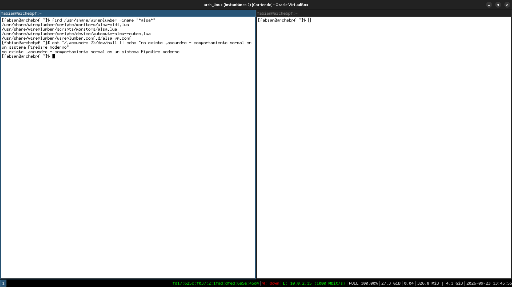
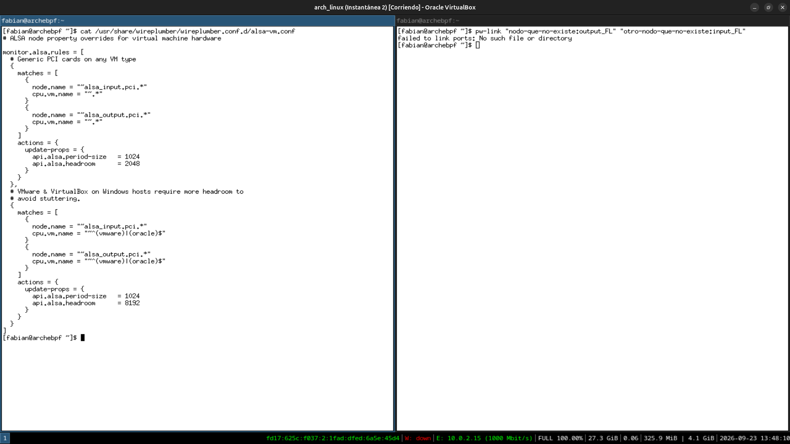

# Módulo 15 — PipeWire, WirePlumber & ALSA

**Fase 05 — Audio**

---

## Objetivos del módulo

- Profundizar en cómo PipeWire modela internamente el audio: nodos, puertos y enlaces (`nodes`, `ports`, `links`).
- Entender el rol exacto de WirePlumber como "cerebro de políticas" sobre PipeWire.
- Editar configuración real de WirePlumber (reglas de dispositivo, perfiles ALSA).
- Usar `pw-cli`, `pw-top` y `pw-link` para inspeccionar y manipular el grafo de audio en tiempo real.
- Entender el archivo `/etc/asound.conf`/ `~/.asoundrc` y cuándo ALSA todavía importa directamente, sin pasar por PipeWire.

---

## 1. CONCEPTO: el modelo interno de PipeWire — grafo de nodos

En el Módulo 14 viste el stack como capas (ALSA → PipeWire → WirePlumber → apps). Puertas adentro, PipeWire no piensa en "capas" sino en un **grafo dirigido**:

```
Nodo (ej: "Firefox", o "Built-in Audio Analog Stereo")
  └─ Puertos (ej: "output_FL", "output_FR" — canales individuales)
        └─ Enlaces (conexiones entre puertos de distintos nodos)
```

Cada aplicación que reproduce o captura audio es un **nodo**. Cada dispositivo físico (o virtual) también es un **nodo**. Los **enlaces** son las conexiones reales entre puertos — literalmente el mismo modelo que usa JACK para audio profesional, lo cual explica por qué PipeWire pudo absorber la compatibilidad JACK sin inventar nada nuevo: ya pensaba en esos términos internamente.

**Por qué esto importa:** entender el grafo es la diferencia entre "reiniciar el servicio y probar de nuevo" (lo que hiciste en el Módulo 14) y **diagnosticar quirúrgicamente** qué nodo no está conectado a qué puerto cuando algo específico no suena.

---

## 2. HERRAMIENTA: `pw-cli`, `pw-top` y `pw-link` — el grafo en vivo

```bash
pw-cli info 0        # info del propio servidor PipeWire (nodo raíz)
pw-cli ls Node        # listar todos los nodos activos ahora mismo
```

```bash
pw-top    # equivalente a "top" pero para el grafo de audio: uso de CPU por nodo, latencia, estado
```

(Ctrl+C para salir)

```bash
pw-link -l    # listar TODOS los enlaces (links) activos entre puertos, en tiempo real
```

**Ejercicio de correlación:** corré `speaker-test` (Módulo 14) en una terminal, y en otra corré `pw-link -l` mientras suena — deberías ver aparecer un enlace nuevo, en vivo, entre el nodo de `speaker-test` y el nodo del dispositivo de salida. Esto es el grafo del Punto 1, pero ahora con evidencia concreta en pantalla.

---

## 3. CONCEPTO: WirePlumber — políticas, no mecanismo

**Distinción clave (mismo patrón arquitectónico que systemd/logind, o que kernel/udev):** PipeWire es el **mecanismo** — sabe cómo mover audio entre nodos, mezclar, resamplear. WirePlumber es la **política** — decide **automáticamente** cosas como: "cuando conectás un dispositivo Bluetooth nuevo (Módulo 16), hacelo el sink default", o "cuando Firefox pide reproducir audio, conectalo al sink default actual".

Sin WirePlumber, PipeWire seguiría corriendo — pero cada conexión tendría que hacerse a mano con `pw-link`. WirePlumber es lo que hace que "simplemente funcione" sin intervención.

```bash
systemctl --user status wireplumber
ls /usr/share/wireplumber/wireplumber.conf.d/    # reglas de política por defecto, versionadas por el paquete
```

---

## 4. HERRAMIENTA: configuración real de WirePlumber — reglas de usuario

```bash
mkdir -p ~/.config/wireplumber/wireplumber.conf.d/
```

WirePlumber lee configuración en capas: primero los defaults del paquete (`/usr/share/...`, sección 3), después overrides tuyos en `~/.config/wireplumber/` — mismo patrón de "defaults del sistema + overrides de usuario" que ya viste en `~/.config/i3/config` (Módulo 10) frente a configuración de sistema.

```bash
cat /usr/share/wireplumber/wireplumber.conf.d/50-alsa-config.lua 2>/dev/null || find /usr/share/wireplumber -iname "*alsa*"
```

Esta es la regla que define, por ejemplo, el perfil ALSA por defecto de tu tarjeta (estéreo vs. 5.1, etc.) — la misma tarjeta `I82801AAICH` que viste con `aplay -l` en el Módulo 14 puede exponer varios perfiles, y WirePlumber decide cuál usar por defecto.

---

## 5. CONCEPTO: `~/.asoundrc` — cuándo ALSA sigue importando directo

A pesar de toda la capa PipeWire encima, ALSA en el kernel **sigue siendo la única forma real** de hablarle al hardware — PipeWire, en el fondo, es un cliente ALSA más (podés confirmarlo: `pactl list sinks` mostraba `alsa_output...` como nombre, Módulo 14). Un archivo `~/.asoundrc` (o `/etc/asound.conf` a nivel sistema) configura **ALSA directamente**, y aplicaciones viejas que no pasan por PipeWire (poco común hoy, pero existen) lo siguen respetando.

```bash
cat ~/.asoundrc 2>/dev/null || echo "no existe .asoundrc — todo el audio pasa por PipeWire, comportamiento normal y esperado hoy"
```

**Por qué esto NO es un problema:** que no exista es la señal correcta en un sistema PipeWire moderno — significa que no hay configuración ALSA de bajo nivel compitiendo o interfiriendo con las decisiones de WirePlumber.

---

## 6. PRÁCTICA

1. Corré `pw-cli ls Node` y contá cuántos nodos están activos ahora mismo (deberían incluir al menos el dispositivo de audio y algún cliente como WirePlumber).
2. Hacé el ejercicio de correlación de la sección 2: `speaker-test` en una terminal, `pw-link -l` en otra, confirmando el enlace en vivo.
3. Abrí `pw-top`, dejalo correr unos segundos, y documentá qué nodos aparecen con actividad de CPU.
4. Explorá `/usr/share/wireplumber/wireplumber.conf.d/` y encontrá al menos una regla relacionada a ALSA.
5. Confirmá si tenés `~/.asoundrc` y explicá con tus palabras por qué su ausencia es el estado esperado.
6. Reflexión: ahora que viste el grafo de nodos/puertos/enlaces, explicá con tus propias palabras la diferencia entre lo que hace PipeWire (mecanismo) y lo que hace WirePlumber (política).

---

## 7. ERROR INTENCIONAL / DIAGNÓSTICO

```bash
pw-link "nodo-que-no-existe:output_FL" "otro-nodo-que-no-existe:input_FL"
```

**Diagnóstico esperado:** un error indicando que no encuentra el puerto de origen o destino especificado — `pw-link` valida los nombres contra el grafo real antes de intentar conectar nada, evitando enlaces "fantasma". Podés confirmar los nombres reales de puertos disponibles con:

```bash
pw-link -o    # listar puertos de salida (output) disponibles
pw-link -i    # listar puertos de entrada (input) disponibles
```

---

## Checklist de cierre del módulo

- [x] Entiendo el modelo de grafo de PipeWire: nodos, puertos, enlaces.
- [x] Usé `pw-cli`, `pw-top` y `pw-link` para inspeccionar el grafo en tiempo real.
- [x] Entiendo la distinción mecanismo (PipeWire) vs. política (WirePlumber).
- [x] Exploré la configuración real de WirePlumber y su sistema de capas (defaults + overrides de usuario).
- [x] Entiendo qué es `~/.asoundrc` y por qué su ausencia es normal en un sistema PipeWire moderno.
- [x] Provoqué y diagnostiqué un error de `pw-link` con puertos inexistentes.

---

## Evidencias

**01 — `pw-cli ls Node`: solo los drivers internos, antes de que la sesión de audio despierte**
Únicamente `Dummy-Driver` y `Freewheel-Driver` (nodos de sincronización interna de PipeWire) — todavía sin dispositivos de audio activos en el grafo.



**02 — `pw-top` con 6 nodos, mientras `speaker-test` está sonando**
Con audio activo aparecen `Midi-Bridge`, `bluez_midi.server`, y los nodos reales del dispositivo (`alsa_output...`, `alsa_input...`) — confirmando que el grafo crece según qué esté en uso.



**03-04 — Hallazgo real: `pw-link -l` vacío, dos veces, con `speaker-test` corriendo**
Primer intento vacío porque `speaker-test` ya había terminado al momento de consultar (los enlaces de PipeWire son efímeros). Repetido con `speaker-test -l 20` activo — seguía vacío, señal de que el problema no era timing sino que el proceso no se registraba como cliente de PipeWire en absoluto.




**05 — Diagnóstico: sin cliente en el grafo, y un typo en el camino**
`pw-cli ls Node` filtrado no muestra nodo de `speaker-test`; `pw-link -o` solo lista puertos de monitor/captura del dispositivo, ningún puerto de reproducción activo. De paso, `pactl list short clientes` (typo en español) confirmó el uso correcto del comando en inglés.



**06 — `pactl list short clients` corregido: `speaker-test` no aparece como cliente de PipeWire**
Solo `wireplumber`, `pipewire` y `pactl` — confirmación adicional de que `speaker-test` por defecto usa el dispositivo ALSA (`hw:0`) directo, bypaseando PipeWire.



**07 — `speaker-test -D pipewire`: ahora sí, cliente registrado**
Forzando el dispositivo `pipewire` explícitamente, `pactl list short clients` muestra la nueva línea `72 PipeWire speaker-test` — la teoría de la sección 5, confirmada con evidencia concreta.



**08 — `pw-link -l`: el enlace real, puerto a puerto**
`alsa_playback.speaker-test:output_FL/FR` conectado a `alsa_output...analog-stereo:playback_FL/FR` — el grafo de nodos/puertos/enlaces de la sección 1, ahora visto en vivo y completo.



**09 — Configuración de WirePlumber explorada, sin `~/.asoundrc`**
`find` sobre `/usr/share/wireplumber` encuentra 4 archivos relacionados a ALSA, incluyendo un `alsa-vm.conf` notable. La ausencia de `~/.asoundrc` confirma que todo el audio pasa por PipeWire, sin configuración ALSA de bajo nivel compitiendo.



**10 — `alsa-vm.conf`: WirePlumber con reglas explícitas para VMs, y el error intencional confirmado**
El archivo detecta `cpu.vm.name` (`oracle` = VirtualBox, `vmware` = VMware) y les aplica más "headroom" de buffer (`8192` vs. `2048` genérico) para evitar cortes de audio — mismo patrón de adaptación inteligente al entorno virtualizado que ya viste con `TLP` en el Módulo 13. El `pw-link` con nombres inventados falló con `No such file or directory`, tal como se esperaba.



---

**Próximo módulo:** 16 — Bluetooth Audio.
