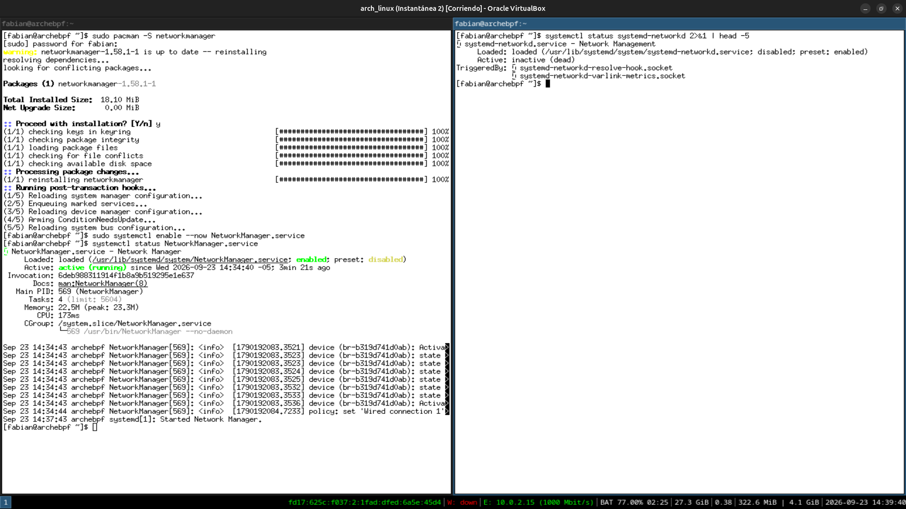
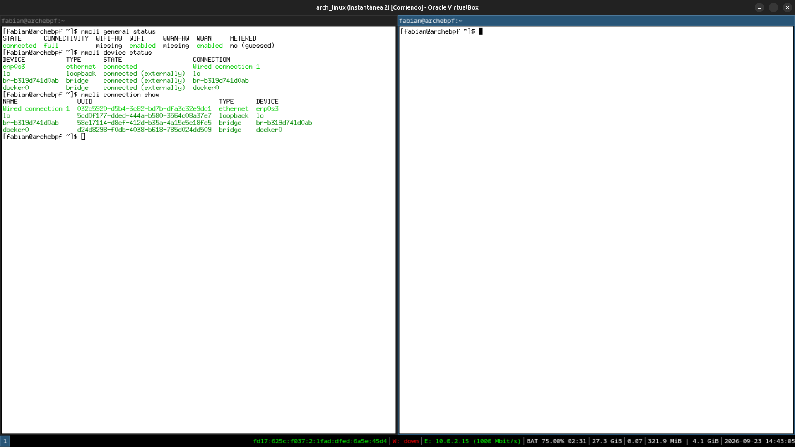
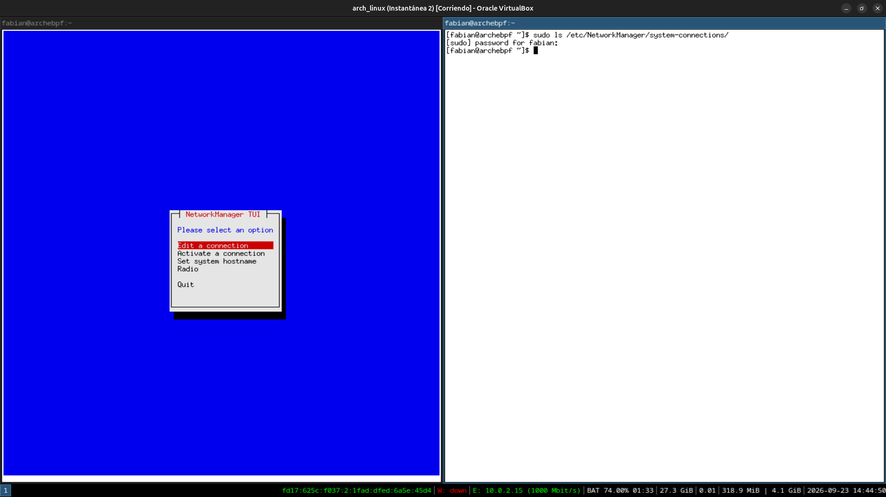
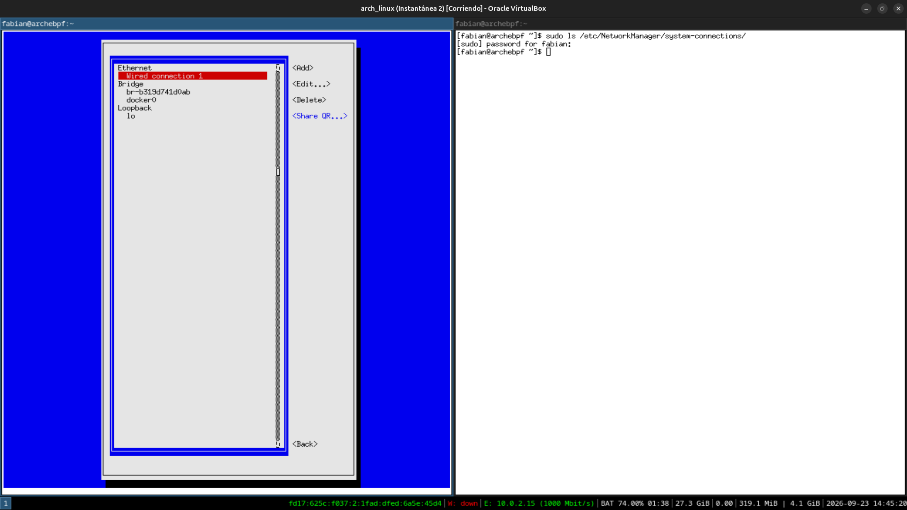
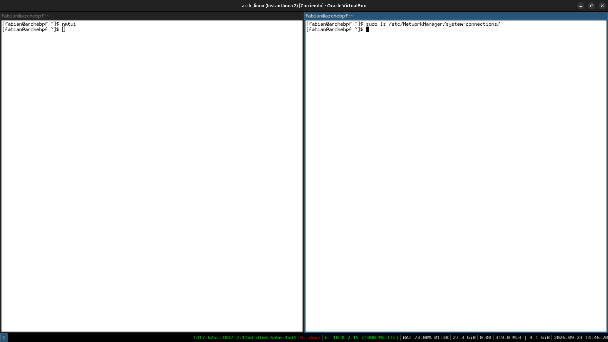
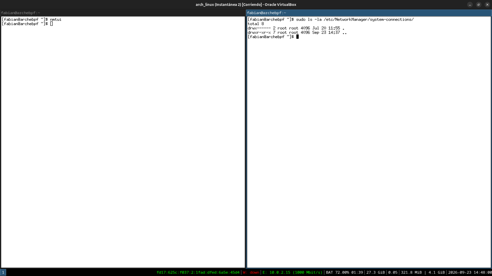
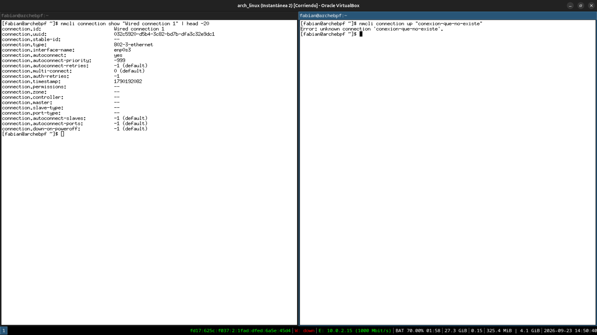

# Módulo 17 — NetworkManager

**Fase 06 — Desktop Networking**

---

## Objetivos del módulo

- Entender por qué el escritorio necesita una capa de gestión de red distinta a la que usaste en el curso anterior (`systemd-networkd`, `iwd`, `wpa_supplicant` manual).
- Instalar y usar `NetworkManager`, y entender su relación con esas herramientas de bajo nivel — no las reemplaza, las orquesta.
- Usar `nmcli` (línea de comandos) y `nmtui` (interfaz de texto) para gestionar conexiones.
- Entender los perfiles de conexión guardados y cómo se relacionan con los applets gráficos de GNOME/KDE que ya viste.

---

## 1. CONCEPTO: por qué el escritorio necesita otra capa sobre lo que ya sabés

En el curso `arch-linux-mastery` configuraste redes de forma explícita y manual: `systemd-networkd` con archivos `.network`, o `wpa_supplicant` con un archivo de configuración fijo para una sola red Wi-Fi. Eso es exactamente lo correcto para un **servidor**: la red no cambia, no hay usuario tocando un ícono, la configuración es predecible y versionable.

Un **escritorio** (sobre todo una laptop) tiene un problema distinto: la red **cambia todo el tiempo** — te movés de tu casa a un café a la oficina, cada uno con su propio Wi-Fi, y el usuario espera que simplemente "aparezca la lista y hagas clic". `NetworkManager` es la capa que resuelve exactamente ese problema: detecta redes automáticamente, recuerda credenciales, prioriza conexiones conocidas, y expone todo eso tanto por línea de comandos como por un ícono gráfico.

```
Hardware de red (Ethernet, Wi-Fi)
        ↓
Kernel (drivers, mismo nivel que ya conocés)
        ↓
wpa_supplicant / iwd (el motor real que negocia WPA2/WPA3 — SIGUE EXISTIENDO)
        ↓
NetworkManager (la capa de orquestación y persistencia de perfiles)
        ↓
nmcli / nmtui / applet gráfico de GNOME o KDE (las interfaces que vos tocás)
```

**Punto clave que no hay que perder:** `NetworkManager` **no reemplaza** `wpa_supplicant` — lo **usa por debajo** como motor de autenticación Wi-Fi. Es exactamente el mismo patrón arquitectónico de "mecanismo de bajo nivel + capa de orquestación encima" que ya viste con PipeWire/ALSA (Módulo 14) y BlueZ/bluez5 (Módulo 16).

---

## 2. HERRAMIENTA: instalar y activar `NetworkManager`

```bash
sudo pacman -S networkmanager
sudo systemctl enable --now NetworkManager.service
systemctl status NetworkManager.service
```

**Nota importante de convivencia:** si tu sistema todavía tiene `systemd-networkd` o `wpa_supplicant` gestionando la conexión directamente (como en el curso anterior), **pueden entrar en conflicto** — ambos intentando controlar la misma interfaz de red. Confirmá qué está activo:

```bash
systemctl status systemd-networkd 2>&1 | head -5
systemctl status wpa_supplicant 2>&1 | head -5
```

Si `systemd-networkd` está activo y gestionando tu interfaz, vas a necesitar deshabilitarlo para que `NetworkManager` tome control sin pelear por el mismo recurso — documentá qué encontraste antes de tocar nada.

---

## 3. HERRAMIENTA: `nmcli` — gestión completa desde la terminal

```bash
nmcli general status         # estado general: conectividad, si NM está corriendo
nmcli device status              # dispositivos de red detectados y su estado
nmcli connection show          # perfiles de conexión guardados
```

```bash
nmcli device wifi list           # redes Wi-Fi visibles (si tenés adaptador Wi-Fi — recordá el Módulo 18 más adelante para el caso "adaptado")
```

**Conexión directa con tu perfil del curso anterior:** `nmcli` es exactamente el tipo de herramienta CLI-first que ya dominás — mismo espíritu que `systemctl`, `nmcli` expone **todo** lo que hace NetworkManager sin necesitar nunca la interfaz gráfica, algo poco frecuente entre herramientas "de escritorio".

---

## 4. HERRAMIENTA: `nmtui` — interfaz de texto interactiva

```bash
nmtui
```

Un menú de texto (similar en espíritu a `raid-*` o instaladores TUI que ya usaste) para: activar una conexión, editar una conexión, cambiar el hostname del sistema. Navegación con flechas y Tab, `Esc` para salir.

**Por qué existe además de `nmcli`:** `nmcli` es mejor para scripting y automatización (recordá los Módulos de Ansible del curso anterior); `nmtui` es mejor para un ajuste rápido interactivo sin recordar sintaxis exacta — mismo trade-off que ya conocés entre un comando con flags y un asistente interactivo.

---

## 5. CONCEPTO: perfiles de conexión — dónde vive la configuración

```bash
sudo ls /etc/NetworkManager/system-connections/
```

Cada red a la que te conectaste (o configuraste) queda guardada como un archivo de perfil ahí — con la contraseña incluida, por eso los permisos son restrictivos (`root:root`, `600`). Esto es lo que le permite a NetworkManager reconectarte automáticamente a redes conocidas sin pedirte la contraseña de nuevo, y es exactamente la información que el applet gráfico de GNOME/KDE (Módulos 08-09) lee y muestra como "Redes conocidas".

```bash
sudo cat /etc/NetworkManager/system-connections/*.nmconnection 2>/dev/null | head -20
```

---

## 6. PRÁCTICA

1. Instalá `NetworkManager`, confirmá que está activo, y verificá si hay conflicto con `systemd-networkd`/`wpa_supplicant` previamente configurados.
2. Corré `nmcli general status`, `nmcli device status` y `nmcli connection show`, documentando qué ves.
3. Abrí `nmtui` y explorá el menú (sin necesariamente cambiar nada), documentando qué opciones ofrece.
4. Explorá `/etc/NetworkManager/system-connections/` y confirmá los permisos restrictivos de los archivos de perfil.
5. Reflexión: explicá con tus propias palabras por qué `NetworkManager` no reemplaza `wpa_supplicant`, sino que lo orquesta — y qué problema del escritorio (frente al servidor del curso anterior) resuelve esta capa adicional.

---

## 7. ERROR INTENCIONAL / DIAGNÓSTICO

```bash
nmcli connection up "conexion-que-no-existe"
```

**Diagnóstico esperado:** un error indicando que no se encontró un perfil de conexión con ese nombre exacto (`Error: Connection 'conexion-que-no-existe' does not exist`) — `nmcli` valida contra los perfiles guardados en `/etc/NetworkManager/system-connections/` antes de intentar activar nada, mismo patrón de validación estricta que ya viste repetidamente en el curso (`pw-link`, Módulo 15; `bluetoothctl connect`, Módulo 16).

---

## Checklist de cierre del módulo

- [x] Entiendo por qué el escritorio necesita NetworkManager sobre lo que ya sabías del curso anterior.
- [x] Entiendo que NetworkManager orquesta `wpa_supplicant`/`iwd`, no los reemplaza.
- [x] Instalé NetworkManager y resolví (o documenté) cualquier conflicto con `systemd-networkd`.
- [x] Usé `nmcli` para inspeccionar el estado general, dispositivos y conexiones.
- [x] Usé `nmtui` como alternativa interactiva.
- [x] Exploré dónde y cómo se guardan los perfiles de conexión, y su relación con el applet gráfico.
- [x] Provoqué y diagnostiqué el error de activar una conexión inexistente.

---

## Evidencias

**01 — `NetworkManager` instalado y activo, sin conflicto con `systemd-networkd`**
`NetworkManager.service` queda `active (running)`, toma control de `Wired connection 1` en segundos. `systemd-networkd.service` está `inactive (dead)` y `disabled` — nunca gestionó nada en este sistema (GNOME/KDE ya traían NetworkManager como dependencia desde el principio), por eso no hubo pelea por la interfaz.



**02 — `nmcli`: estado general, dispositivos y conexiones**
`nmcli general status` muestra `connected`/`full`, con `WIFI: enabled` pero `WIFI-HW: missing` — VirtualBox no emula hardware Wi-Fi, anticipo directo del Módulo 18. `nmcli device status` confirma `enp0s3` conectado vía `Wired connection 1`; los bridges de Docker aparecen gestionados "externally".



**03-04 — `nmtui`: menú principal y lista de conexiones**
El menú de texto (`Edit a connection`, `Activate a connection`, `Set system hostname`, `Radio`) y, dentro de "Edit a connection", la misma lista que `nmcli connection show`: `Wired connection 1`, los bridges de Docker, loopback.




**05-06 — Hallazgo real: `/etc/NetworkManager/system-connections/` completamente vacío**
Pese a que `nmcli`/`nmtui` muestran un perfil `Wired connection 1` activo con UUID propio, el directorio no contiene ningún archivo `.nmconnection` (`total 8`, solo `.` y `..`) — NetworkManager genera automáticamente una conexión Ethernet "en memoria" cuando no hay ningún perfil guardado previamente, y no la persiste a disco hasta que se edite o guarde explícitamente.




**07 — Confirmación del perfil en memoria, y error intencional**
`nmcli connection show "Wired connection 1"` expone el detalle completo del perfil (UUID, tipo `802-3-ethernet`, `autoconnect: yes`) viviendo en memoria/D-Bus sin archivo en disco. `nmcli connection up "conexion-que-no-existe"` responde `Error: unknown connection 'conexion-que-no-existe'.` — validación estricta, tal como se esperaba.



---

**Próximo módulo:** 18 — Wi-Fi (adaptado).
