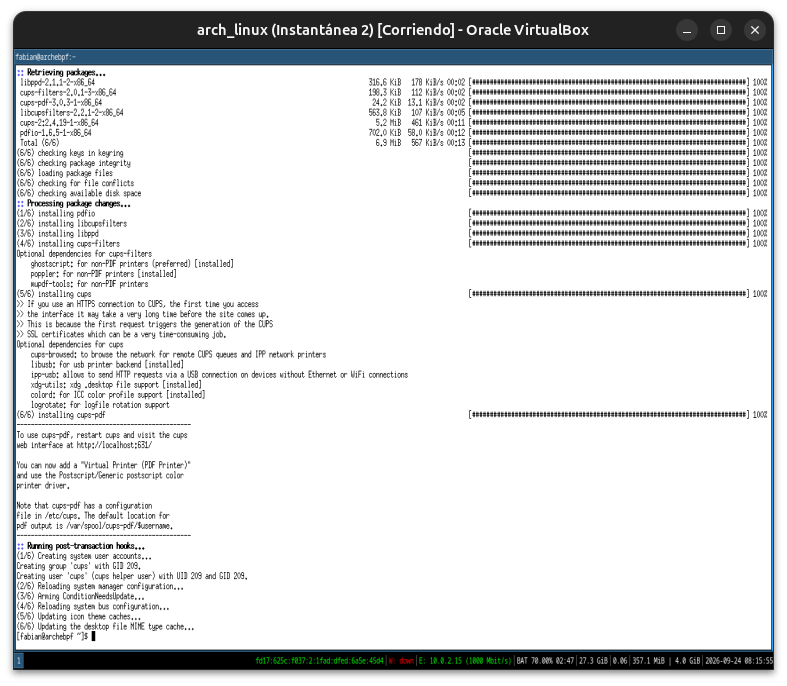
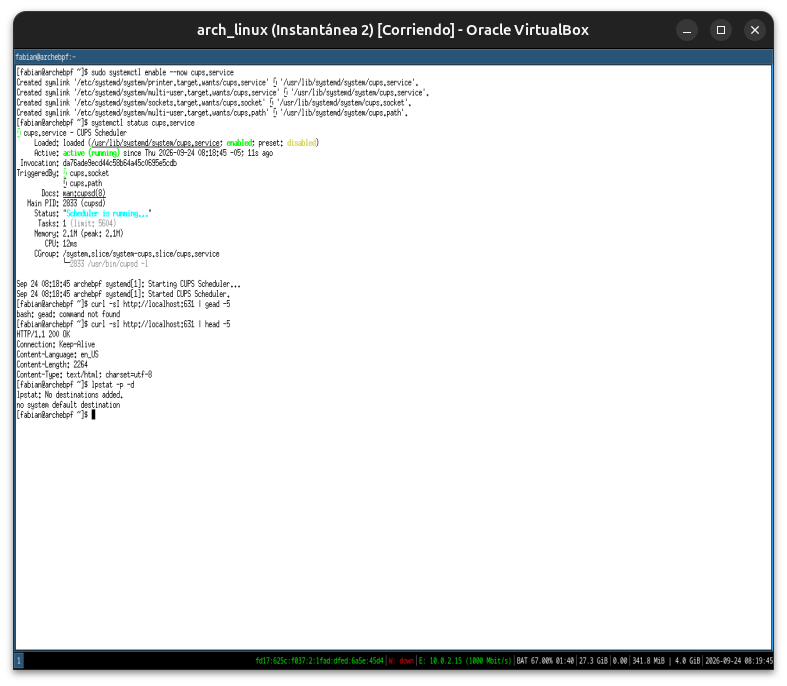
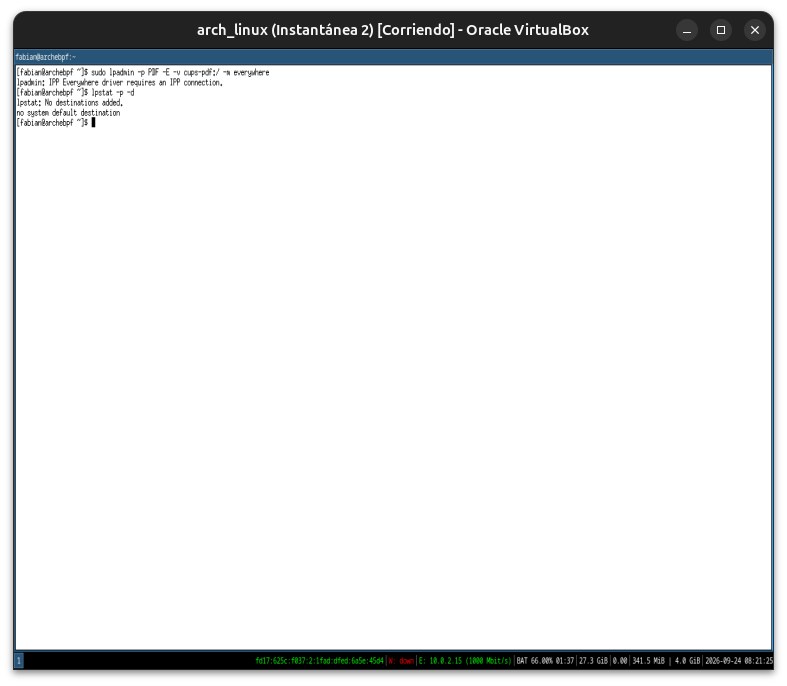
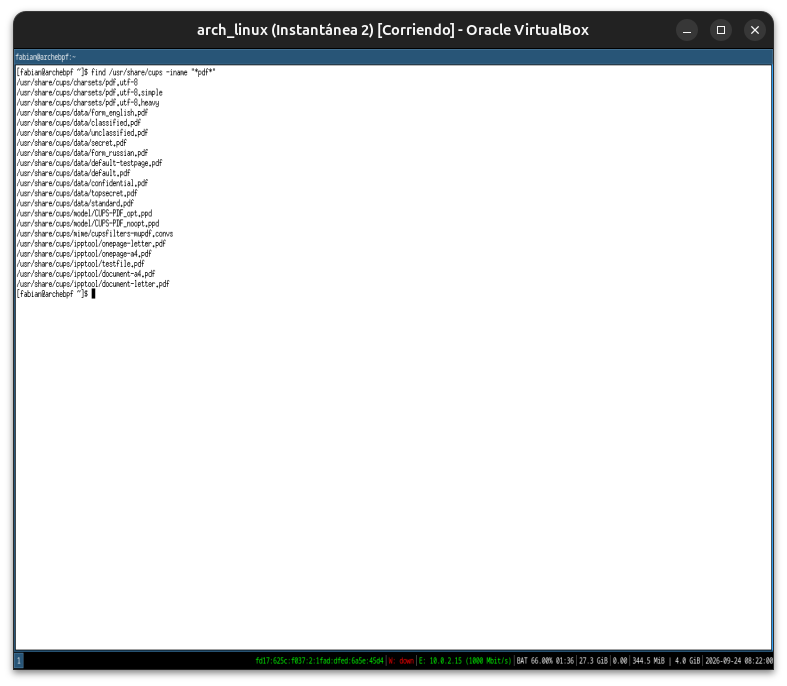
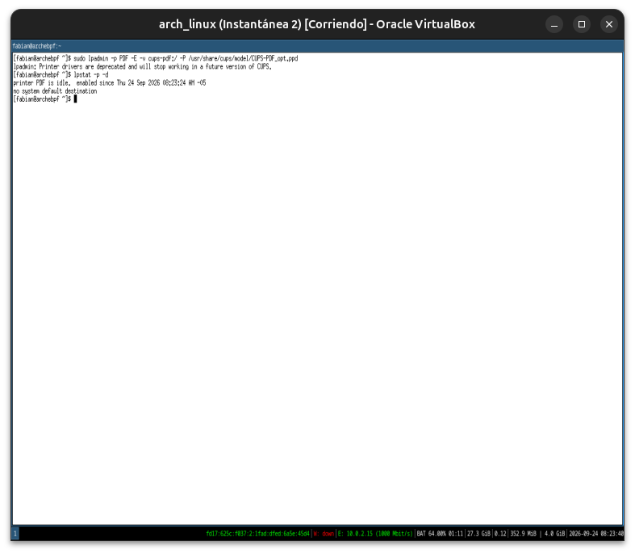
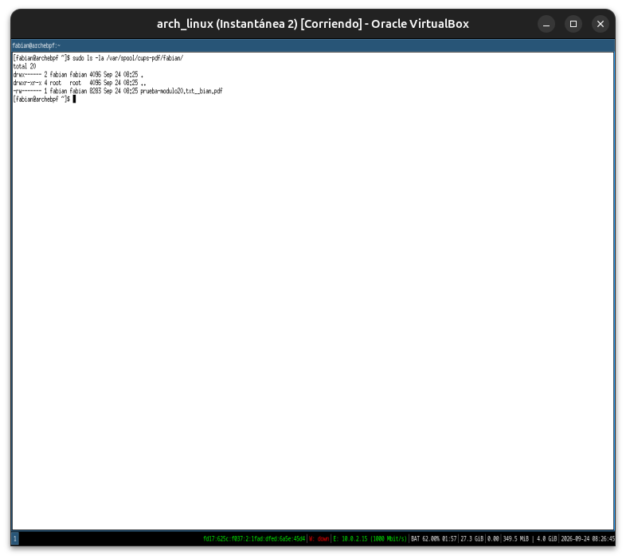
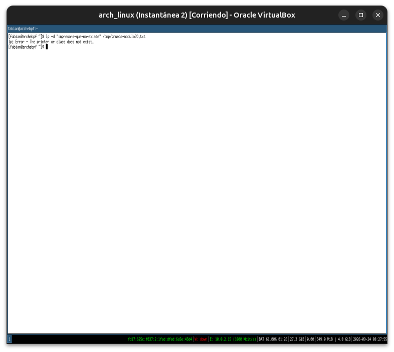

# Módulo 20 — Printing & CUPS

**Fase 06 — Desktop Networking**

Con este módulo cerramos la Fase 06.

---

## Objetivos del módulo

- Entender la arquitectura de impresión en Linux: `CUPS` (Common Unix Printing System) como demonio central.
- Instalar `CUPS` y explorar su interfaz web de administración.
- Entender drivers de impresora (PPD/IPP) y colas de impresión.
- Usar `lp`/`lpr`/`lpstat` desde terminal, y agregar una impresora virtual PDF para probar el flujo completo sin hardware real.

---

## 1. CONCEPTO: CUPS como demonio central de impresión

```
Aplicación (navegador, LibreOffice, terminal)
        ↓ envía un trabajo de impresión
CUPS (cupsd — demonio de sistema, gestiona colas y drivers)
        ↓
Driver de la impresora (PPD tradicional, o IPP Everywhere — sin driver específico, estándar moderno)
        ↓
Impresora (USB, red, o virtual — ej. "Imprimir a PDF")
```

**Mismo patrón arquitectónico que ya reconocés de sobra a esta altura del curso:** un demonio de sistema (como `bluetoothd`, Módulo 16, o `NetworkManager`, Módulo 17) que abstrae el hardware real detrás de una interfaz uniforme — cualquier aplicación "imprime" de la misma forma, sin necesitar saber si el destino es una impresora USB, una de red, o un PDF.

**IPP Everywhere, la evolución relevante:** durante años, cada impresora necesitaba un archivo PPD específico del fabricante. Hoy, la mayoría de las impresoras modernas hablan **IPP** (Internet Printing Protocol) de forma nativa — CUPS puede autodetectarlas y configurarlas sin ningún driver instalado manualmente, mismo espíritu de "estándar en vez de driver propietario" que viste con ACPI (Módulo 11) o D-Bus (Módulo 07).

---

## 2. HERRAMIENTA: instalar y activar CUPS

```bash
sudo pacman -S cups cups-pdf
sudo systemctl enable --now cups.service
systemctl status cups.service
```

`cups-pdf` agrega una impresora virtual ("Imprimir a PDF") — útil específicamente para este módulo, porque te permite probar el flujo completo de impresión sin depender de hardware físico, algo que la VM no puede darte de otra forma (mismo espíritu de adaptación que ya aplicaste en Módulos 16 y 18, pero acá sí hay una solución completa disponible).

---

## 3. HERRAMIENTA: la interfaz web de administración

CUPS expone una interfaz web completa en el puerto `631`, sirviéndose a sí mismo — no necesita nginx ni ningún servidor externo (mismo patrón que viste con Prometheus/Grafana en el curso anterior, cada servicio sirviendo su propia UI).

```bash
curl -sI http://localhost:631 | head -5
```

Desde un navegador dentro de la VM (GNOME/KDE, Módulos 08-09): `http://localhost:631` — ahí podés ver impresoras configuradas, colas de trabajos, y agregar impresoras nuevas gráficamente.

---

## 4. HERRAMIENTA: agregar la impresora virtual PDF

```bash
lpstat -p -d    # impresoras configuradas y la que está por defecto
lpinfo -v         # dispositivos de impresión detectados por CUPS
```

Si `cups-pdf` no aparece automáticamente en `lpstat -p`, agregala manualmente:

```bash
sudo lpadmin -p PDF -E -v cups-pdf:/ -m everywhere
lpstat -p
```

---

## 5. HERRAMIENTA: imprimir desde la terminal — `lp`/`lpr`

```bash
echo "Módulo 20 - prueba de impresión real" > /tmp/prueba-modulo20.txt
lp -d PDF /tmp/prueba-modulo20.txt
```

```bash
lpstat -o    # trabajos de impresión en cola
ls ~/PDF/ 2>/dev/null    # cups-pdf guarda la salida acá por defecto
```

**Conexión directa con el curso anterior:** `lp`/`lpr` son exactamente el tipo de herramienta CLI-first que ya dominás — podés scriptear impresión desde cualquier automatización (Ansible, cron) sin tocar nunca una interfaz gráfica, mismo espíritu que `nmcli` (Módulo 17).

---

## 6. PRÁCTICA

1. Instalá `cups` y `cups-pdf`, confirmá que `cups.service` está activo.
2. Confirmá que la interfaz web responde en el puerto 631.
3. Agregá (o confirmá que ya existe) la impresora virtual `PDF`, y listala con `lpstat -p -d`.
4. Enviá un trabajo de impresión real con `lp` hacia la impresora PDF, y confirmá que el archivo resultante aparece en `~/PDF/`.
5. Reflexión: explicá con tus propias palabras por qué CUPS necesitaba durante años un driver PPD específico por fabricante, y qué resuelve IPP Everywhere al respecto — mismo patrón de "protocolo estándar reemplazando drivers propietarios" que ya viste en otras partes del curso.

---

## 7. ERROR INTENCIONAL / DIAGNÓSTICO

```bash
lp -d "impresora-que-no-existe" /tmp/prueba-modulo20.txt
```

**Diagnóstico esperado:** un error indicando que esa impresora de destino no existe (`lp: Error - The printer or class does not exist.`) — CUPS valida el nombre de destino contra las colas configuradas antes de aceptar el trabajo, mismo patrón de validación estricta que el curso viene repitiendo desde `pw-link` (Módulo 15).

---

## Checklist de cierre del módulo (y de la Fase 06 completa)

- [x] Entiendo a CUPS como demonio central de impresión, con la misma arquitectura de abstracción que ya viste en otros servicios de sistema.
- [x] Entiendo la diferencia entre drivers PPD tradicionales e IPP Everywhere.
- [x] Instalé CUPS y confirmé la interfaz web en el puerto 631.
- [x] Agregué y usé la impresora virtual PDF para probar el flujo completo sin hardware real.
- [x] Imprimí un archivo real desde la terminal con `lp` y confirmé el resultado.
- [x] Provoqué y diagnostiqué el error de imprimir a un destino inexistente.

---

## Evidencias

**01 — Instalación de `cups` y `cups-pdf`**
6 paquetes (`libppd`, `cups-filters`, `cups-pdf`, `libcupsfilters`, `cups`, `pdfio`), sin errores. El instalador informa la ubicación por defecto de la salida (`/var/spool/cups-pdf/$username`) y que la interfaz web queda en `localhost:631`.



**02 — `cups.service` activo, interfaz web respondiendo**
`active (running)` desde el arranque. Typo real en el camino: `curl -sI http://localhost:631 | gead -5` (`gead` no existe), corregido a `head -5` → `HTTP/1.1 200 OK`. `lpstat -p -d` confirma que todavía no hay ninguna impresora registrada (`No destinations added`).



**03 — Hallazgo real: `-m everywhere` no aplica a `cups-pdf`**
`sudo lpadmin -p PDF -E -v cups-pdf:/ -m everywhere` falla con `IPP Everywhere driver requires an IPP connection` — `cups-pdf:/` es un backend local de CUPS, no una impresora de red que hable IPP, así que el driver universal de la sección 1 no es aplicable acá.



**04 — Localizando el PPD específico de `cups-pdf`**
`find /usr/share/cups -iname "*pdf*"` encuentra `CUPS-PDF_opt.ppd` y `CUPS-PDF_noopt.ppd` en `/usr/share/cups/model/` — el driver correcto para este backend específico.



**05 — Impresora PDF registrada con el PPD correcto**
`sudo lpadmin -p PDF -E -v cups-pdf:/ -P /usr/share/cups/model/CUPS-PDF_opt.ppd` funciona; `lpstat -p -d` confirma `printer PDF is idle, enabled`. CUPS avisa de paso que los drivers PPD tradicionales están deprecados a favor de IPP Everywhere — la misma transición que explica la sección 1 del módulo, confirmada en un mensaje real del sistema.



**06 — Trabajo de impresión real enviado**
`lp -d PDF /tmp/prueba-modulo20.txt` acepta el trabajo (`request id is PDF-1`); `lpstat -o` ya no lo muestra en cola (procesado). `~/PDF/` no existe — la ubicación real es otra (ver evidencia 07).


**07 — El PDF real, confirmado en `/var/spool/cups-pdf/`**
`prueba-modulo20.txt__bian.pdf`, 8283 bytes, generado por `fabian:fabian` — el flujo completo (`lp` → cola de CUPS → backend `cups-pdf` → archivo real) funcionó de punta a punta, sin ninguna limitación de la VM.



**08 — Error intencional: imprimir a un destino inexistente**
`lp -d "impresora-que-no-existe" ...` responde `lp: Error - The printer or class does not exist.` — validación estricta confirmada.



---

## Cierre de Fase 06 — Desktop Networking

Con este módulo termina la Fase 06: NetworkManager orquestando la conectividad de escritorio (Módulo 17), Wi-Fi y Bluetooth documentados honestamente pese a las limitaciones de hardware de la VM (Módulos 18-19), y CUPS cerrando el capítulo con un caso donde la virtualización **no** fue una limitación — la impresora PDF permitió probar el flujo completo de punta a punta.

---

**Próximo módulo:** 21 — Btrfs Desktop Architecture (inicio de la Fase 07 — Btrfs Desktop).
