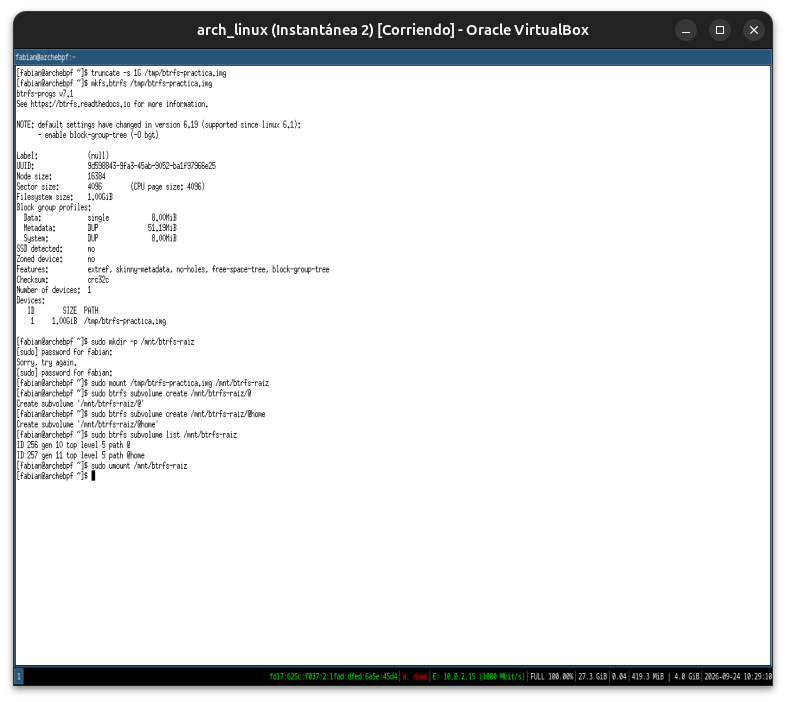
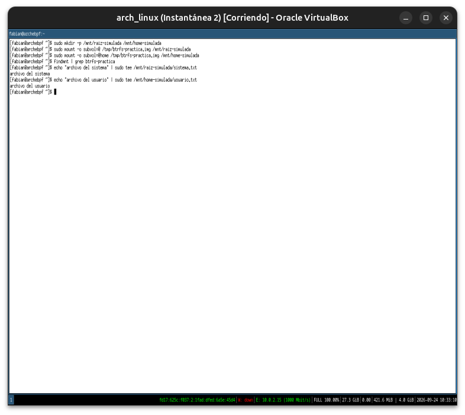
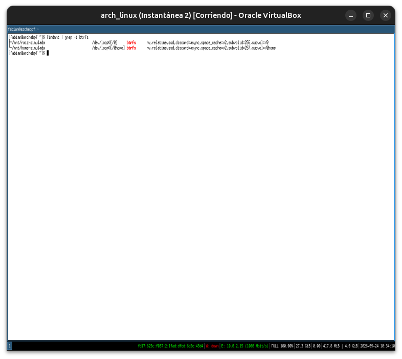
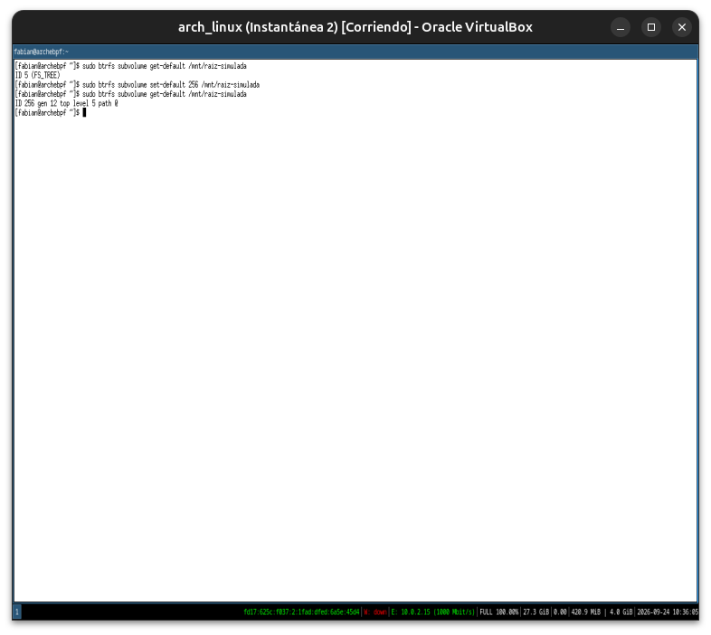
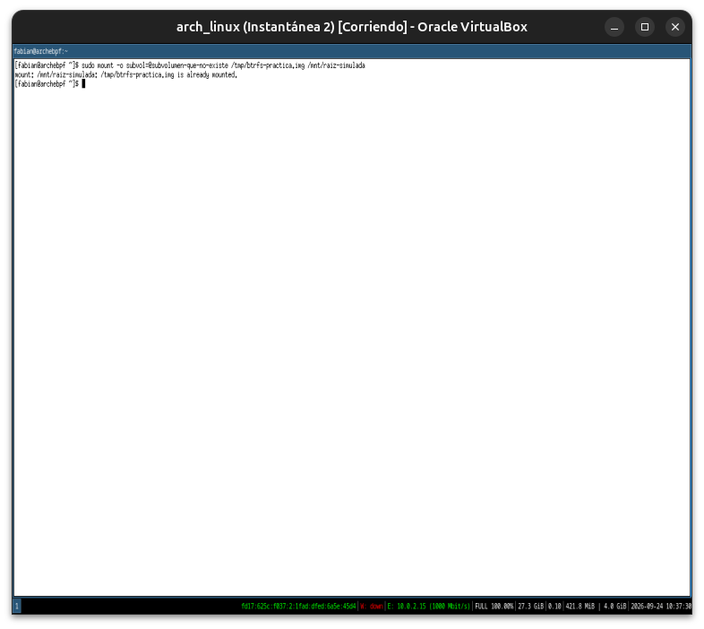
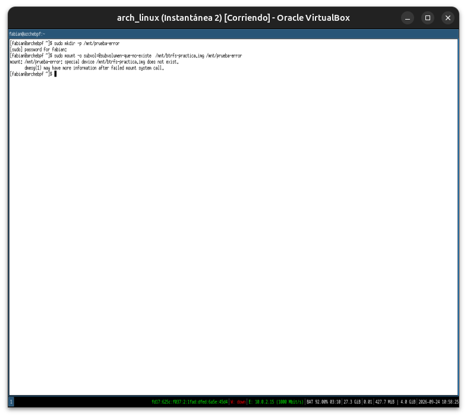
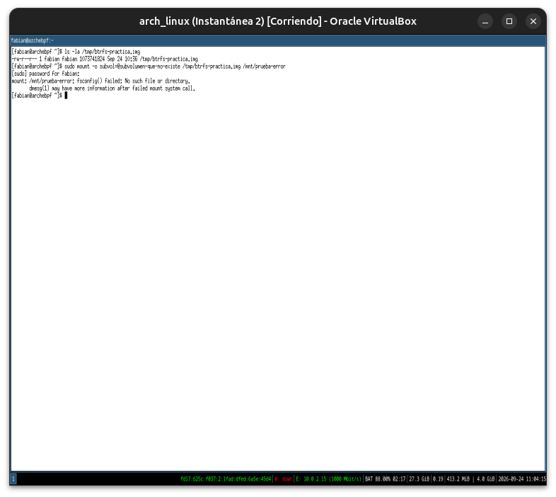
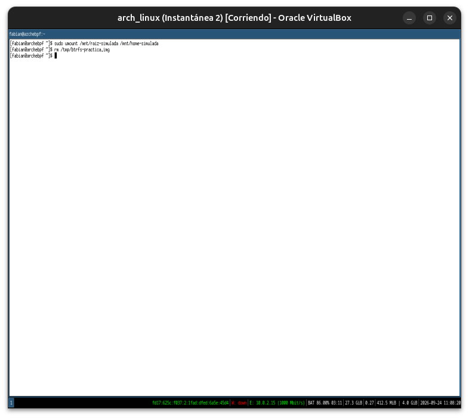

# Módulo 22 — Subvolumes

**Fase 07 — Btrfs Desktop**

> **Nota de adaptación:** seguimos sobre ext4 real (confirmado en el Módulo 21), así que la práctica de este módulo también corre sobre una imagen de disco de prueba, sin tocar tu sistema real — pero esta vez simulando el layout `@`/`@home` completo, con puntos de montaje reales, tal como se vería en una instalación Arch con Btrfs de verdad.

---

## Objetivos del módulo

- Entender el layout estándar `@` / `@home` que usan las instalaciones Arch con Btrfs, y por qué existe específicamente para separar sistema de datos de usuario.
- Montar subvolúmenes individuales como si fueran particiones independientes, usando la opción `subvol=`.
- Entender el subvolumen por defecto (`btrfs subvolume set-default`) y cómo se relaciona con lo que ve el bootloader al arrancar.
- Practicar el layout completo sobre la imagen de prueba del Módulo 21.

---

## 1. CONCEPTO: por qué `@` / `@home` — el patrón real de Arch+Btrfs

En una instalación Arch con Btrfs (a diferencia de la ext4 simple que tenés vos ahora, Módulo 21), el patrón estándar de la comunidad es crear **dos subvolúmenes de primer nivel** dentro del mismo filesystem:

```
Btrfs (un solo filesystem físico)
 ├── @        → montado en /       (sistema: binarios, configuración, paquetes)
 └── @home    → montado en /home   (datos del usuario: documentos, dotfiles, proyectos)
```

**El motivo real, no solo convención:** cuando en el Módulo 24 instales `Snapper` y hagas rollback del sistema tras una actualización rota, ese rollback opera sobre el subvolumen `@` — y como `@home` es un subvolumen **completamente independiente**, tus archivos personales **no se tocan**, pase lo que pase con el rollback del sistema. Es exactamente el problema inverso al que viste con LVM+ext4 en el curso anterior: ahí, restaurar un snapshot de LVM significa restaurar el volumen lógico entero, dato de usuario incluido.

---

## 2. HERRAMIENTA: montar subvolúmenes individuales con `subvol=`

Retomando la imagen de prueba del Módulo 21 (recreala si ya la borraste):

```bash
truncate -s 1G /tmp/btrfs-practica.img
mkfs.btrfs /tmp/btrfs-practica.img
sudo mkdir -p /mnt/btrfs-raiz
sudo mount /tmp/btrfs-practica.img /mnt/btrfs-raiz
```

Creamos el layout `@`/`@home`:

```bash
sudo btrfs subvolume create /mnt/btrfs-raiz/@
sudo btrfs subvolume create /mnt/btrfs-raiz/@home
sudo btrfs subvolume list /mnt/btrfs-raiz
sudo umount /mnt/btrfs-raiz
```

Ahora montamos **cada subvolumen por separado**, como si fueran particiones distintas — esto es exactamente lo que hace `/etc/fstab` en una instalación real:

```bash
sudo mkdir -p /mnt/raiz-simulada /mnt/home-simulada
sudo mount -o subvol=@ /tmp/btrfs-practica.img /mnt/raiz-simulada
sudo mount -o subvol=@home /tmp/btrfs-practica.img /mnt/home-simulada
```

```bash
findmnt | grep btrfs-practica
echo "archivo del sistema" | sudo tee /mnt/raiz-simulada/sistema.txt
echo "archivo del usuario" | sudo tee /mnt/home-simulada/usuario.txt
```

**Lo que acabás de confirmar:** ambos puntos de montaje comparten el mismo dispositivo físico (`/tmp/btrfs-practica.img`), pero cada uno ve **solo su propio subvolumen** — `sistema.txt` no existe dentro de `/mnt/home-simulada`, y viceversa. Aislamiento lógico completo sobre almacenamiento físico compartido.

---

## 3. CONCEPTO: el subvolumen por defecto

Cuando montás un filesystem Btrfs sin especificar `subvol=`, Btrfs monta el **subvolumen por defecto** — que arranca siendo el subvolumen raíz técnico (ID 5), pero se puede cambiar:

```bash
sudo btrfs subvolume list /mnt/raiz-simulada    # necesita verse desde adentro de cualquier subvol montado
sudo btrfs subvolume get-default /mnt/raiz-simulada
```

```bash
sudo btrfs subvolume set-default <ID-del-subvolumen-@> /mnt/raiz-simulada
sudo btrfs subvolume get-default /mnt/raiz-simulada
```

**Por qué esto importa para instalaciones reales:** en una instalación Arch+Btrfs típica, `/etc/fstab` monta `@` explícitamente con `subvol=@`, así que el "subvolumen por defecto" no suele usarse en producción — pero entender que existe es clave para diagnosticar instalaciones Btrfs de otras distros (algunas, como openSUSE, sí dependen del subvolumen por defecto en vez de fstab explícito).

---

## 4. PRÁCTICA

1. Recreá la imagen de prueba del Módulo 21 (o reutilizá la que sigas teniendo).
2. Creá el layout `@`/`@home` como subvolúmenes de primer nivel.
3. Montá cada uno por separado con `subvol=`, confirmando con `findmnt` que son puntos de montaje independientes sobre el mismo dispositivo.
4. Escribí un archivo distinto en cada uno, y confirmá que no son visibles entre sí.
5. Consultá y cambiá el subvolumen por defecto, documentando qué ID tenía antes y después.
6. Reflexión: explicá con tus propias palabras por qué separar `@` de `@home` protege tus datos personales durante un rollback de sistema — conexión directa con lo que vas a instalar en el Módulo 24.

---

## 5. ERROR INTENCIONAL / DIAGNÓSTICO

```bash
sudo mount -o subvol=@subvolumen-que-no-existe /tmp/btrfs-practica.img /mnt/raiz-simulada
```

**Diagnóstico esperado:** un error de montaje indicando que ese subvolumen no existe en el filesystem — el kernel valida el nombre de `subvol=` contra la tabla de subvolúmenes reales antes de permitir el montaje, mismo patrón de validación estricta del curso.

Al terminar, limpiá todo:

```bash
sudo umount /mnt/raiz-simulada /mnt/home-simulada
rm /tmp/btrfs-practica.img
```

---

## Checklist de cierre del módulo

- [x] Entiendo por qué el layout `@`/`@home` existe específicamente para proteger datos de usuario durante rollbacks de sistema.
- [x] Monté subvolúmenes individuales con `subvol=`, confirmando aislamiento lógico sobre almacenamiento compartido.
- [x] Entiendo qué es el subvolumen por defecto y cuándo importa (fstab explícito vs. otras distros).
- [x] Provoqué y diagnostiqué el error de montar un subvolumen inexistente.

---

## Evidencias

**01 — `@` y `@home` creados**
`ID 256` para `@`, `ID 257` para `@home` — secuenciales, confirmando la numeración que ya se había visto en el Módulo 21. Un typo de sudo en el camino ("Sorry, try again") sin consecuencia.



**02 — Cada subvolumen montado por separado, archivos aislados**
`mount -o subvol=@` y `subvol=@home` sobre la misma imagen; `sistema.txt` y `usuario.txt` escritos correctamente, cada uno visible solo desde su propio punto de montaje.



**03 — `findmnt` confirma el aislamiento sobre el mismo dispositivo físico**
Ambos puntos de montaje (`/mnt/raiz-simulada`, `/mnt/home-simulada`) apuntan a `/dev/loop0`, con `subvolid=256`/`257` y `subvol=/@`/`/@home` respectivamente — mismo device, subvolúmenes lógicamente independientes.



**04 — Subvolumen por defecto: antes (`ID 5`, FS_TREE) y después (`ID 256`, `@`)**
`get-default` inicial devuelve el subvolumen raíz técnico reservado; tras `set-default 256`, `@` pasa a ser el default.



**05 — Primer intento del error intencional: `already mounted`**
El punto de montaje reutilizado ya tenía algo montado — error distinto al esperado, diagnosticado en el momento y corregido usando un punto de montaje nuevo.



**06 — Typo real: `/mnt/` en vez de `/tmp/` en la ruta de la imagen**
`special device /mnt/btrfs-practica.img does not exist` — la imagen vive en `/tmp/`, no en `/mnt/`. Confirmado y corregido con `ls -la /tmp/btrfs-practica.img`.



**07 — Error intencional confirmado, con la ruta correcta**
`mount: fsconfig() failed: No such file or directory` — el subvolumen inventado no existe, validado antes de montar. Redacción distinta a la anticipada en la teoría (API moderna `fsconfig()` del kernel), mismo resultado de fondo.



**08 — Limpieza final**
`umount` de ambos subvolúmenes y borrado de la imagen de prueba, sin dejar rastro en el sistema real.



---

**Próximo módulo:** 23 — Snapshots.
