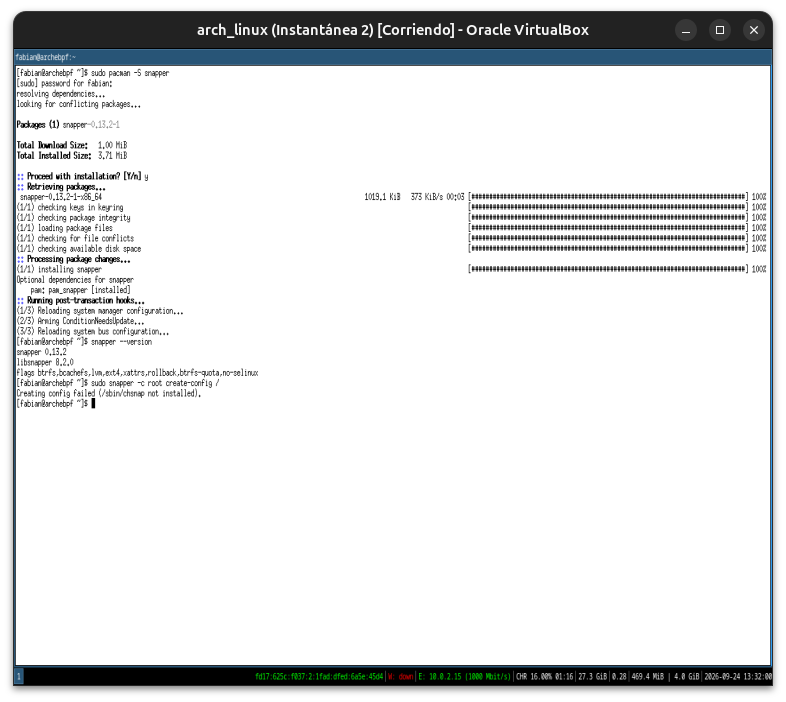
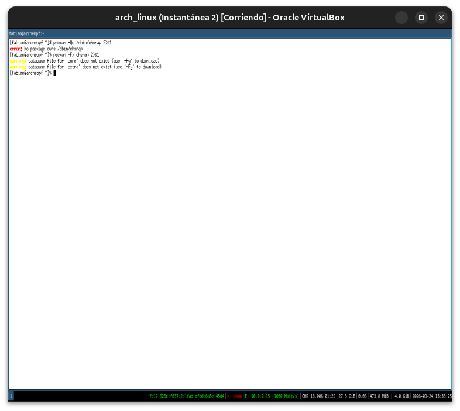
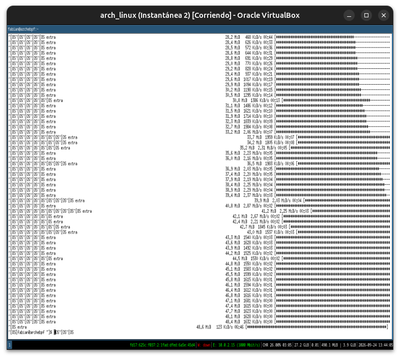
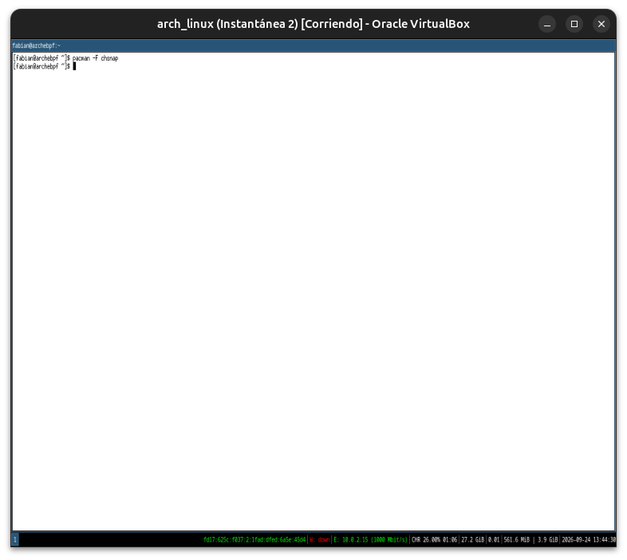
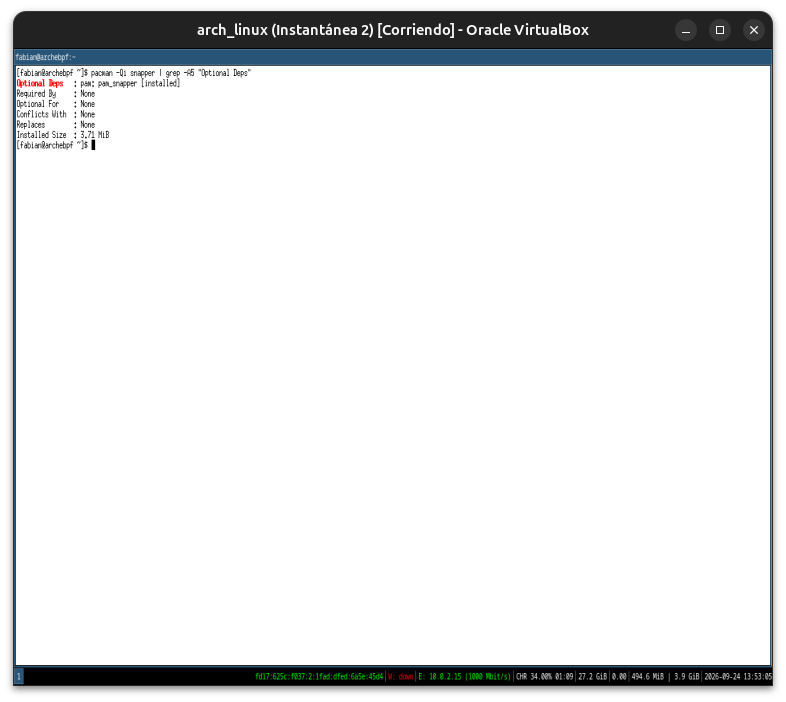
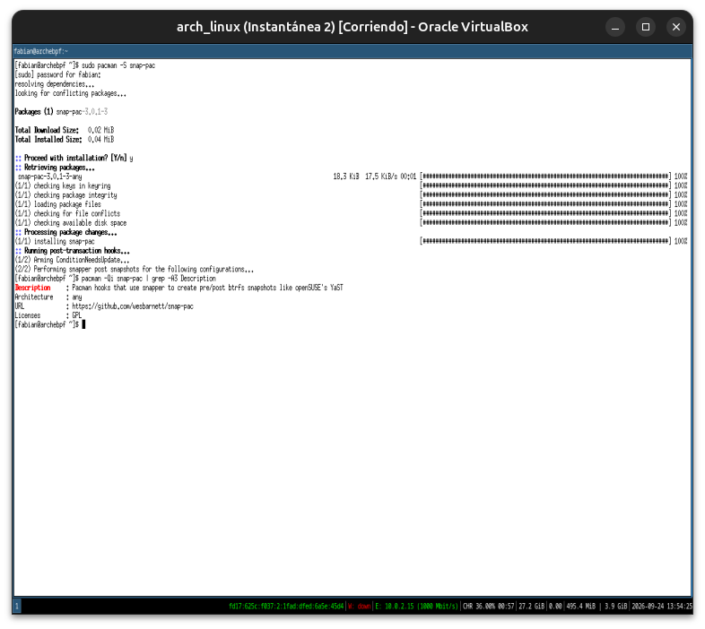
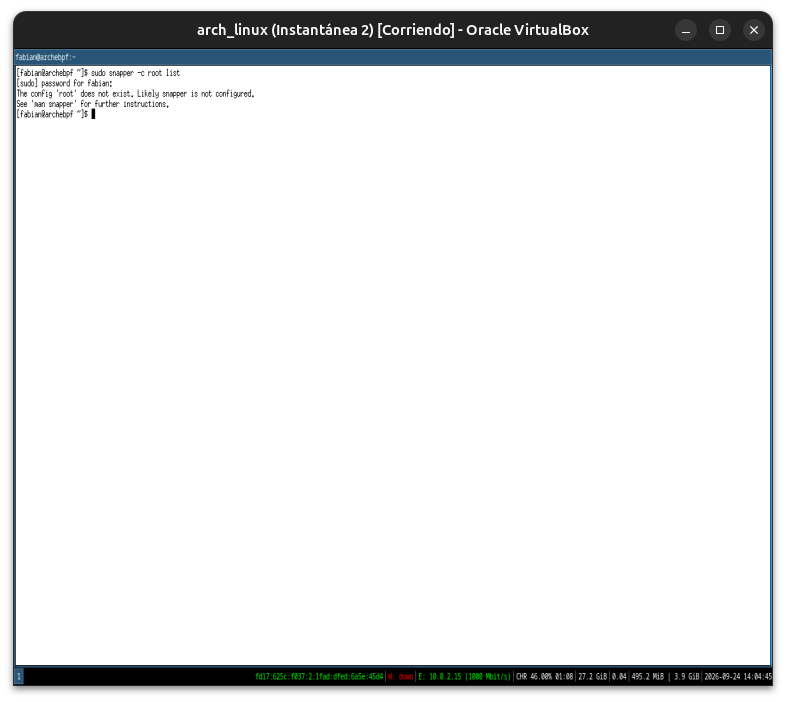

# Módulo 24 — Snapper & Rollback

**Fase 07 — Btrfs Desktop**

Con este módulo cerramos la Fase 07.

> **Nota de adaptación importante:** confirmado desde el Módulo 21 — tu partición raíz real es ext4, no Btrfs. Aunque `snapper --version` muestra soporte compilado también para `ext4`/`lvm` (vía snapshots LVM thin, no COW nativo), tu sistema actual no usa LVM tampoco (Módulo 21: partición directa) — así que `create-config` contra tu `/` real va a fallar igual, aunque no necesariamente por el motivo que esperás. Este módulo documenta la herramienta completa igual — es exactamente lo que instalarías el día que tengas Arch en Btrfs real, sea en esta VM reinstalada o en hardware físico.

---

## Objetivos del módulo

- Entender qué automatiza Snapper sobre lo que ya hiciste a mano en los Módulos 21-23.
- Instalar Snapper y entender su archivo de configuración por subvolumen.
- Entender `snap-pac`, el hook que crea snapshots automáticos antes/después de cada operación de `pacman`.
- Entender cómo funciona un rollback real en la práctica — qué pasa exactamente al reiniciar.

---

## 1. CONCEPTO: qué automatiza Snapper

Todo lo que hiciste a mano en los Módulos 21-23 (`btrfs subvolume snapshot -r`, listarlos, decidir cuándo tomarlos) es exactamente lo que Snapper hace **automáticamente**, con una política de retención configurable:

```
Vos manualmente (Módulo 23)          Snapper (este módulo)
────────────────────────────         ──────────────────────
btrfs subvolume snapshot -r    →     snapper create (con metadata: descripción, tipo, usuario)
btrfs subvolume list           →     snapper list (con fecha, tipo pre/post, limpieza automática)
(nada — vos elegís a mano)     →     snapper cleanup (borra snapshots viejos según política)
```

**Por qué existe la capa extra:** Btrfs te da el mecanismo (subvolúmenes + COW), pero no gestiona **cuándo** tomar el snapshot, **cuánto tiempo** guardarlo, ni te da un menú de arranque para elegir a cuál volver. Snapper es la política de administración encima del mecanismo — mismo patrón arquitectónico que viste con NetworkManager (Módulo 17) sobre `wpa_supplicant`, o WirePlumber (Módulo 15) sobre PipeWire.

---

## 2. HERRAMIENTA: instalar Snapper

```bash
sudo pacman -S snapper
```

```bash
snapper --version
man snapper 2>&1 | head -20
```

**Configuración por subvolumen — el concepto central:** Snapper no gestiona "todo Btrfs" de una — gestiona **configuraciones** individuales, cada una apuntando a un subvolumen específico. La configuración estándar para el sistema se llama `root`:

```bash
sudo snapper -c root create-config /
```

**Resultado esperado en tu VM (ext4):** este comando va a fallar, indicando que `/` no es un filesystem Btrfs. Documentalo — es exactamente la limitación anticipada en la nota de adaptación.

```bash
cat /etc/snapper/configs/root 2>/dev/null || echo "no se generó config, confirmando que / no es Btrfs"
```

---

## 3. CONCEPTO: el archivo de configuración — qué controlaría en un sistema Btrfs real

Aunque no puedas generarlo contra tu `/` real, así es como luce (documentación de referencia — no ejecutable en tu VM):

```
# /etc/snapper/configs/root (ejemplo, en un sistema Btrfs real)
SUBVOLUME="/"
TIMELINE_CREATE="yes"          # snapshots automáticos por horario (horario/diario/semanal/mensual)
TIMELINE_LIMIT_HOURLY="5"
TIMELINE_LIMIT_DAILY="7"
NUMBER_LIMIT="10"                # cuántos snapshots "number" (los de pacman) conservar como máximo
```

**Conexión directa con el Módulo 22:** `SUBVOLUME="/"` es justamente por qué el layout `@`/`@home` importa — Snapper apunta específicamente al subvolumen `@` (montado en `/`), dejando `@home` completamente afuera de su alcance.

---

## 4. CONCEPTO: `snap-pac` — snapshots automáticos alrededor de cada `pacman`

```bash
sudo pacman -S snap-pac
pacman -Qi snap-pac | grep -A3 Description
```

`snap-pac` es un hook de `pacman` (mismo mecanismo de hooks que ya usaste indirectamente cada vez que viste `Running post-transaction hooks...` en instalaciones anteriores, Módulos 14-23) que dispara automáticamente:

```
ANTES de cualquier pacman -S/-R/-U    →  snapper crea un snapshot "pre" (tipo pre)
DESPUÉS de que termina la operación   →  snapper crea un snapshot "post" (tipo post), emparejado con el pre
```

**Por qué esto es lo que realmente hace valioso a Snapper en el día a día:** no tenés que acordarte de tomar un snapshot antes de actualizar — pasa solo, siempre, sin excepción. Si una actualización rompe algo (como viste en instalaciones reales del curso anterior con conflictos de dependencias), tenés automáticamente un punto de restauración exacto de justo antes.

```bash
sudo snapper list 2>&1
```

---

## 5. CONCEPTO: cómo funciona un rollback real (paso a paso conceptual)

**Importante: rollback no es "restaurar archivos uno por uno"** — es un cambio de qué subvolumen usa el sistema al arrancar:

```
1. sudo snapper rollback <número-de-snapshot>
   → Esto crea un subvolumen NUEVO, copia de ese snapshot (todavía usando COW: casi instantáneo)
   → El @ actual (roto) queda guardado también, por si necesitás algo de ahí después

2. Reiniciás el sistema

3. GRUB (Módulo 03) muestra ahora un submenu con snapshots disponibles
   (vía el paquete grub-btrfs, que integra automáticamente los snapshots de Snapper al menú de arranque)

4. Al arrancar contra el subvolumen restaurado, el sistema vuelve a verse
   exactamente como estaba en el momento del snapshot "pre" — paquetes,
   configuración, todo — sin tocar @home en absoluto
```

**Conexión directa con Módulos anteriores:** esto es literalmente el mismo mecanismo GRUB (Módulo 03) que ya conocés, mostrando entradas de arranque adicionales — nada nuevo en el bootloader, solo un integrador (`grub-btrfs`) que genera esas entradas automáticamente a partir de los subvolúmenes que Snapper va creando.

---

## 6. PRÁCTICA

1. Instalá Snapper y confirmá la versión.
2. Intentá `snapper -c root create-config /` y documentá honestamente el error (esperado en ext4).
3. Instalá `snap-pac` y confirmá su descripción/propósito con `pacman -Qi`.
4. Leé el ejemplo de configuración de la sección 3, y explicá con tus propias palabras qué controla `TIMELINE_LIMIT_DAILY` y `NUMBER_LIMIT`.
5. Explicá con tus propias palabras, paso a paso, qué pasa realmente cuando hacés `snapper rollback` — enfatizando que no es "copiar archivos de vuelta".
6. Reflexión de cierre de fase: repasá los Módulos 21-24 y explicá cómo cada uno construyó sobre el anterior (filesystem → subvolúmenes → snapshots → automatización) hasta llegar a un sistema con rollback real.

---

## 7. ERROR INTENCIONAL / DIAGNÓSTICO

```bash
sudo snapper -c root list
```

**Diagnóstico esperado:** un error indicando que la configuración `root` no existe (porque el `create-config` del punto 2 falló) — `snapper` valida que la configuración exista antes de listar nada contra ella, mismo patrón de validación estricta de siempre.

---

## Checklist de cierre del módulo (y de la Fase 07 completa)

- [x] Entiendo qué automatiza Snapper sobre el mecanismo manual que ya practiqué en los Módulos 21-23.
- [x] Instalé Snapper y documenté honestamente la limitación de `create-config` sobre mi `/` real (ext4).
- [x] Entiendo el rol de `snap-pac` como hook automático de `pacman`.
- [x] Entiendo qué controla el archivo de configuración por subvolumen (`TIMELINE_*`, `NUMBER_LIMIT`).
- [x] Puedo explicar paso a paso qué pasa realmente en un rollback — cambio de subvolumen activo, no restauración archivo por archivo.
- [x] Provoqué y diagnostiqué el error de listar snapshots de una configuración inexistente.

---

## Evidencias

**01 — Snapper instalado, `create-config` falla por una dependencia faltante**
`snapper --version` confirma flags de compilación con soporte `btrfs, bcachefs, lvm, ext4, xattrs, rollback` — Snapper soporta ext4 también (vía LVM thin), no es exclusivo de Btrfs. `sudo snapper -c root create-config /` falla, pero con un error distinto al anticipado: `Creating config failed (/sbin/chsnap not installed)`.



**02 — `chsnap` sin dueño, falta sincronizar la base de archivos**
`pacman -Qo /sbin/chsnap` → `No package owns /sbin/chsnap`. `pacman -Fx chsnap` pide sincronizar primero (`use -Fy to download`).



**03 — `pacman -Fy` sincronizando la base de archivos completa**
Descarga completa de los índices de archivos de `core` y `extra`.



**04 — Hallazgo real: `chsnap` no existe en ningún paquete de los repos oficiales**
`pacman -F chsnap` no devuelve nada — ni un solo paquete de `core`/`extra` provee ese binario. Conexión directa con el próximo módulo (AUR Deep Dive): herramientas así, ausentes de los repos oficiales, son justamente el tipo de caso que resuelve el AUR.



**05 — Typo real: `frep` en vez de `grep`**
Corregido al toque, sin consecuencia.


**06 — Confirmado: `chsnap` ni siquiera es dependencia opcional documentada de `snapper`**
`Optional Deps` de `snapper` es únicamente `pam, pam_snapper [installed]` — refuerza que `chsnap` es ajeno al empaquetado oficial, probablemente específico de la ruta LVM/ext4 menos común.



**07 — `snap-pac` instalado, descripción confirmada palabra por palabra**
*"Pacman hooks that use snapper to create pre/post btrfs snapshots like openSUSE's YaST"* — coincide exactamente con la explicación de la sección 4 del módulo, incluyendo la misma referencia a openSUSE.



**08 — Error intencional: configuración `root` inexistente**
`sudo snapper -c root list` responde `The config 'root' does not exist. Likely snapper is not configured. See 'man snapper' for further instructions.` — validación estricta, con sugerencia amigable del siguiente paso.



---

## Cierre de Fase 07 — Btrfs Desktop

Con este módulo termina la Fase 07: arquitectura de Btrfs y copy-on-write (Módulo 21), subvolúmenes con el layout `@`/`@home` (Módulo 22), snapshots y la diferencia solo-lectura/lectura-escritura confirmada con COW en vivo (Módulo 23), y la capa de automatización que junta todo en un sistema con rollback real (Módulo 24) — cuatro módulos construidos uno sobre el otro, sobre un sistema que en la práctica sigue en ext4, documentando honestamente esa limitación en cada paso sin que afecte la comprensión completa de la arquitectura.

---

**Próximo módulo:** 25 — AUR Deep Dive (inicio de la Fase 08 — AUR Profesional).
