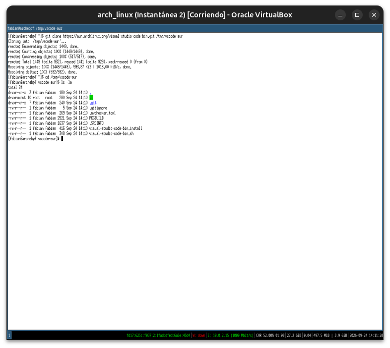
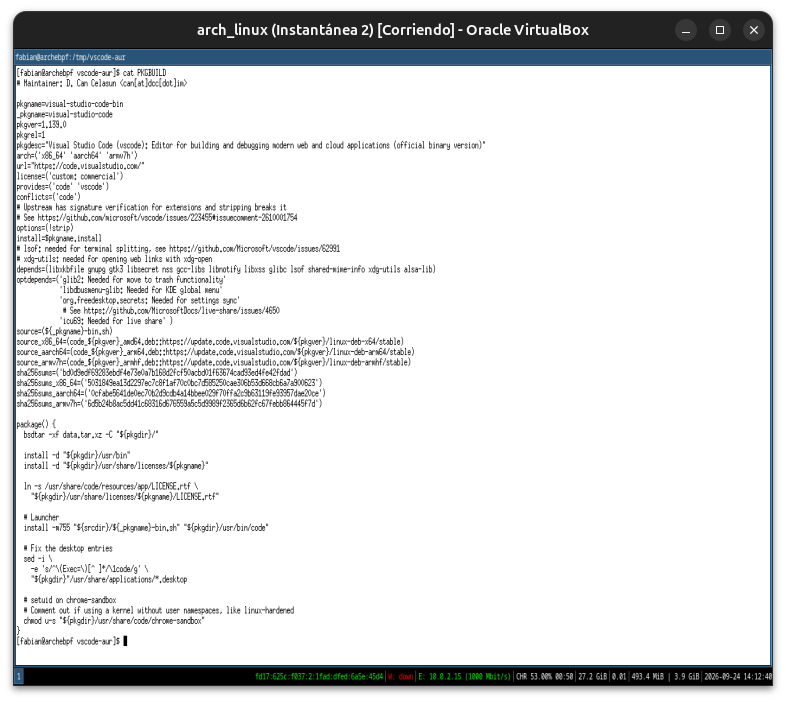
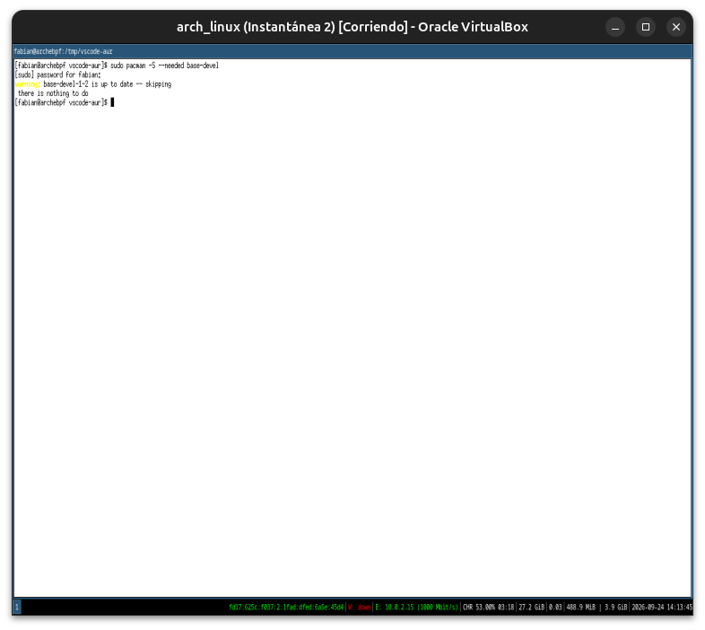
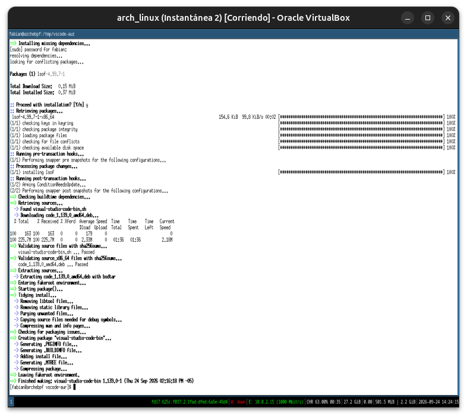
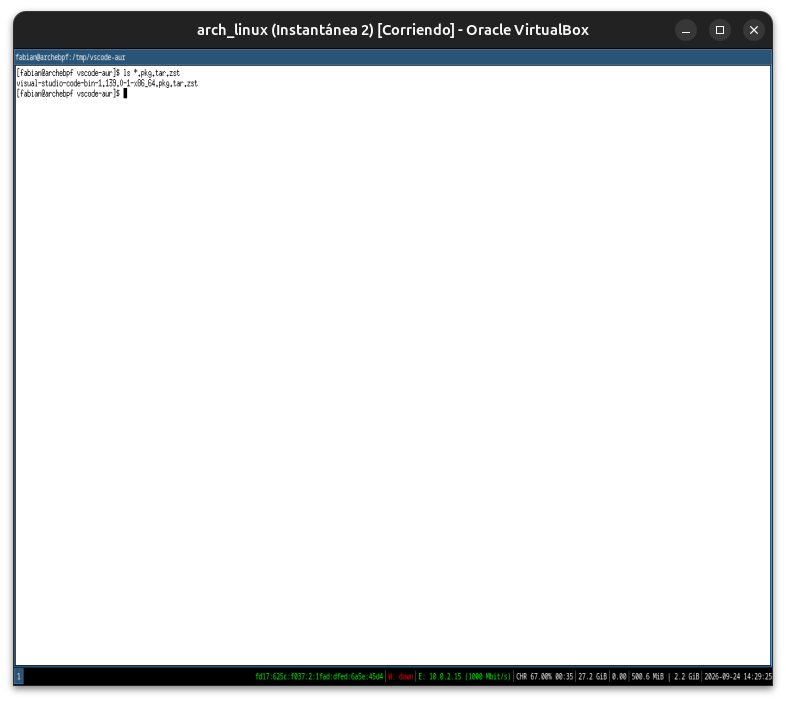
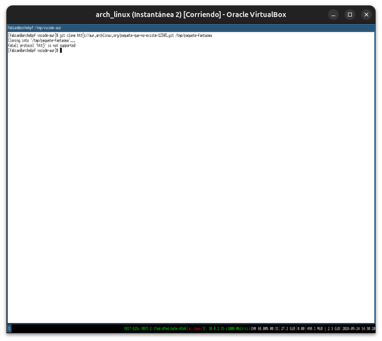
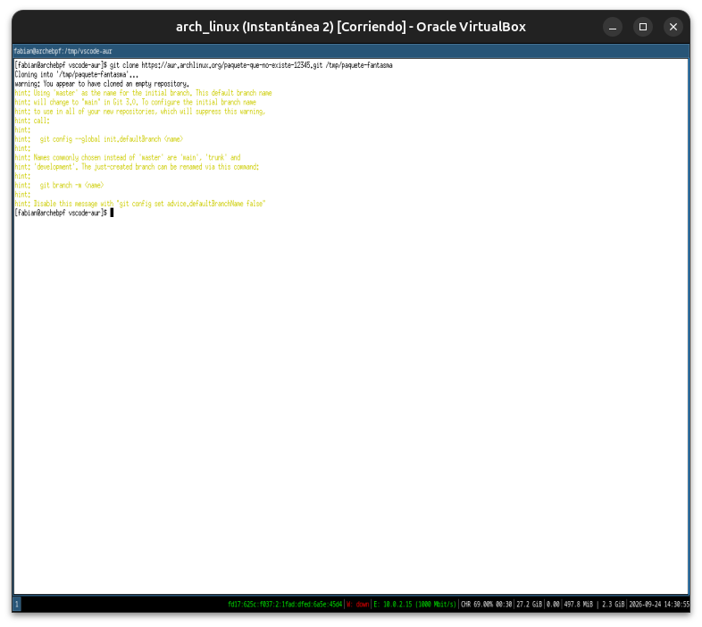
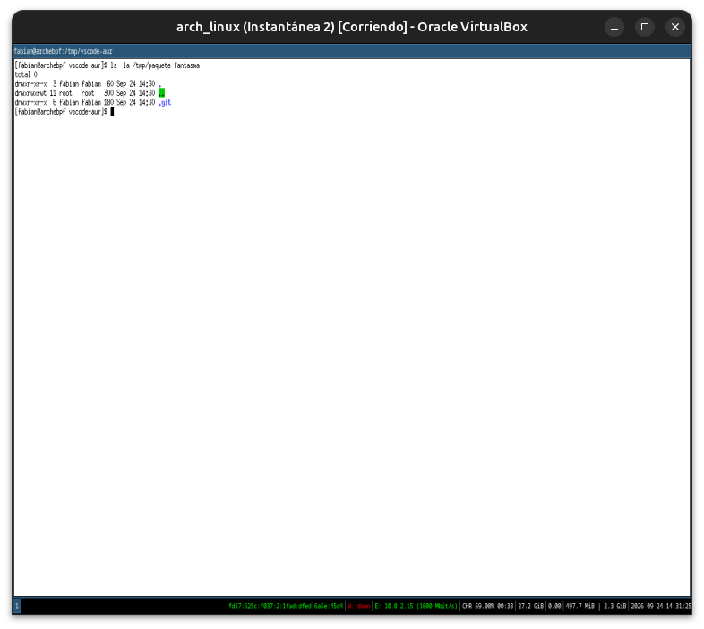

# Módulo 25 — AUR Deep Dive

**Fase 08 — AUR Profesional**

> **Gancho real del módulo anterior:** en el Módulo 24 buscamos `chsnap` con `pacman -F` y no apareció en ningún paquete de `core`/`extra` — los repos oficiales de Arch. Ese es exactamente el tipo de vacío que el AUR llena: herramientas de nicho, versiones de desarrollo, utilidades comunitarias que Arch oficial nunca va a empaquetar, pero que alguien de la comunidad sí armó y publicó.

---

## Objetivos del módulo

- Entender qué es el AUR realmente: un repositorio de **recetas de compilación**, no de binarios.
- Entender la diferencia de confianza entre `core`/`extra` (revisados por Arch) y el AUR (sin revisión oficial).
- Clonar y explorar un paquete AUR manualmente, sin usar un AUR helper todavía (eso es el Módulo 27).
- Entender los riesgos reales del AUR y por qué revisar el `PKGBUILD` antes de compilar no es opcional.

---

## 1. CONCEPTO: el AUR no es un repositorio de paquetes — es un repositorio de recetas

```
core/extra (lo que usaste en TODO el curso hasta ahora)
─────────────────────────────────────────────────────
pacman -S paquete  →  descarga un BINARIO ya compilado, firmado, desde un mirror

AUR (este módulo)
─────────────────────────────────────────────────────
(clonar/descargar)  →  un archivo PKGBUILD (receta: de dónde bajar el código fuente,
                        cómo compilarlo, qué dependencias necesita)
makepkg             →  compila el código FUENTE en tu propia máquina, ahí mismo
pacman -U            →  instala el paquete .pkg.tar.zst que vos mismo generaste
```

**Por qué esta diferencia es central:** cuando hacés `pacman -S firefox`, estás confiando en que el equipo de Arch revisó, compiló y firmó ese binario. Cuando instalás algo del AUR, **nadie de Arch revisó nada** — estás confiando en que la persona que subió esa receta (`PKGBUILD`) no puso nada malicioso ahí, y en que vos mismo (o el AUR helper que uses, Módulo 27) la revisaste antes de ejecutarla.

---

## 2. CONCEPTO: qué es un paquete AUR realmente

Cada paquete AUR es, técnicamente, **un repositorio git individual** alojado en `aur.archlinux.org`, con como mínimo dos archivos:

```
PKGBUILD        → la receta: de dónde bajar el código fuente, cómo compilarlo, dependencias
.SRCINFO        → metadata generada automáticamente a partir del PKGBUILD (para que herramientas
                   puedan leer info del paquete sin tener que ejecutar bash)
```

```bash
git clone https://aur.archlinux.org/visual-studio-code-bin.git /tmp/vscode-aur
cd /tmp/vscode-aur
ls -la
cat .SRCINFO | head -20
```

**Por qué clonar en vez de descargar un zip:** porque el AUR versiona sus paquetes con git — si necesitás actualizar el paquete después, es literalmente un `git pull`, mismo flujo que ya conocés de sobra del curso anterior (Módulos de Git/GitHub).

---

## 3. HERRAMIENTA: leer el `PKGBUILD` antes de confiar en él

```bash
cat PKGBUILD
```

**Lo mínimo que hay que revisar, siempre, antes de compilar nada:**

| Campo/sección | Qué mirar |
|---|---|
| `source=()` | ¿De dónde baja realmente el código? ¿Un dominio confiable (GitHub del proyecto oficial) o algo sospechoso? |
| `sha256sums=()` / `b2sums=()` | ¿Hay checksums reales, o `SKIP` en todos lados (sin verificación de integridad)? |
| Funciones `build()`, `package()` | ¿Ejecuta algo raro — `curl` a una URL rara, `sudo`, borrado de archivos fuera del directorio de build? |
| `maintainer` (en el header o `.SRCINFO`) | ¿Es un paquete con historial, o recién subido por alguien sin trayectoria? |

**Esta no es paranoia — es la práctica estándar de la comunidad Arch**, documentada explícitamente en la ArchWiki: nunca instalar un paquete AUR sin leer el `PKGBUILD` primero, sea cual sea el AUR helper que uses después.

---

## 4. HERRAMIENTA: `makepkg` — compilar desde la receta

Instalá las herramientas base de compilación si no las tenés (probablemente ya las tengas, del curso anterior):

```bash
sudo pacman -S --needed base-devel
```

```bash
makepkg -s    # -s: instala automáticamente dependencias faltantes desde los repos oficiales antes de compilar
```

**Lo que pasa internamente cuando corrés esto:**
1. Descarga el código fuente desde las URLs de `source=()`.
2. Verifica los checksums.
3. Ejecuta la función `build()` del `PKGBUILD` (típicamente `./configure && make`, o el equivalente del lenguaje del proyecto).
4. Empaqueta el resultado en un archivo `.pkg.tar.zst` — el mismo formato que usa `pacman` para paquetes oficiales.

```bash
ls *.pkg.tar.zst
```

**No lo instales todavía sobre tu sistema real** — para este módulo, alcanza con confirmar que el `.pkg.tar.zst` se generó. Si querés instalarlo de verdad más adelante, sería `sudo pacman -U <archivo>.pkg.tar.zst`.

---

## 5. CONCEPTO: riesgos reales — casos que pasaron de verdad

El AUR tuvo incidentes reales de paquetes maliciosos subidos por usuarios (no hackeos del AUR en sí, sino paquetes nuevos con código malicioso en la función `package()`, retirados después de ser detectados por la comunidad). La defensa no es "el AUR es peligroso, no lo uses" — es:

1. Preferir paquetes con muchos votos/comentarios recientes en la página web del AUR (señal de que la comunidad los usa y los vigila).
2. Leer el `PKGBUILD` siempre, especialmente en paquetes nuevos o con pocos votos.
3. Nunca correr `makepkg`/`pacman -U` con `sudo` innecesario más allá de lo que el propio proceso pide.

---

## 6. PRÁCTICA

1. Cloná un paquete AUR real (podés elegir cualquiera; `visual-studio-code-bin` o algo que uses) y explorá su estructura.
2. Leé el `PKGBUILD` completo, identificando `source=()`, los checksums, y qué hace `build()`/`package()`.
3. Instalá `base-devel` si no lo tenías, y corré `makepkg -s`, confirmando que se generó el `.pkg.tar.zst`.
4. Reflexión: explicá con tus propias palabras la diferencia de modelo de confianza entre instalar desde `core`/`extra` vs. desde el AUR.
5. Buscá (en la web del AUR, `aur.archlinux.org`) el paquete que compilaste y mirá cuántos votos/comentarios tiene — documentá si eso te da más o menos confianza.

---

## 7. ERROR INTENCIONAL / DIAGNÓSTICO

```bash
git clone https://aur.archlinux.org/paquete-que-no-existe-12345.git /tmp/paquete-fantasma
```

**Diagnóstico esperado:** un error de git indicando que el repositorio remoto no existe. **Diagnóstico real, confirmado en la práctica:** a diferencia de GitHub, el servidor git del AUR (`cgit`) no rechaza el clone — entrega un repositorio **vacío** (`warning: You appear to have cloned an empty repository`), sin `PKGBUILD` ni `.SRCINFO` adentro. Es la infraestructura real que usás para subir un paquete propio nuevo: el slot existe vacío hasta el primer push. Un comportamiento distinto al anticipado, pero igual de válido como validación — la ausencia de contenido es la señal de que el paquete no existe.

---

## Checklist de cierre del módulo

- [x] Entiendo que el AUR es un repositorio de recetas de compilación, no de binarios.
- [x] Entiendo la diferencia de modelo de confianza entre `core`/`extra` (revisado por Arch) y el AUR (sin revisión oficial).
- [x] Cloné un paquete AUR y exploré su estructura (`PKGBUILD`, `.SRCINFO`).
- [x] Leí un `PKGBUILD` completo, identificando qué revisar antes de confiar en él.
- [x] Compilé un paquete AUR con `makepkg -s` y confirmé el `.pkg.tar.zst` generado.
- [x] Provoqué y diagnostiqué el comportamiento real de clonar un paquete AUR inexistente (repo vacío, no error).

---

## Evidencias

**01 — Clonado el paquete AUR `visual-studio-code-bin`, `.SRCINFO` confirmado**
Clone limpio (1449 objetos); estructura real: `.git`, `.gitignore`, `.nvchecker.toml`, `PKGBUILD`, `.SRCINFO`, y archivos extra del paquete (`.install`, `.sh`). `.SRCINFO` confirma `pkgver=1.139.0`, licencia `custom;commercial`, soporte `x86_64`/`aarch64`/`armv7h`, y la lista completa de dependencias.



**02 — `PKGBUILD` revisado: fuente oficial, checksums reales**
`source=()` apunta a `update.code.visualstudio.com` (dominio oficial Microsoft); `sha256sums=()` con hashes reales, sin ningún `SKIP`; mantenedor identificado (`D. Can Celasun`); `package()` sin nada sospechoso — extracción, symlinks, y un `chmod u-s chrome-sandbox` justificado con comentario (compatibilidad con kernels tipo `linux-hardened`).



**03 — `base-devel` ya instalado**
`up to date — skipping` — quedó del curso anterior, sin necesitar reinstalación.



**04 — `makepkg -s`: compilación exitosa, con hooks de `snap-pac` en vivo**
Instala automáticamente la dependencia faltante (`lsof`); `Validating source files with sha256sums... Passed`; compilación dentro de un entorno `fakeroot`. De paso, los hooks `Performing snapper pre/post snapshots...` del Módulo 24 se disparan automáticamente alrededor de la instalación de `lsof` — conexión en vivo entre dos módulos consecutivos. Termina con `Finished making: visual-studio-code-bin 1.139.0-1`.



**05 — El `.pkg.tar.zst` generado**
`visual-studio-code-bin-1.139.0-1-x86_64.pkg.tar.zst` — mismo formato que cualquier paquete oficial de `core`/`extra`, compilado íntegramente en la propia VM.



**06 — Typo real en la URL del error intencional**
`https` se corrompió a `htt[c` al tipear, dando `Fatal: protocol 'htt[' is not supported` — corregido reintentando con cuidado.



**07 — Hallazgo real: el AUR no rechaza el clone de un paquete inexistente, clona un repo vacío**
Distinto a lo anticipado en la teoría (un error tipo GitHub 404): `git clone` de un nombre de paquete inventado da `warning: You appear to have cloned an empty repository` — el servidor git del AUR (basado en `cgit`) entrega un repositorio vacío en vez de rechazar la conexión.



**08 — Confirmado: directorio completamente vacío salvo `.git`**
`ls -la` no muestra ni `PKGBUILD` ni `.SRCINFO` — solo el esqueleto interno de git, confirmando que no es un paquete real.



---

**Próximo módulo:** 26 — makepkg & PKGBUILD.
