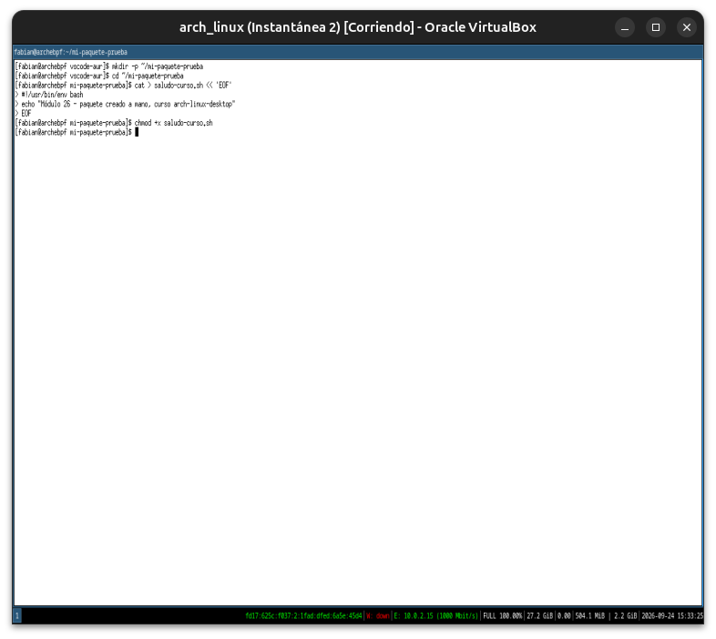
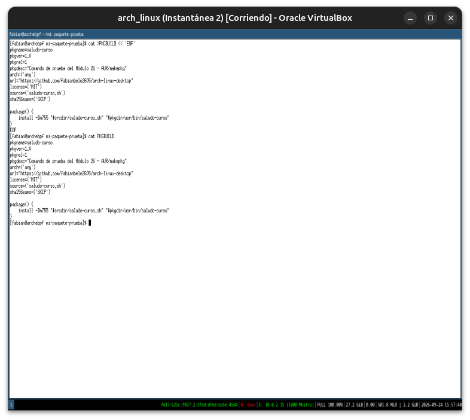
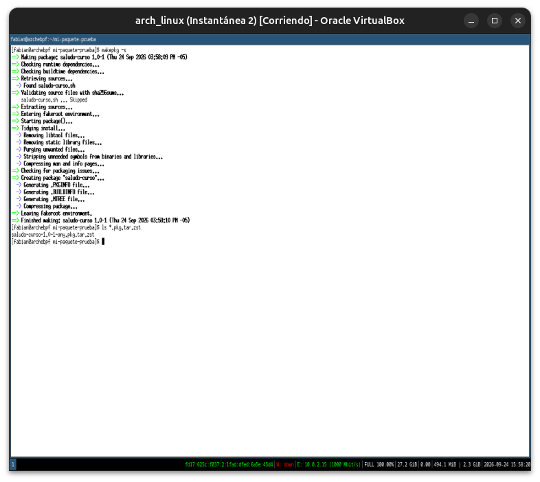
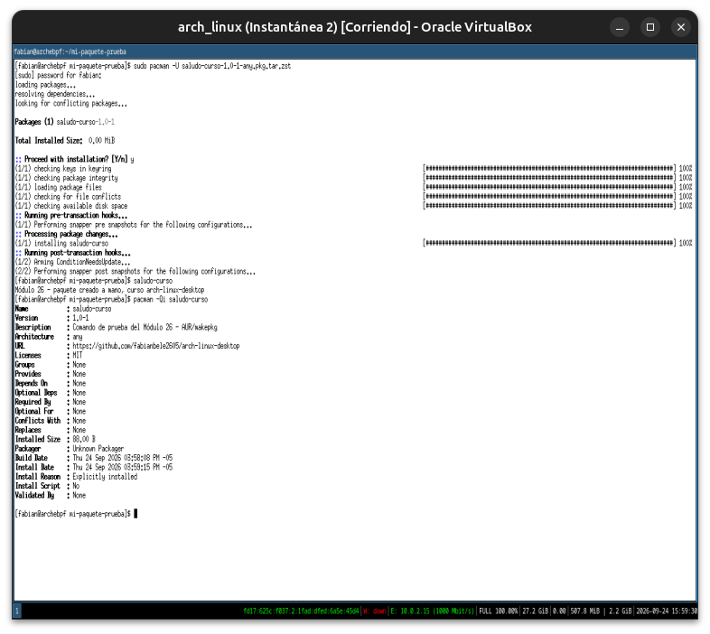
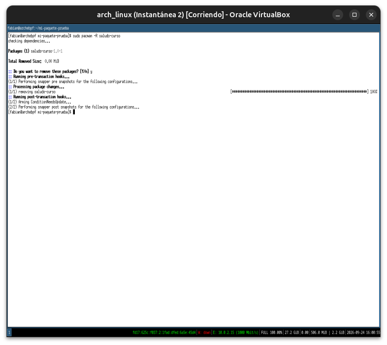
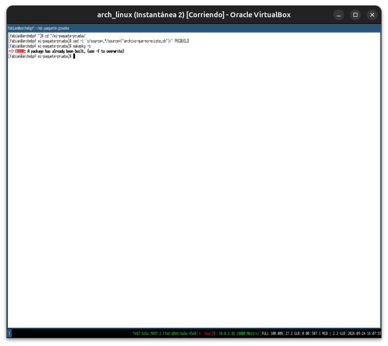
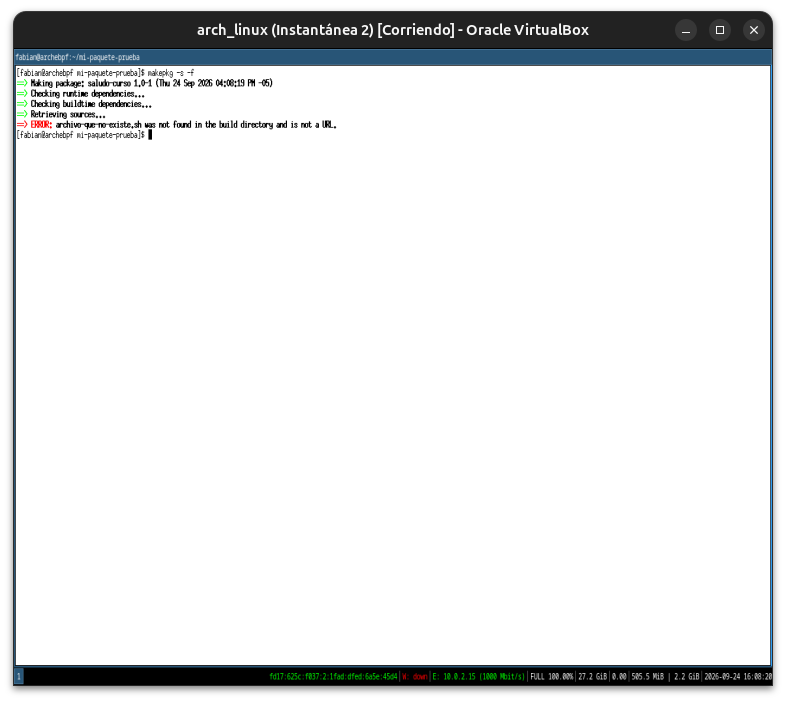
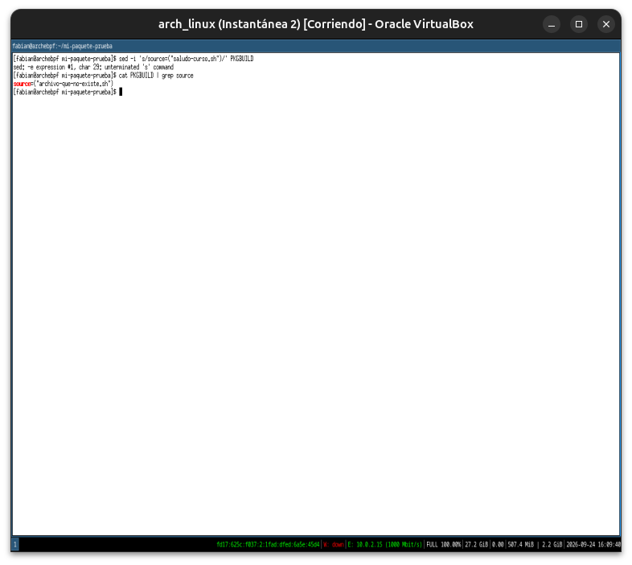
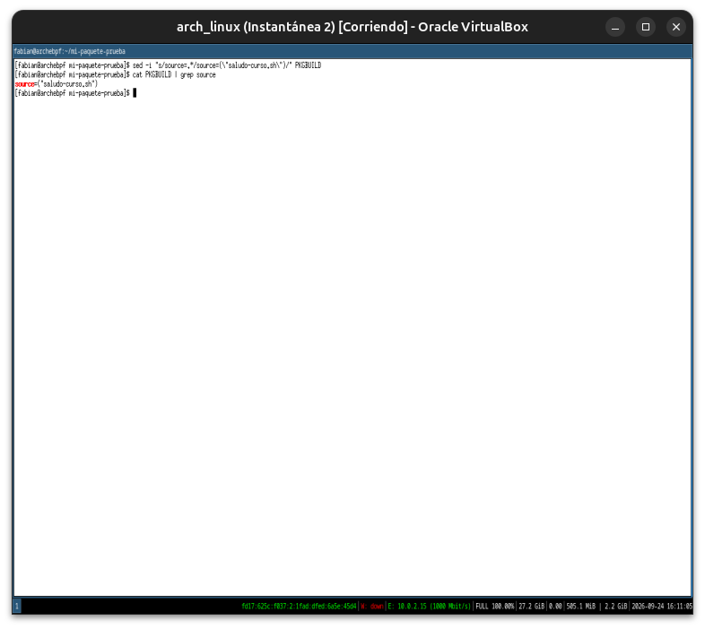

# Módulo 26 — makepkg & PKGBUILD

**Fase 08 — AUR Profesional**

---

## Objetivos del módulo

- Diseccionar la anatomía completa de un `PKGBUILD`: todas las variables y funciones del ciclo de vida.
- Entender qué hace `makepkg` internamente, fase por fase (ya lo viste correr en el Módulo 25; ahora entendemos el detalle).
- Escribir un `PKGBUILD` propio desde cero, empaquetando algo simple — la mejor forma de entender una herramienta de empaquetado es crear con ella, no solo consumir paquetes ajenos.

---

## 1. CONCEPTO: anatomía completa de un `PKGBUILD`

**Variables obligatorias/comunes:**

| Variable | Qué es |
|---|---|
| `pkgname` | Nombre del paquete (el que usás con `pacman -S`) |
| `pkgver` | Versión del software |
| `pkgrel` | Revisión del *paquete* (no del software) — sube cuando cambiás algo del empaquetado sin que cambie la versión upstream |
| `pkgdesc` | Descripción corta (la que viste con `pacman -Qi`) |
| `arch` | Arquitecturas soportadas (`x86_64`, `any` para scripts sin binarios) |
| `url` | Sitio del proyecto |
| `license` | Licencia del software |
| `depends` | Dependencias necesarias en **runtime** (para que el programa funcione ya instalado) |
| `makedepends` | Dependencias necesarias solo para **compilar** (no quedan como dependencia del paquete final) |
| `optdepends` | Dependencias opcionales, con explicación de para qué sirven cada una |
| `source` | De dónde descargar el código fuente |
| `sha256sums` (o `b2sums`) | Checksums de integridad de cada archivo en `source` |

**La distinción `depends` vs. `makedepends` es la que más confunde al principio** — pensalo con un ejemplo del curso: compilar un programa en C necesita `gcc` (`makedepends`, solo para compilar), pero el binario resultante no necesita `gcc` instalado para *correr* — sus dependencias reales de runtime son otra cosa (`depends`).

---

## 2. CONCEPTO: las funciones del ciclo de vida

```bash
prepare() {
    # Opcional. Se ejecuta ANTES de build() — parchear código fuente, por ejemplo
}

build() {
    # Compilar. Típicamente ./configure && make, o cargo build, o go build, etc.
}

check() {
    # Opcional. Correr la suite de tests del proyecto, si tiene
}

package() {
    # OBLIGATORIA. Copiar los archivos ya compilados a $pkgdir,
    # replicando la estructura final de directorios del sistema
    # (ej: $pkgdir/usr/bin/, $pkgdir/usr/share/...)
}
```

**`package()` es la única obligatoria porque es literalmente la definición de "empaquetar":** decirle a `makepkg` exactamente qué archivos, en qué rutas, van a terminar en el `.pkg.tar.zst` final. Todo lo anterior (`prepare`, `build`, `check`) existe para *producir* esos archivos; `package()` es lo que los *convierte en paquete*.

---

## 3. CONCEPTO: qué hace `makepkg` internamente, paso a paso

Ya viste esto correr en el Módulo 25 — ahora entendemos cada línea de ese output:

```
1. Descarga cada URL de source=() (o usa el archivo local si ya está en el directorio)
2. Verifica cada checksum contra sha256sums=()
3. Extrae el código fuente a src/
4. Entra a un entorno fakeroot (simula ser root sin serlo realmente — Módulo de contenedores del curso anterior)
5. Ejecuta prepare() (si existe)
6. Ejecuta build()
7. Ejecuta check() (si existe, y si no se pasó --nocheck)
8. Ejecuta package(), volcando resultado en pkg/
9. Genera el .PKGINFO (metadata) y .MTREE (integridad de archivos) dentro del paquete
10. Comprime todo en el .pkg.tar.zst final
```

**Por qué `fakeroot` en vez de `sudo` real:** `package()` necesita "actuar como root" para poder fijar ownership/permisos correctos en los archivos que van a terminar en `/usr/bin`, etc. — pero ejecutar la compilación completa de un proyecto ajeno con privilegios reales de root sería un riesgo de seguridad enorme (recordá los riesgos del Módulo 25). `fakeroot` intercepta esas syscalls y las simula, sin dar privilegios reales al proceso.

---

## 4. PRÁCTICA: escribir un `PKGBUILD` propio desde cero

Vamos a empaquetar algo trivial pero real: un script propio que instale como comando del sistema.

```bash
mkdir -p ~/mi-paquete-prueba
cd ~/mi-paquete-prueba
```

Creamos el "software" a empaquetar — un script bash simple:

```bash
cat > saludo-curso.sh << 'EOF'
#!/usr/bin/env bash
echo "Módulo 26 - paquete creado a mano, curso arch-linux-desktop"
EOF
chmod +x saludo-curso.sh
```

Ahora el `PKGBUILD`:

```bash
cat > PKGBUILD << 'EOF'
pkgname=saludo-curso
pkgver=1.0
pkgrel=1
pkgdesc="Comando de prueba del Módulo 26 - AUR/makepkg"
arch=('any')
url="https://github.com/fabianbele2605/arch-linux-desktop"
license=('MIT')
source=('saludo-curso.sh')
sha256sums=('SKIP')

package() {
    install -Dm755 "$srcdir/saludo-curso.sh" "$pkgdir/usr/bin/saludo-curso"
}
EOF
```

**Nota honesta sobre `sha256sums=('SKIP')`:** la sección 3 del Módulo 25 marcaba `SKIP` como señal de alerta en un paquete AUR ajeno — acá es aceptable porque `source` es un archivo **local** tuyo, en el mismo directorio, no algo descargado de internet. La regla es sobre verificar integridad de algo que no controlás, no sobre tus propios archivos.

---

## 5. HERRAMIENTA: compilar e instalar tu propio paquete

```bash
makepkg -s
ls *.pkg.tar.zst
```

Instalalo de verdad — es tu propio script, sin riesgo:

```bash
sudo pacman -U saludo-curso-1.0-1-any.pkg.tar.zst
```

```bash
saludo-curso
pacman -Qi saludo-curso
```

**Lo que acabás de confirmar:** tu comando corre como cualquier otro instalado por `pacman`, y `pacman -Qi` lo reporta con toda la metadata (`pkgdesc`, `url`, `license`) que escribiste en el `PKGBUILD` — es, técnicamente, un paquete Arch real, indistinguible en el sistema de uno bajado de `core`/`extra`.

---

## 6. PRÁCTICA (completa)

1. Escribí el `PKGBUILD` de la sección 4, explicando con tus palabras qué hace cada variable.
2. Compilalo con `makepkg -s` y confirmá el `.pkg.tar.zst`.
3. Instalalo con `pacman -U` y confirmá que el comando funciona.
4. Confirmá con `pacman -Qi` que aparece como un paquete gestionado normalmente por `pacman`.
5. Desinstalalo (`sudo pacman -R saludo-curso`) para no dejar basura en el sistema.
6. Reflexión: ahora que escribiste uno propio, explicá con tus palabras la diferencia entre `depends` y `makedepends`, y por qué tu `PKGBUILD` no necesitó ninguna de las dos (pista: pensá qué tan simple es un script bash comparado con compilar C o Rust).

---

## 7. ERROR INTENCIONAL / DIAGNÓSTICO

```bash
cd ~/mi-paquete-prueba
sed -i 's/source=.*/source=("archivo-que-no-existe.sh")/' PKGBUILD
makepkg -s
```

**Diagnóstico esperado:** `makepkg` falla indicando que no puede encontrar el archivo fuente localmente ni descargarlo (no es una URL) — valida la existencia de cada entrada de `source=()` antes de intentar compilar nada. Restaurá el `PKGBUILD` original después:

```bash
sed -i 's/source=.*/source=("saludo-curso.sh")/' PKGBUILD
```

---

## Checklist de cierre del módulo

- [x] Entiendo todas las variables principales de un `PKGBUILD` (`pkgname`, `pkgver`, `pkgrel`, `depends` vs. `makedepends`, etc.).
- [x] Entiendo las funciones del ciclo de vida (`prepare`, `build`, `check`, `package`) y por qué solo `package()` es obligatoria.
- [x] Entiendo por qué `makepkg` usa `fakeroot` en vez de privilegios reales de root.
- [x] Escribí un `PKGBUILD` propio desde cero y lo compilé con `makepkg -s`.
- [x] Instalé mi propio paquete con `pacman -U` y confirmé que funciona como cualquier paquete del sistema.
- [x] Provoqué y diagnostiqué el error de un `source` inexistente.

---

## Evidencias

**01 — El "software" a empaquetar: un script bash trivial**
`saludo-curso.sh` creado y marcado ejecutable — el contenido a empaquetar, deliberadamente simple para enfocarse en el `PKGBUILD` mismo.



**02 — `PKGBUILD` propio, escrito desde cero**
Todas las variables de la sección 1 completas, con `source` local y `sha256sums=('SKIP')` justificado (archivo propio, no descargado).



**03 — `makepkg -s`: compilación exitosa**
`Finished making: saludo-curso 1.0-1` en segundos (sin `build()` real que ejecutar). Confirmación de `saludo-curso.sh ... Skipped` en la validación de checksums.



**04 — Instalado con `pacman -U`, funciona, metadata completa**
El comando corre e imprime el mensaje; `pacman -Qi saludo-curso` reporta toda la metadata del `PKGBUILD` (`Description`, `URL`, `Licenses: MIT`) — indistinguible de un paquete oficial. Los hooks de `snap-pac` (Módulo 24) se disparan una vez más, de fondo.



**05 — Desinstalado limpio con `pacman -R`**
Sin rastro en el sistema, hooks de `snap-pac` disparándose otra vez.



**06 — `source` modificado a un archivo inexistente, `makepkg` rechaza reconstruir sin `-f`**
Paso intermedio inesperado: `A package has already been built. (use -f to overwrite)` — validación defensiva adicional antes de llegar al error buscado.



**07 — Error intencional confirmado, con `-f`**
`ERROR: archivo-que-no-existe.sh was not found in the build directory and is not a URL.` — validación de `source=()` confirmada, tal como se esperaba.



**08 — Intento fallido de restaurar el `PKGBUILD` con `sed`**
`sed: -e expression #1, char 29: unterminated 's' command` — problema de comillas al tipear en la VM.



**09 — `PKGBUILD` restaurado correctamente, con comillas dobles**
`source=("saludo-curso.sh")` confirmado de vuelta al valor original.



---

**Próximo módulo:** 27 — AUR Helpers.
